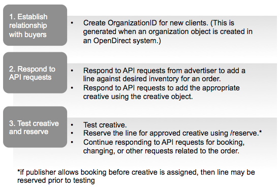
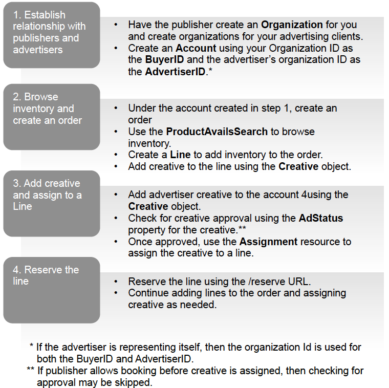
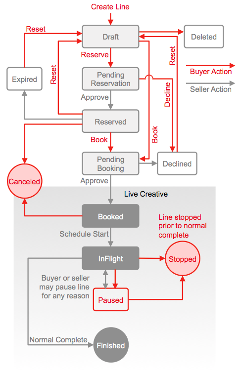
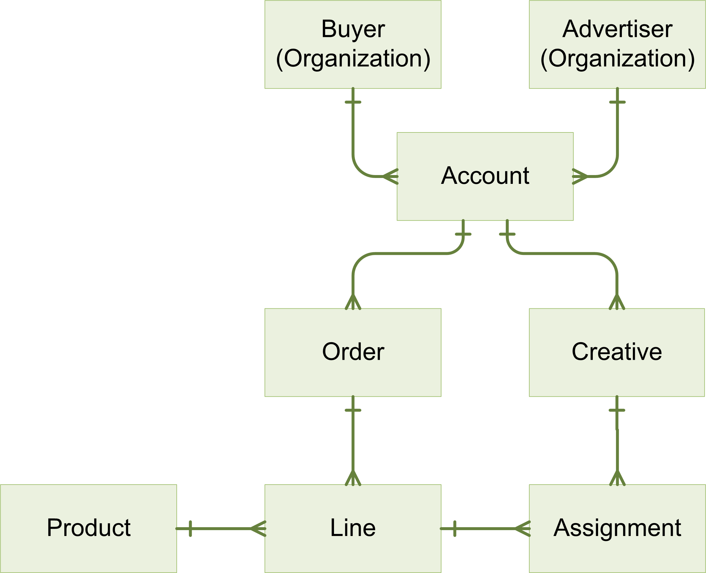

# OpenDirect

## API Specification Version 1.5.1

### Released March 2016

---

## About the IAB Technology Lab

The IAB Technology Laboratory is a nonprofit research and development consortium charged with producing and helping companies implement global industry technical standards and solutions. The goal of the Tech Lab is to reduce friction associated with the digital advertising and marketing supply chain while contributing to the safe growth of an industry.

The IAB Tech Lab spearheads the development of technical standards, creates and maintains a code library to assist in rapid, cost-effective implementation of IAB standards, and establishes a test platform for companies to evaluate the compatibility of their technology solutions with IAB standards, which for 18 years have been the foundation for interoperability and profitable growth in the digital advertising supply chain.

The OpenDirect Work Group is a working group within the IAB Technology Lab. Further details about the IAB Technology Lab can be found at: [www.iab.com/organizations/iab-tech-lab](http://www.iab.com/organizations/iab-tech-lab)

Melissa Gallo  
Director of Product, Programmatic Automation and Data  
IAB Technology Lab  
[melissa@iab.com](mailto:melissa@iab.com)

---

## License/Intellectual Property Notice

Upon any person or entity’s request, AOL, Yahoo!, Microsoft, Yieldex, Bionic, MediaMath, and IAB (“Contributors”) agree to offer such person or entity, under such Contributor’s necessary patent claims, a no-charge, royalty free, fully paid-up, non-exclusive license under and to such Contributor’s necessary patent claims on reasonable and non-discriminatory terms for purposes of implementing any this specification. Such license may be subject to the condition of reciprocity by the licensee with respect to, among other things, a license to be granted by such licensee to such party with respect to such licensee’s necessary patent claims and other reasonable and nondiscriminatory terms.

THE CONTRIBUTIONS AND SPECIFICATION ARE PROVIDED "AS IS." THE ENTIRE RISK AND LIABILITY WITH RESPECT TO THE IMPLEMENTATION OR ANY OTHER USE OR EXPLOITATION OF ANY CONTRIBUTION, DRAFT SPECIFICATION OR FINAL SPECIFICATION ARE ASSUMED BY THE IMPLEMENTER, USER AND EXPLOITER. EACH CONTRIBUTOR EXPRESSLY DISCLAIMS ANY WARRANTIES (EXPRESS, IMPLIED, OR OTHERWISE), INCLUDING, WITHOUT LIMITATION, IMPLIED WARRANTIES OF MERCHANTABILITY, NON-INFRINGEMENT, FITNESS FOR A PARTICULAR PURPOSE, OR TITLE, RELATED TO ANY CONTRIBUTION, DRAFT SPECIFICATION OR FINAL SPECIFICATION. IN NO EVENT WILL ANY CONTRIBUTOR BE LIABLE TO ANY OTHER CONTRIBUTOR, PERSON OR ENTITY FOR ANY LOST PROFITS OR ANY FORM OF INDIRECT,
SPECIAL, INCIDENTAL, OR CONSEQUENTIAL DAMAGES OF ANY CHARACTER FROM ANY CAUSES OF ACTION OF ANY KIND WITH RESPECT TO THIS AGREEMENT OR ANY SUBJECT MATTER OF THIS AGREEMENT, WHETHER BASED ON BREACH OF CONTRACT, TORT (INCLUDING NEGLIGENCE), OR OTHERWISE, WHETHER OR NOT ANY CONTRIBUTOR, PERSON OR ENTITY HAS BEEN ADVISED OF THE POSSIBILITY OF SUCH DAMAGE, AND EVEN IF THE REMEDIES PROVIDED FOR IN THIS AGREEMENT FAIL OF THEIR ESSENTIAL PURPOSE.

---

## Table of Contents

* [**Executive Summary**](#executive-summary)
  * [*What’s New in Version 1.5*](#what’s-new-in-version-15)
  * [*Audience*](#audience)
* [**1 Introduction/Overview**](#1-introductionoverview)
  * [*1.1 How it works*](#11-how-it-works)
  * [*1.2 Authorization*](#12-authorization)
  * [*1.3 Programming Elements*](#13-programming-elements)
* [**2 Resources**](#2-resources)
  * [*2.1 Account*](#21-account)
  * [*2.2 Assignment*](#22-assignment)
  * [*2.3 Creative*](#23-creative)
  * [*2.4 Line*](#24-line)
    * [2.4.1 Booking Status Values](#241-booking-status-values)
  * [*2.5 Order*](#25-order)
  * [*2.6 Organization*](#26-organization)
  * [*2.7 Product*](#27-product)
  * [*2.8 Change Request*](#28-change-request)
* [**3 Common Objects**](#3-common-objects)
  * [*3.1 Address*](#31-address)
  * [*3.2 Contact*](#32-contact)
  * [*3.3 ProductAvails*](#33-productavails)
  * [*3.4 ProductAvailsSearch*](#34-productavailssearch)
  * [*3.5 ProductSearch*](#35-productsearch)
  * [*3.6 OrderSearch*](#36-ordersearch)
  * [*3.7 Size*](#37-size)
  * [*3.8 Segment*](#38-segment)
* [**4 Reference Data**](#4-reference-data)
  * [*4.1 AdFormatType*](#41-adformattype)
  * [*4.2 AdPosition*](#42-adposition)
  * [*4.3 ContactType*](#43-contacttype)
  * [*4.4 Country*](#44-country)
  * [*4.5 Currency*](#45-currency)
  * [*4.6 DeliveryType*](#46-deliverytype)
  * [*4.7 FrequencyCapInterval*](#47-frequencycapinterval)
  * [*4.8 Industry*](#48-industry)
  * [*4.9 InventoryType*](#49-inventorytype)
  * [*4.10 Language*](#410-language)
  * [*4.11 MaturityLevel*](#411-maturitylevel)
  * [*4.12 RateType*](#412-ratetype)
  * [*4.13 Target*](#413-target)
  * [*4.14 TargetValue*](#414-targetvalue)
* [**5 Collection Objects**](#5-collection-objects)
* [**6 General Support Requirements**](#6-general-support-requirements)
  * [*6.1 Authentication*](#61-authentication)
  * [*6.2 Versioning*](#62-versioning)
  * [*6.3 HTTP Error Codes/Error Handling*](#63-http-error-codeserror-handling)
  * [*6.4 Error Response*](#64-error-response)
  * [*6.5 Data Format*](#65-data-format)
  * [*6.6 Reporting*](#66-reporting)
  * [*6.7 Paging Query Parameters*](#67-paging-query-parameters)
* [**7 URIs and General Request/Response Rules**](#7-uris-and-general-requestresponse-rules)
  * [*7.1 URI Summary Table*](#71-uri-summary-table)
  * [*7.2 Account*](#72-account)
    * [7.2.1 /accounts](#721-accounts)
    * [7.2.2 /accounts/{id}](#722-accountsid)
    * [7.2.3 /accounts?$filter=](#723-accounts?$filter=)
  * [*7.3 Account Assignments*](#73-account-assignments)
    * [7.3.1 /accounts/{id}/assignments](#731-accountsidassignments)
    * [7.3.2 /accounts/{id}/assignments/{id}](#732-accountsidassignmentsid)
    * [7.3.3 /accounts/{id}/assignments/{id}?disable](#733-accountsidassignmentsid?disable)
    * [7.3.4 /accounts/{id}/assignments?$filter=](#734-accountsidassignments?$filter=)
  * [*7.4 Account Creative*](#74-account-creative)
    * [7.4.1 /accounts/{id}/creatives](#741-accountsidcreatives)
    * [7.4.2 /accounts/{id}/creatives/{id}](#742-accountsidcreativesid)
    * [7.4.3 /accounts/{id}/creatives?$filter=](#743-accountsidcreatives?$filter=)
  * [*7.5 Account Orders*](#75-account-orders)
    * [7.5.1 /accounts/{id}/orders](#751-accountsidorders)
    * [7.5.2 /accounts/{id}/orders/{id}](#752-accountsidordersid)
    * [7.5.3 /accounts/{id}/orders?$filter=](#753-accountsidorders?$filter=)
  * [*7.6 Account Order Lines*](#76-account-order-lines)
    * [7.6.1 /accounts/{id}/orders/{id}/lines](#761-accountsidordersidlines)
    * [7.6.2 /accounts/{id}/orders/{id}/lines/{id}](#762-accountsidordersidlinesid)
    * [7.6.3 /accounts/{id}/orders/{id}/lines?$filter=](#763-accountsidordersidlines?$filter=)
    * [7.6.4 accounts/{id}/orders/{id}/lines/{id}?book](#764-accountsidordersidlinesid?book)
    * [7.6.5 /accounts/{id}/orders/{id}/lines/{id}?reserve](#765-accountsidordersidlinesid?reserve)
    * [7.6.6 /accounts/{id}/orders/{id}/lines/{id}?cancel](#766-accountsidordersidlinesid?cancel)
    * [7.6.7 /accounts/{id}/orders/{id}/lines/{id}?reset](#767-accountsidordersidlinesid?reset)
  * [*7.7 Organizations*](#77-organizations)
    * [7.7.1 /organizations](#771-organizations)
    * [7.7.2 /organization/{id}](#772-organizationid)
    * [7.7.3 /organizations?$filter=](#773-organizations?$filter=)
  * [*7.8 Products*](#78-products)
    * [7.8.1 /products](#781-products)
    * [7.8.2 /product/{id}](#782-productid)
    * [7.8.3 /products/search](#783-productssearch)
    * [7.8.4 /products/avails](#784-productsavails)
  * [*7.9 Change Request*](#79-change-request)
    * [7.9.1 /accounts/{id}/changerequest](#791-accountsidchangerequest)
    * [7.9.2 /accounts/{id}/changerequest/{id}](#792-accountsidchangerequestid)
    * [7.9.3 /accounts/{id}/changerequest?$filter=](#793-accountsidchangerequest?$filter=)
    * [7.9.4 /accounts/{id}/changerequest/{id}/approve](#794-accountsidchangerequestidapprove)
    * [7.9.5 /accounts/{id}/changerequest/{id}/reject](#795-accountsidchangerequestidreject)
  * [*7.10 Change Request Lines*](#710-change-request-lines)
    * [7.10.1 /accounts/{id}/changerequest/{id}/lines](#7101-accountsidchangerequestidlines)
    * [7.10.2 /accounts/{id}/changerequest/{id}](#7102-accountsidchangerequestid)
    * [7.10.3 /accounts/{id}/changerequest/lines?$filter=](#7103-accountsidchangerequestlines?$filter=)
* [**8 OpenDirect Workflow**](#8-opendirect-workflow)
  * [*8.1 Onboarding a Provider*](#81-onboarding-a-provider)
  * [*8.2 Adding an Agency Organization*](#82-adding-an-agency-organization)
  * [*8.3 Adding an Advertiser Organization*](#83-adding-an-advertiser-organization)
  * [*8.4 Getting an OAuth 2.0 Access Token*](#84-getting-an-oauth-20-access-token)
  * [*8.5 Adding an Account*](#85-adding-an-account)
  * [*8.6 Get Product Inventory, Availability and Pricing*](#86-get-product-inventory,-availability-and-pricing)
  * [*8.7 Creating an Order*](#87-creating-an-order)
  * [*8.8 Adding Lines to the Order*](#88-adding-lines-to-the-order)
  * [*8.9 Uploading a Creative and Assigning It to a Line*](#89-uploading-a-creative-and-assigning-it-to-a-line)
  * [*8.10 Reserving, Booking, and Canceling a Line*](#810-reserving,-booking,-and-canceling-a-line)
  * [*8.11 Diagrams*](#811-diagrams)
    * [8.11.1 Publisher Workflow Diagram](#8111-publisher-workflow-diagram)
    * [8.11.2 Agency and Advertiser Workflow Diagram](#8112-agency-and-advertiser-workflow-diagram)
    * [8.11.3 Booking State Diagram](#8113-booking-state-diagram)
    * [8.11.4 Resource Model Diagram](#8114-resource-model-diagram)

---

# Executive Summary

OpenDirect enables publishers to offer premium inventory using a programmatic interface that
partners and vendors build according to the OpenDirect specifications.

Every organization in the industry uses some kind of interface (or a combination thereof) to
manage inventory throughout the buying and selling of premium, reserved inventory. Each
system is different, which means if one partner wants to integrate their system with another
system, the integration is customized to that system. Further integrations all require
customization, each instance consuming valuable overhead. While the overhead enables more
business, cutting down on the cost of these integrations allows resources to be diverted to more
important ad operations tasks.

OpenDirect provides a standard way for publishers to make their inventory available in any
OpenDirect-compliant interface where agencies and advertisers can reserve premium inventory.

For publishers, this means that in a programmatic marketplace, publishers can make premium
guaranteed inventory available to more buyers. Tech providers can offer a greater variety of
premium inventory to their customers. For the industry, a marketplace that uses OpenDirect
means more fluid movement of inventory while greatly reducing the overhead involved when
integrating with partners.

Adoption of OpenDirect also opens the doorway to improved tracking of inventory across
systems, providing early visibility reporting and potentially reducing discrepancies down the
road. While OpenDirect does not directly enable improved impression counting between parties,
it does lay the foundation for opportunities to improve impression reporting between systems.

Publishers can begin using OpenDirect by modifying their systems to log Organizational IDs and
accounts consistent with the specs in this document. They also need to be able to respond to
API requests for inventory details as well as manage inventory in response to API requests.

Tech providers who want to use OpenDirect need to make use of the API in this spec as they
design and build their interfaces for offering automated guaranteed inventory.

As OpenDirect becomes more adopted in the marketplace, the movement of premium inventory
becomes more fluid.

## What's New in Version 1.5.1

Minor changes and bug-fixes to v1.5

## What’s New in Version 1.5

OpenDirect 1.0 was released in January 2015. While a handful of companies have already
started adopting the API, more features are needed to encourage wider adoption. Version 1.5
adds more context, clarification, bug fixes, and feature updates while proposals for version 2.0
include features such as increased channel buying support (mobile, video, native, etc.) and
order negotiation.

Updates to OpenDirect 1.5 include:

* **Context and clarification:** as much as possible, version 1.5 adds details that provide more context for programming elements, the parties involved, and how they work together.
* **Bug fixes:** as much as possible inconsistencies in the spec have been addressed.
* **Creative assignment:** version 1.0 prevented a line to be booked before creative was assigned. While functioning as designed, some publishers would like to allow a line to be booked without creative assigned on a product-by-product basis.
* **Orders:** for more control over inventory orders, features have been added for defining an expiration date and time for held inventory, order status, and for restricting inventory to a packaged deal.
* **Search by currency:** search criteria on product availability has been added to allow searching by currency.
* **Change Request Support:** in an effort to provide better service to their clients, publishers often enter order details on behalf of buyers and advertisers. Version 1.5 enables publishers to do this using OpenDirect.
* **Publisher order creation:** Publishers often create orders on behalf of their clients. Features for summarizing line booking statuses, product package only deals, and order expiration date have been added to support publisher order creation.

The industry effort to promote and establish OpenDirect in the marketplace is open to
suggestions for new features and solutions for increasing adoption (as well as new adopters).
Contact the IAB AdTech Lab at [adtechnology@iab.com](mailto:adtechnology@iab.com) to get involved.

## Audience

Tech providers can use the specifications in this document to build a system for accessing and
booking publisher inventory. Tech providers may include the technical staff or partners who
work with agencies, networks, exchanges, or specialty vendors that offer inventory purchasing
services.

Publishers also need to use this spec to make their inventory available to API requests from
Tech Providers.

---

# 1 Introduction/Overview

The OpenDirect API provides a standard way for publishers to integrate with tech provider
partners so that they can offer premium guaranteed inventory programmatically. Using the API,
buyers can build one system that can access inventory from multiple publishers without custom
integrations for each one.

Some of the features supported in OpenDirect are:

* Searching product inventory
* Determining price and availability
* Applying targeting and frequency constraints
* Creating orders and adding lines
* Uploading creative and assigning creative to lines
* Reserving and booking inventory

Additional features are added with each new update to further enable wider adoption and
support the needs of the industry.

## 1.1 How it works

At a high level, the workflow involves establishing a relationship between buyer and publisher,
setting up accounts, and placing orders on the buyer side while publisher systems respond to
API requests for order placement.

The following table outlines general steps for using the API:

| Buy Side | Sell Side |
| ---|--- |
| **1. Establish a relationship** <br />In order to buy inventory with publishers using OpenDirect systems, buyers must first obtain an ID from the publisher that can be used in any OpenDirect system for as long as you do business with the publisher. | **1. Establish a relationship** <br />To protect your premium inventory, buyers must first obtain an ID from you. This ID can be used in any OpenDirect system for as long as you maintain a business relationship with the buyer.|
| **2. Set up** <br />Buyers use with their publisher-obtained IDs and accounts to begin browsing inventory and placing orders. | **2. Set up** <br />Publishers create accounts for buyers to access in any OpenDirect system which the publisher has a working relationship. |
| **3. Place Orders** <br />After establishing accounts in the system, buyers can begin browsing publisher inventory and adding lines to orders. | **3. Respond to API Requests** <br />Once buyers are set up in their OpenDirect system(s), they can begin browsing and booking inventory. On the publisher side, this is received as API requests that publisher systems must respond to. |
| **4. Submit Creative and Book Inventory** <br />Once desired order is established, buyers can submit creative for approval using the OpenDirect system for approval. Once approved, the order can be booked to run. | **4. Test Creative and Approve Inventory** <br />Buyers can submit creative using the OpenDirect system. Once tested and approved, you can book the order to run. |

## 1.2 Authorization

The OpenDirect API is a RESTful API that supports paging query parameters and uses OAuth to authenticate users. A publisher must support at least one "full access" user account (API credentials) per buying organization. Non-buying organizations may have optional user accounts. A publisher may support flexible permission schemas for additional user accounts.

OpenDirect users include:

* **Organization:** All organizations that work with the publisher must obtain an Organization ID, whether they are a buyer, or a brand advertiser.  
* **Buyer:** The buyer is the organization that places orders and usually represents an agency acting on behalf of the advertiser, or the advertiser that places orders directly. If the buyer represents advertisers, the buyer must obtain formal consent for acting on behalf of the advertiser and provide proof of that consent to the publisher.
* **Advertisers:** Advertisers represent the brands that purchase publisher inventory for advertising their brands. An advertiser may also be a buyer, but if the advertiser works with a buyer, the advertiser must provide formal consent to allow the buyer to act on its behalf. The Advertiser ID can be used to set up advertiser accounts in an agency or publisher’s OpenDirect system.

## 1.3 Programming Elements

For details about the programming elements that this specification defines, see the following sections.

* **Resources:** The key objects, such as Account, Order, Line, Creative, etc. that define the OpenDirect API.
* **Common Objects:** Defines the objects that supply field values used in one or more resources, such as Address and Contact.
* **Collection Objects:** A list of objects that return an array of values for a field, typically provided by the publisher. For example, publisher-defined target fields (Target) and their values (TargetValue) are provided as collection objects, where Target might be 'Age' and the TargetValue would be a list of the publisher-defined age groups (18-24, 25-32, 33-39, etc.)
* **URIs and General Request/Reponse Rules:** Defines the URI supported HTTP verbs (GET, POST, etc.) for each resource.
* **Authentication:** Defines the authentication scheme that publishers must use.
* **Versioning:** Defines the versioning scheme that publishers must use.
* **HTTP Error Cosed/Error Handling:** Defines the error objects that publishers must return for 400 Bad Request errors.
* **Reporting:** Defines the reporting URIs and objects.
* **OpenDirect Workflow:** Outlines the process for establishing an account and the calls required to create and process an order.

---

# 2 Resources

The OpenDirect API is a RESTful API that supports JSON. This section defines the JSON resource objects used by the API. For a diagram that shows the relationships between these resources, see Resource Model.

For a list of URIs that use these resources, see URIs.

## 2.1 Account

An account defines a buyer-advertiser relationship. A buyer is typically an agency that places orders on behalf of several advertisers. Each account associates a buyer with one advertiser and is used to manage orders for one publisher. An advertiser may also work with several buyers, and therefore, advertisers have a separate account for each buyer they work with. If an advertiser represents itself, the account identifies the advertiser as both the buyer and the
advertiser.

Before an agency may create accounts and perform buys on behalf of the advertiser, the advertiser must give permissions to the agency. The process of giving or removing permissions is publisher-defined. Creating an account must fail if the advertiser has not given the agency permissions.

The Account owns the orders and creative.

### Parameters

| Property | Type | Constraints | Add | Update | Publisher Support Requirement |
| -------- | ---- | ----------- | --- | ------ | ----------------------------- |
| **AdvertiserId** | String | Max 36 char | Required | Read-only | Must support
| **BuyerId** | String | Max 36 char | Required | Read-only | Must support
| **Id** | String | Max 36 char | Read-only | Read-only | Must support |
| **Name** | String | Max 36 char | Required | Optional | Must support |
| **ProviderData** | CLOB | Max 1,000 char | Optional | Optional | May support

### Parameter Details

| Property | Description |
| -------- | ----------- |
| **AdvertiserId** | An ID that identifies the organization that is acting as the advertiser. Advertiser ID may be generated by the buyer (agency) or by the publisher if the advertiser is also the buyer. An advertiser that is representing itself must have an AdvertiserId and BuyerId that match. |
| **BuyerId** | An ID that identifies the organization that is acting as the buyer. The Publisher generates the BuyerId. If the advertiser is performing their own buys, AdvertiserId and BuyerId must be the same. |
| **Id** | A system-generated opaque ID that uniquely identifies the account. |
| **Name** | The name of the account. Used for display purposes. |
| **ProviderData** | An opaque CLOB of provider-defined data. Providers may use this field as needed (for example, to store an ID that correlates this object with resources within their system).<p />_**Note that any provider that edits this object may override the data in this field. The data should include a marker that you can identify to ensure the data is yours.**_ |

## 2.2 Assignment

Defines an Assignment resource. An Assignment associates a creative with a line of the order. A creative may be assigned to one or more lines and a line may be assigned one or more creative.

Notes: The assignment must fail if the following are true.

* The language property for the creative does not match any of the languages in the language property for the product (products are defined in the LINE resource for an Order).
* The specified maturity level property for the creative does not match the maturity level property for the product specified in the LINE resource.

**Booking an Assignment**  
In most cases, a creative must be assigned to a line before the line may be booked. Publishers may allow booking without creative assignment for certain products. This feature may be set in the Product resource. See section X for details on permitting booking before creative is assigned. See section X for details on booking a line.

**Updating Creative**  
To change the creative assigned to a line when creative assignment is required, first assign a new creative to the line and then use the disable verb to set the current assignment to Inactive. This operation ensures that the order line item continues to deliver until the new creative is assigned.

**Weighting Creative**  
To display different creative at different times, add a line for each creative. If weighting is used, providers should make sure all assignments for a line specify a weight and that the sum of all weights is 100.

### Parameters

| Property | Type | Constraints | Add | Update | Publisher Support Requirement |
| -------- | ---- | ----------- | --- | ------ | ----------------------------- |
| **CreativeId** | String | Max 36 char | Required | Read-only | Must support |
| **Id** | String | Max 36 char | Read-only | Read-only | Must support |
| **LineId** | String | Max 36 char | Required | Read-only | Must support |
| **ProviderData** | CLOB | Max 1,000 char | Optional | Optional | May support |
| **Status** | String | Value of “Active” or “Inactive” | Read-only | Read-only | Must support |
| **Weight** | Byte | Numeric value of 1-100. | Optional | Optional | Should support |

### Parameter Details

| Property | Description |
| -------- | ----------- |
| **CreativeId** | The ID of the creative to display when the line runs. |
| **Id** | A system-generated opaque ID that uniquely identifies the assignment. |
| **LineId** | The ID of the line that will display the creative. |
| **ProviderData** | An opaque blob of provider-defined data. Providers may use this field as needed (for example, to store an ID that correlates this object with resources within their system).<p />_**Note that any provider that edits this object may override the data in this field. The data should include a marker that you can identify to ensure the data is yours.**_ |
| **Status** | A value that determines whether the creative serves. The following are the possible values.<ul><li>**Active** – The creative may serve. Set at create time.</li><li>**Inactive** –The creative may not serve. Set by the disable verb.</li></ul>The status may not transition from Inactive to Active. |
| **Weight** | Determines how much the creative is displayed relative to the other creative assigned to the same line.<p />To provide even rotation, do not specify a weight.<p />If weight is specified, all assignments that specify the same line must specify a weight and the weight of all the assignments must add up to 100. If the weight of all assignments does not add up to 100, even rotation is applied.<p />Assignments with heavier weight get proportionally more rotation compared to those with lesser weight.<p />For example, if the line has 2 creative, A and B, assigned with the same dates, and A has weight 25 and B has weight 75, B will serve three times as often as A. |
| **CreativeId** | The ID of the creative to display when the line runs. |
|

## 2.3 Creative

Defines a Creative resource. The Creative provides information about the ad to be displayed for
a line of the order. Creative are assigned to the LINE resource of an order using the
ASSIGNMENT resource, which is specified in section 2.2.

See Assignment for instructions on updating a creative.

### Parameters

| Property | Type | Constraints | Add | Update | Publisher Support Requirement |
| -------- | ---- | ----------- | --- | ------ | ----------------------------- |
| **AccountId** | String | Max 36 char | Required | Read-only | Must support |
| **AdFormatType** | Object | Values from AD FORMAT TYPE reference data | Required | Read-only | Must support |
| **AdRejectionReason** | String | | Empty field for advertisers | Empty field for advertisers | Optional
| **AdStatus** | String | See description for accepted values | Empty field for advertisers | Empty field for advertisers | Optional |
| **BackupFlashAsset** | String | Optional | Read-only | Should support |
| **ClickUrl** | String | URL | Required | Optional | Must support |
| **CreativeAsset** | String | Required | Read-only | Must support |
| **Geometry** | Object | Values from SIZE object | Required | Read-only | Must support |
| **HttpsCompatible** | Boolean | | Optional | Optional | Should support |
| **Id** | String | | Read-only | Read-only | Must support |
| **Language** | 2.3.1 Object | Values from LANGUAGE reference data | Required | Optional | Must support |
| **MaturityLevel** | Object | Values from MATURITY LEVEL reference data | Optional | Optional | May support |
| **Name** | String | Required | Optional | Must support |
| **ProviderData** | String | Max 1,000 char | Optional | Optional | May support |

### Parameter Details

| Property | Description |
| -------- | ----------- |
| **AccountId** | The ID of the account that owns the creative. |
| **AdFormatType** | The ad’s format. Publisher-supported ad format types are supplied as options using reference data. The ad format type for the creative must be supported for the product. See section 4.1 for more information. |
| **AdRejectionReason** | The reason why the creative audit did not approve the creative. |
| **AdStatus** | A status value that indicates where in the audit process the creative is. The following are the possible values.<ul><li>**Pending** – The creative was submitted and is either waiting for review or is in the process of being reviewed.</li><li>**Approved** – The Creative passed the review.</li><li>**Rejected** – The creative failed the review.</li></ul>The AdRejectionReason field contains the reason why it failed the review. |
| **BackupFlashAsset** | A base64 string that contains the backup Image in case the user’s browser does not support Flash.<p />The image must be of one of the following mime types.<ul><li>GIF</li><li>JPEG</li><li>PNG</li></ul> The CreativeAsset property contains the Flash creative.<p />The publisher’s documentation should indicate any size constraints. If the asset exceeds the constraint, the publisher must return error code *"BackupCreativeTooLarge"*. |
| **ClickUrl** | The URL of a webpage that the user is taken to if they click the ad. The URL may be specified if AdFormatType is set to Flash, FlashExpandable, or Image. |
| **CreativeAsset** | A string that contains the creative. The AdFormatType determines whether the string is a character string or a base64 string. Image and Flash creatives, must use base64 strings and all others (tags, text, and video) use character strings.<p />If the creative is an image, it must be of one of the following mime types.<ul><li>GIF</li><li>JPEG</li><li>PNG</li></ul>The publisher’s documentation should indicate any size constraints. If the asset exceeds the constraint, the publisher must return error code, *"CreativeTooLarge"*. |
| **Geometry** | The options available for ad size are publisher-provided using the SIZE object. See section 3.7 for details. |
| **HttpsCompatible** | A Boolean value that determines whether the creative can properly render on an HTML web page served over HTTPS. True indicates the creative is HTTPS-compatible. Defaults to False. |
| **Id** | A system-generated opaque ID that uniquely identifies this resource. |
| **Language** | The ISO 639-1 language code that identifies the language used in the ad. For example, if the ad uses English, the ISO code would be EN. Publisher supported languages are provided using reference data. See section 4.10 for more information. |
| **MaturityLevel** | The maturity level of the creative content. The following are the possible values.<ul><li>All</li><li>Over12</li><li>Mature</li><li>NotSpecified</li></ul>At assignment time, the assignment must be rejected if the specified maturity level for the creative does not match the maturity level of the product specified in the LINE resource. The default is “All.” Publisher support for this property is optional. Values are provided using reference data as specified in section 4.11. |
| **Name** | The display name of the creative. |
| **ProviderData** | An opaque CLOB of provider-defined data. Providers may use this field as needed (for example, to store an ID that correlates this object with resources within their system).<p />_**Note that any provider that edits this object may override the data in this field. The data should include a marker that you can identify to ensure the data is yours.**_ |

## 2.4 Line

Line resources are included in an order and provide details about the product being booked, status, start and end dates, and other settings for the order item.

Creative are assigned to the LINE resource of an order using the ASSIGNMENT resource, which is specified in section 2.2.Notes: The user may update a line only if it’s in the Draft state. If the line is in the Reserved or Declined state, the user may call Reset to move the line back to the Draft state in order to update the line.

### Parameters ####

| Property | Type | Constraints | Add | Update | Publisher Support Requirement |
| -------- | ---- | ----------- | --- | ------ | ----------------------------- |
| **BookingStatus** | String | See description for accepted values | Read-only | Read-only | Must support |
| **Comment** | String | Max 255 char | Optional | Optional | May support |
| **Cost** | Decimal | Value in currency for the order | Read-only | Read-only | Must support |
| **EndDate** | String | Max 26 char [ISO-8601](https://en.wikipedia.org/wiki/ISO_8601) | Required | Optional | Must support |
| **FrequencyCount** | Byte | |  Optional | Optional | Should support |
| **FrequencyInterval** | String | Max 5 char | Optional | Optional | Should support |
| **Id** | String | Max 36 char | Read-only | Read-only | Must support |
| **Quantity** | (Big) Integer |  | Optional | Optional | Must support |
| **Name** | String | Max 200 char | Required | Optional | Must support |
| **OrderId** | String | Max 36 char | Read-only | Read-only | Must support |
| **ProductId** | String | Max 36 char | Required | Readonly | Must support |
| **ProviderData** | String | Max 1,000 char | Optional | Optional | May support |
| **Rate** |  Decimal | Value in currency for the order | Read-only | Read-only | Must support |
| **RateType** | Object | See description for accepted values | Read-only | Read-only | Must support |
| **ReservedExpiryDate** | String | Max 26 char [ISO-8601](https://en.wikipedia.org/wiki/ISO_8601) | Read-only | Read-only | Should support |
| **StartDate** | String | Max 26 char [ISO-8601](https://en.wikipedia.org/wiki/ISO_8601) | Required | Optional | Must support |
| **StateChangeReason** | String | | Read-only | Read-only | Must support |
| **Targeting** | Object | Values from SEGMENT object | Optional | Optional | Should support |
| **UsesExpandables** | Boolean | | Optional | Optional | Should support |

### Parameter Details ####

| Property | Description |
| -------- | ----------- |
| **BookingStatus** | A value that determines whether the line is booked and is capable of delivering ads. For a state diagram, see Booking State Diagram. If the line is reset, the StateChangeReason should be cleared.<p />Possible booking state values are:<ul><li>Draft</li><li>PendingReservation</li><li>Reserved</li><li>PendingBooking</li><li>Booked</li><li>InFlight</li><li>Finished</li><li>Stopped</li><li>Canceled</li><li>Pause</li><li>Expired</li><li>Declined</li><li>ChangePending</li></ul>See section [2.4.1](#2.4.1-Booking-Status-Values) for descriptions of booking status values. |
| **Comment** | User notes related to this line. |
| **Cost** | The projected cost of the line is based on the specified quantity, rate and targeting. The actual cost (the amount billed) is based on the actual number of impressions.<p />The cost is specified in the currency for the order. If the order uses a different currency than what the product uses, the cost for the line must be converted to the order’s currency.<p />The cost is determined at the time the line is saved with the following statuses: Drafted, Reserved, or Booked. |
| **EndDate** | The date and time that the line will stop.<p />The date and time must be specified in UTC and conform to [ISO-8601](https://en.wikipedia.org/wiki/ISO_8601). If the time is missing, 11:59 PM is assumed.<p />The line end date must be later than the line start date and should be less than or equal to the order’s end date.<p />If the line end date is later than the order’s end date, the order’s end date should be extended to match the line’s end date. |
| **FrequencyCount** | The maximum number of times that a unique user must see ads from this line during the specified interval (see FrequencyInterval). |
| **FrequencyInterval** | The interval that FrequencyCount applies to.<p />For example, per day or per week. For a list of possible intervals, see FrequencyCapInterval. |
| **Id** | A system-generated opaque ID that uniquely identifies this resource. |
| **Quantity** | The quantity requested for the specified date range. This value will differ based on various cost types. For CPM, for examples, the value would be impressions.<p />The line must contain a quantity before the user may reserve or book it. If the requested quantity is not available, reserving or booking the line must fail and bookingStatus must be set to Declined. |
| **Name** | The line’s display name. Should be unique. |
| **OrderId** | The ID of the order that this line belongs to. |
| **ProductId** | The ID of the product where the creatives run. |
| **ProviderData** | An opaque blob of provider-defined data. Providers may use this field as needed (for example, to store an ID that correlates this object with resources within their system).<p />_**Note that any provider that edits this object may override the data in this field. The data should include a marker that you can identify to ensure the data is yours.**_ |
| **Rate** | The price per unit of impressions. For example, $10 per 1,000 impressions (CPM).<p />The rate is determined each time the line is saved (added, updated, booked, or reserved). |
| **RateType** | The unit of measure for the Rate property. Values are provided using RATE TYPE reference data.<p />The rate type is determined at the time the line is saved (added, updated, booked, or reserved). |
| **ReservedExpiryDate** | The date and time that the reserved inventory will expire. If the line is reserved, the expiry date must be set. |
| **StartDate** | The date and time that the line will start.<p />The date and time must be specified in UTC and conform to [ISO-8601](https://en.wikipedia.org/wiki/ISO_8601).<p />If the time is missing, 12:00 AM is assumed.<p />The date and time must be greater than or equal to now and should be greater than or equal to the order’s start date.<p />If the line start date is earlier than the order’s start date, the order’s start date should be moved to match the line’s start date. Both dates must be later than the present day.<p />Start dates that are in the past may not be updated. |
| **StateChangeReason** | The reason why the state was changed by the publisher. The reason must be specified if:<ul><li>The publisher declined the booking or reservation.</li><li>The publisher or user canceled the flight.</li></ul> |
| **Targeting** | The segments used to target users and determine product availability. For example, behavioral, age, and gender segments.<p />The creative assigned to the LINE resource is display when the line includes user segments and the delivery engine can determine whether the user matches the specified segments. Values are provided in SEGMENT object as specified in section 3.8. |
| **UsesExpandables** | A Boolean value that indicates whether the line will be assigned expandable creatives. Used to determine availability.<p />The default is false. |

## 2.4.1 Booking Status Values

* **Draft** – Indicates that a draft of the line has been saved. The line may be updated only in this state. The line remains in this state until the user deletes, reserves, or books the line.
* **PendingReservation** – Indicates that the reservation is in progress. If approved, the state moves to Reserved; otherwise, it moves to Declined. Any user action requested in this state must fail.
* **Reserved** – Indicates that the inventory for the line has been reserved. Remains in this state until the user cancels, books, resets the line or the reservation expires. The ability to reserve inventory is optional. Each publisher determines the length of time that inventory may be reserved without booking before it’s released. If the line is reserved, the ReservedExpiryDate must be set to the date and time that the reserved inventory will expire.
* **PendingBooking** – Indicates that the booking is in progress. If approved, the state moves to Booked; otherwise, it moves to Declined. Any user action requested in this state must fail.
* **Booked** – Indicates that the line is booked and the buyer is obligated to the terms. To book the line, the line must have a creative assigned to it. If a creative is not assigned, the booking must fail. The line stays in this state until the user cancels the line or the line reaches its delivery window. After the line reaches its delivery window, the line moves to the InFlight state.
* **InFlight** – Indicates that the line is in its delivery window. The line stays in this state until the user cancels the line or the line reaches the end of its delivery window. If the line reaches the end of its delivery window, then it moves to the Finished state; otherwise, it moves to the Stopped state.
* **Finished** – Indicates that the line successfully completed its flight. The line remains in this state.
* **Stopped** – Indicates that the user or publisher canceled the line while it was in-flight. The StateChangeReason field must specify the reason why the flight was canceled. The line remains in this state.
* **Canceled** – Indicates that the user canceled the line while it was in the Reserved or Booked state. The line remains in this state.
* **Paused** – Indicates that all creative for the line have been temporarily stopped while in Inflight status. Line may return to Inflight status or be updated to the Stopped status if creative is to be canceled.
* **Expired** – Indicates that the reservation expired. The line remains in this state unless the user resets the line, which moves it back to the Draft state
* **Declined** – Indicates that booking or reservation was declined by the publisher or failed. The line remains in this state unless the user resets the line, which moves it back to the Draft state. The StateChangeReason field must specify the reason why the booking or reservation was declined or failed.
* **Change Pending** – A change order has been initiated for the line. Upon approval the booking status is updated to reflect the approved change.

## 2.5 Order

The Order resource specifies the plan’s start and end dates, estimated budget, currency, and preferred billing method for all line items in the order.

To specify the individual line item details of the order, use the LINEresource specified in section
2.4.

### Parameters

| Property | Type | Constraints | Add | Update | Publisher Support Requirement |
| -------- | ---- | ----------- | --- | ------ | ----------------------------- |
| **AccountId** | String | Max 36 char | Read-only | Read-only | Must support |
| **Brand** | String | Max 25 char | Optional | Optional | May support |
| **Budget** | Decimal | Optional | Optional | Should support |
| **Contacts** | Object | No duplicate contact types | Optional | Optional | Should support |
| **Currency** | String | Max 3 char [ISO-4217](https://en.wikipedia.org/wiki/ISO_4217) | Required | Optional | Must support |
| **EndDate** | Date | Max 26 char [ISO-8601](https://en.wikipedia.org/wiki/ISO_8601) | Optional | Optional | Should support |
| **OrderExpiryDate** | Date | Max 26 char [ISO-8601](https://en.wikipedia.org/wiki/ISO_8601) | Read-only | Read-only | Optional |
| **Id** | String | Max 36 char | Read-only | Read-only | Must support |
| **Industry** | Object | Values provided using INDUSTRY object | Optional | Optional | May support |
| **Name** | String | Max 100 char | Required | Optional | Must support |
| **OrderStatus** | String | See description for returned values | Read-only | Read-only | Must support |
| **PackageOnly** | Boolean | Read-only | Ready-only | Optional |
| **PreferredBillingMethod** | String | Max 10 char | Optional | Optional | Should support |
| **ProviderData** | CLOB | Max 1,000 char | Optional | Optional | May support |
| **StartDate** | Date | Max 26 char [ISO-8601](https://en.wikipedia.org/wiki/ISO_8601) | Optional | Optional | Should support |

### Parameter Details

| Property | Description |
| -------- | ----------- |
| **AccountId** | The ID of the account that identifies the advertiser and buyer that own the order. |
| **Brand** | A descriptive name for the brand being advertised. |
| **Budget** | The order’s estimated budget. The budget is directional; it is not used to limit the amount of money that the order spends. To determine the projected spend based on quantity, aggregate the Cost property for each line of the order. |
| **Contacts** | The list of contacts to use for this order. This list of contacts is in addition to the buyer’s and advertiser’s list of contacts. |
| **Currency** | The currency that all monetary properties of the order and lines are specified in. The currency is also used for billing and reporting. Values are provided using the CURRENCY reference data as specified in section 4.5.<p />The publisher may enforce that all lines of the order specify products that use the same currency. |
| **EndDate** | The date and time that the order will end. The end date is directional and may be updated by the publisher to match the latest end date found in the order’s lines.<p />The date and time must be specified in UTC and conform to [ISO-8601](https://en.wikipedia.org/wiki/ISO_8601).<p />If the time is missing, 11:59 PM is assumed.<p />The end date must be later than the start date. End dates that have past cannot be updated. |
| **OrderExpiryDate** | The date and time using the [ISO-8601](https://en.wikipedia.org/wiki/ISO_8601) format for when the order expires. Publisher will only hold inventory up until the date and time indicated. |
| **Id** | A system-generated opaque ID that uniquely identifies this resource. |
| **Industry** | The industry associated with the order. This industry may differ from the industry specified on the advertiser’s Organization object. Values are provided using INDUSTRY reference data as specified in section 0. |
| **Name** | The order’s display name.<p />_**Must be unique within the account’s list of orders.**_ |
| **OrderStatus** | Specifies the Status of the Order:<ul><li>**PENDING** – The Order has not yet been approved/rejected</li><li>**APPROVED** – The Order has been approved</li><li>**REJECTED** – The Order has been rejected</li></ul> |
| **PackageOnly** | Identifies whether the order is only available as a package or if specific items can be separated from the inventory. A value of TRUE means the inventory is only available as a package. A value of FALSE allows the buyer to select specific items from inventory. |
| **PreferredBillingMethod** | The preferred billing method for this order. The following are the possible values.<ul><li>**Electronic** – The invoice is sent to the billing contact’s email address.</li><li>**Postal** – The invoice is sent to the billing contact’s postal address.</li></ul>The default is Electronic.<p />If the billing contact is not specified in the order, the billing contact comes from buyer’s list of contacts. |
| **ProviderData** | An opaque CLOB of provider-defined data. Providers may use this field as needed (for example, to store an ID that correlates this object with resources within their system).<p />_**Note that any provider that edits this object may override the data in this field. The data should include a marker that you can identify to ensure the data is yours.**_ |
| **StartDate** | The date and time that the order will start. The start date is directional and may be updated by the publisher to match the earliest start date found in the order’s list of lines.<p />The date and time must be specified in UTC and conform to [ISO-8601](https://en.wikipedia.org/wiki/ISO_8601).<p />If the time is missing, 12:00 AM is assumed.<p />When creating the order, the date and time must be greater than or equal to now.<p />Start dates that have past may not be updated. |

## 2.6 Organization

The organization resource may represent an advertiser or agency (buyer). The Account determines the role that the organization plays by using the organization ID in place of the BuyerId or AdvertiserId. The organization’s role may vary by account. For example, the organization may be an advertiser in one account and a buyer in another. An advertiser may create one or more organizations to meet their business needs. For example, they may create a single organization and then create accounts for each brand, subsidiary, or division. Or, they may create an organization for each brand. It is up to the advertiser to determine how they use Organization and Account to meet their organizational needs.

A publisher may also create an organization for itself for the purpose of requesting a change to an order. To identify a publisher for a change request, the organization ID is supplied as the RequesterId for the ChangeRequest resource.

### Parameters

| Property | Type | Constraints | Add | Update | Publisher Support Requirement |
| -------- | ---- | ----------- | --- | ------ | ----------------------------- |
| **Address** | Object | Values provided using ADDRESS object | Optional | Optional | Should support |
| **Contacts** | Object array | No duplicate contact types. Values provided using CONTACT object. | Required | Optional | Must support |
| **Disapproval Reason** | String | Max 255 char | Read-only | Read-only | Must support |
| **Fax** | String | Max 20 char | Optional | Optional | May support |
| **Id** | String | Max 36 char | Read-only | Read-only | Must support |
| **Industry** | Object | Values provided using INDUSTRY reference data | Optional | Optional | May support |
| **Name** | String | Max 128 char.<p />Cannot be an empty string. Must be unique. | Required | Optional | Must support |
| **Phone** | String | Max 20 char | Optional | Optional | Should support |
| **ProviderData** | CLOB | Max 1,000 char | Optional | Optional | May support |
| **Status** | String | Max 15 char<p />See description for accepted values | Read-only | Read-only | Must support |
| **Url** | String | Max 1,024 char | Optional | Optional | Should support |

### Parameter Details

| Property | Description |
| -------- | ----------- |
| **Address** |  The organization’s corporate headquarters address. |
| **Contacts** | A list of one or more contacts within the organization. Available contacts are provided using the CONTACT common object as specified in section 3.2. The list must contain unique contact types (for example, only one billing contact) and at least one billing contact is required. |
| **DisapprovalReason** | The reason why the organization was not registered.<p />Must be specified if Status is Disapproved. |
| **Fax** | The organization’s fax number. |
| **Id** | A system-generated opaque ID that uniquely identifies this resource. |
| **Industry** | An industry label for the organization. Values provided using INDUSTRY reference data specified in section 0. Only required for advertiser organization. |
| **Name** | The organization’s display name. |
| **Phone** | The organization’s phone number. |
| **ProviderData** | An opaque CLOB (character large object) of provider-defined data. Providers may use this field as needed (for example, to store an ID that correlates this object with resources within their system).<p />_**Note that any provider that edits this object may override the data in this field. The data should include a marker that you can identify to ensure the data is yours.**_ |
| **Status** | A value that indicates the current state of the approval process. The approval process confirms the organization’s identity. The following are the possible values.<ul><li>**Pending** – The organization is under review.</li><li>**Approved** – The organization is approved and can create and book orders.</li><li>**Disapproved** – The organization’s identity could not be verified. The organization may not create and book orders. The DisapprovalReason property must specify the reason why the organization was not approved.</li><li>**Limited** – The organization’s identity could not be verified; however, they may create and book orders.</li></ul> This state may affect the products and pricing offered to the organization. The organization may create orders in any state (except where noted); however, they may search for available inventory or reserve and book inventory only in the Approved and Limited states. |
| **Url** | A URL to the organization’s website. |

## 2.7 Product

A Product resource identifies anything from an ad placement to a Run of Network product in the publisher’s product catalog. Values for all supported fields are provided by the publisher

### Parameters

| Property | Type | Constraints | Publisher Support Requirement |
| -------- | ---- | ----------- | ----------------------------- |
| **ActiveDate** | String | Max 26 char _[ISO-8601](https://en.wikipedia.org/wiki/ISO_8601)_ | Should support |
| **AdFormatTypes** | Array | Values provided using AD FORMAT TYPES reference data | Must support |
| **AllowNoCreative** | Boolean | | May support |
| **BasePrice** | Decimal | | Must support |
| **Currency** | Max 3 char [ISO-4217](https://en.wikipedia.org/wiki/ISO_4217) | Values provided using CURRENCY reference data | Must support |
| **DeliveryType** | Object | Max 10 char. Values provided using DELIVERY TYPE reference data | Should support |
| **Description** | String | Max 255 char | May support |
| **Domain** | Array | Max 255 char | Should support |
| **EstimatedDailyAvails** | String | | Should support | 
| **Geometry** | Object | Values provided using SIZE common object | Must support |
| **HttpsCompatible** | Boolean | | Should support |
| **Icon** | String | Publishers should support icons that are 150x150 or less. The maximum size is 10 KB. | May support |
| **Id** | String | Max 36 char | Must support |
| **InventoryType** | Object | Values provided using INVENTORY TYPE reference data | Should support |
| **Languages** | Array | Values provided using LANGUAGE reference data | May support |
| **LeadTime** | Integer | | May support |
| **Name** | String | Max 38 char | Must support |
| **MaturityLevel** | Object | Values provided using MATURITY LEVEL reference data | May support |
| **MaxDuration** | Integer | | Should support |
| **MinDuration** | Integer | | Should support |
| **MinSpend** | Decimal | | Should support |
| **Position** | Byte | Values provided using AD POSITION reference data | Should support |
| **ProductTags** | Array | Max 500 tags. Max 100 characters each | May Support |
| **RateType** | Object | Values provided using RATE TYPE reference data | Must support |
| **RetirementDate** | Date | Max 26 char _[ISO-8601](https://en.wikipedia.org/wiki/ISO_8601)_ | Should support |
| **TargetTypes** | Object | Values provided using TARGET reference data | Should support |
| **TimeZone** | String |  | Should support |
| **Url** | String | | Should support |

### Parameter Details

| Property | Description |
| -------- | ----------- |
| **ActiveDate** | The date and time, in UTC, that the product may become part of the bookable inventory. Use ISO-8601 format for time and date. |
| **AdFormatTypes** | A list of ad types that the product supports. Values provided using AD FORMAT TYPES reference data as specified in section 4.1. |
| **AllowNoCreative** | A Boolean value that indicates whether line items assigned to this order may be booked before creative is assigned. A value of TRUE allows lines to be booked without creative assigned. Default value is FALSE and prevents lines from being booked when no creative is assigned. |
| **BasePrice** | The product’s base retail price; this is not the rate card price. The actual price may be more if targeting is specified. |
| **Currency** | Identifies the currency for BasePrice and MinSpend. Values provided using CURRENCY reference data as specified in section 4.5. |
| **DeliveryType** | The type of delivery. For example, exclusive or guaranteed. Values provided using DELIVERY TYPES reference data as specified in section 4.6 |
| **Description** | The product’s description. |
| **Domain** | The product’s domain. For example, yahoo.com. |
| **EstimatedDailyAvails** | An estimated range of available daily impressions. The ranges should be of the form: Thousands, Tens of Thousands, Hundreds of Thousands, and so on. |
| **Geometry** | A list of ad format sizes that the product supports. Values provided using the SIZE common object as specified in section 3.7. |
| **HttpsCompatible** | A Boolean value that determines whether the product supports creatives that can properly render on an HTML web page served over HTTPS. |
| **Icon** | URL to a thumbnail icon of the product. May be used to display next to the product in the product catalog. |
| **Id** | A system-generated opaque ID that uniquely identifies this resource. |
| **InventoryType** | A list of devices that the product may serve on. Values provided using INVENTORY TYPE reference data as specified in section 0.<p />The default is Desktop. |
| **Languages** | A list of creative languages that the product supports. Values provided using LANGUAGE reference data as specified in section 4.10. |
| **LeadTime** | The number of days (n) from today that a line that reference this product can begin running; the line’s start date must be equal to or later than today + n. |
| **Name** | The product’s display name.<p />The name must be unique. |
| **MaturityLevel** | The maturity level of the publisher’s content. Values provided using MATURITY LEVEL reference data as specified in section 4.11. |
| **MaxDuration** | The maximum number of days that the product may be booked for.<p />The line must enforce the duration. |
| **MinDuration** | The minimum number of days that the product must be booked for.<p />The line must enforce the duration. |
| **MinSpend** | The minimum amount of money that must be spent on this product in order to book it. |
| **Position** | The position of the ad as a relative measure of visibility or prominence. Values provided using AD POSITION reference data as specified in section 4.2. |
| **ProductTags** | List of tags used for searching the product catalog. RateType The unit of measure that BasePrice is expressed in. Values provided using RATE TYPE reference data as specified in section 4.12. |
| **RetirementDate** | The date and time, in UTC, that the product may be removed from the bookable inventory.<p />Use ISO-8601 format for time and date |
| **TargetTypes** | A list of IDs that identify the types of targeting that the product supports. For example, DMA or Gender. Values provided using TARGET reference data as specified in section 0. |
| **TimeZone** | The time zone that the product runs in. |
| **Url** | A URL to the specification that describes the creative requirements. |

## 2.8 Change Request

When an order has already been placed and a change is needed, the ChangeRequest resource can be used to request a change and subsequently modify the order pending the approval of the change request.

The OrderSearch object specified in section 3.6 can be used to search for orders that have an order status of “change pending”.

### Parameters

| Property | Type | Constraints | Add | Update | Publisher Support Requirement |
| -------- | ---- | ----------- | --- | ------ | ----------------------------- |
| **AccountId** | String | Max 36 characters. | Required | Read-only | Must support |
| **Comments** | String | Max1,000 characters | Optional | Optional | Should support |
| **Contacts** | Contact[] | The list must contain unique contact types (for example, only one billing contact). | Optional | Optional | Should support |
| **Id** | String | Max 36 characters. | Read-only | Read-only | Must support |
| **OrderId** | String | Max 36 characters. | Required | Read-only | Must support |
| **ProviderData** | String | Max 1,000 characters | Optional | Optional | May support |
| **RequesterId** | String |  Max 36 characters. | Required | Required | Must support |
| **Status** | String | Max 36 characters. | Read-only | Read-only Must support |
| **Webhook** | String | Max 1024 characters | Optional | Optional | May support |

### Parameter Details

| Property | Description |
| -------- | ----------- |
| **AccountId** | The ID of the account that identifies the advertiser and buyer that own the Change. This must be the same as the AccountId for the Order. |
| **Comments** | Optional comments as to why the Change is being requested/proposed. |
| **Contacts** | The list of contacts to use for this change. This list of contacts is in addition to the buyer’s and advertiser’s list of contacts. |
| **Id** | A system-generated opaque ID that uniquely identifies this resource. |
| **OrderId** | The ID of the Order that the Change is Requested for. |
| **ProviderData** | An opaque blob of provider-defined data. Providers may use this field as needed (for example, to store an ID that correlates this object with resources within their system). _**Note that any provider that edits this object may override the data in this field. The data should include a marker that you can identify to ensure the data is yours.**_ |
| **RequesterId** | The OrganisationID of the Change Requester usually the AgencyID if the change was requested by an Agency or the PublisherID if the change was requested by the Vendor. |
| **Status** | Specifies the Status of the Change Request:<ul><li>**PENDING** – The Change has not yet been approved/rejected</li><li>**APPROVED** – The Change has been approved</li><li>**REJECTED** – The Change has been rejected</li></ul> |
| **Webhook** | URI which is called when the change is approved, rejected or modified by the Seller. URI is called with a PUT request containing Change as a JSON object. |

# 3 Common Objects

The following objects are common to one or more resources. For example, the CONTACT common object is used to provide values for both the PRODUCT and ORGANIZATION resources.

## 3.1 Address

The address object is used to provide values for the ORGANIZATION resource.

### Parameters

| Property | Type | Constraints | Add | Update | Publisher Support Requirement |
| -------- | ---- | ----------- | --- | ------ | ----------------------------- |
| **City** | String | Max 35 alpha characters.<p />Cannot be an empty string. | Required | Optional | Required |
| **Country** | String | Max 2 alpha characters.<p />Must be a valid _**ISO 3166-1**_ country code. | Required | Optional | Required |
| **AddressLine1** | String | Max 255 alphanumeric characters.<p />Cannot be an empty string. | Required | Optional | Required |
| **AddressLine2** | String | Max 255 alphanumeric characters. | Optional | Optional | Required |
| **PostalCode** | String | Max 15 alphanumeric characters.<p />Can include a dash and space.<p />Cannot be an empty string. | Optional | Optional | Required |
| **State** | String | Max 35 alpha characters.<p />Cannot be an empty string. | Optional | Optional | Required

### Parameter Details

| Property | Description |
| -------- | ----------- |
| **City** | The city name of an organization or contact for which this address is associated. |
| **Country** | The country/region of an organization or contact for which this address is associated. Country must use a valid ISO 3166-1 country code. |
| **AddressLine1** | The first line of the address of an organization or contact for which this address is associated. |
| **AddressLine2** | The optional second line of the address. |
| **PostalCode** | The postal or ZIP code for the address. |
| **State** | The state or province for the address. |

## 3.2 Contact

Defines an agency or advertiser contact.

### Parameters

| Property | Type | Constraints | Add | Update | Publisher Support Requirement |
| -------- | ---- | ----------- | --- | ------ | ----------------------------- |
| **Address** | Object | Value provided using ADRESS object | Optional | Optional | Optional |
| **Email** | String | Max 254 characters. | Optional | Optional | Required |
| **Honorific** | String | Max 20 characters. | Optional | Optional | Optional |
| **Fax** | String | Max 20 characters. | Optional | Optional | Optional |
| **FirstName** | String | Max 20 characters. | Required | Optional | Required |
| **LastName** | String | Max 20 characters. | Required | Optional | Required |
| **Phone** | String | Max 20 characters. | Optional | Optional | Required |
| **Title** | String | Max 30 characters. | Optional | Optional | Required |
| **Type** | Object | Max 10 characters.<p />The string is case insensitive.<p />Values provided using CONTACT TYPE reference data | Required | Read-only | Required |

### Parameter Details

| Property | Description |
| -------- | ----------- |
| **Address** | The contact’s address as supplied in the ADDRESS objection specified in section 3.1.<p />Required if TYPE is Billing and the preferred billing method for the organization or order is paper. |
| **Email** | The contact’s email address.<p />Required if TYPE is Billing and the preferred billing method for the organization or order is electronic. |
| **Honorific** | Honorific such as Mr. or Ms. Fax The contact’s fax number. |
| **FirstName** | The contact’s first name. |
| **LastName** | The contact’s last name. |
| **Phone** | The contact’s phone number. |
| **Title** | The contact’s job title. |
| **Type** | The type of contact that this resource represents. Values provided using CONTACT TYPE reference data as specified in section 4.3. |

## 3.3 ProductAvails

The ProductAvails object returns product availability and pricing information defined using the ProductAvailsSearch object specified in section 3.4.

### Parameters

| Property | Type | Publisher Support Requirement | Description |
| -------- | ---- | ----------------------------- | ----------- |
| **Availability** | (Big) Integer | Required | The quantity available for booking for the specified date range. Availability for a given date range may vary.<p />In order for products to be returned in a PRODUCT AVAILS SEARCH, product availability must be equal to or less than the value provided in the Quantity property of the PRODUCT AVAILS SEARCH object specified in section 3.4.<p />For example, if Quantity is set to 500,000 in PRODUCT AVAILS SEARCH, impression availability for the product must be at least 500,000. However, if only 250,000 impressions are available, the product is not returned.<p />Publishers may set an artificial limit on the maximum number of available impressions. If the quantity field in PRODUCT AVAILS SEARCH is not provided, all products matching other criteria are returned showing maximum availability. |
| **Currency** | Max 3 char [ISO-4217](https://en.wikipedia.org/wiki/ISO_4217) | Required | The currency used to specify Price. Currency is set for the PRODUCT resource specified in section 2.7 and uses CURRENCY reference data specified in section 4.5. |
| **ProductId** | String | Required | A system-generated opaque ID that uniquely identifies the product. Each ID returned matches one of the product IDs provided in the ProductId property of the PRODUCT AVAILS SEARCH object specified in section 3.4. |
| **Price** | Decimal | Required | The product’s price per unit as defined using RATE TYPE reference data specified in section 4.12. The product’s rate type determines the unit. For example, if RateType is CPM, the price is per 1,000 impressions. |

## 3.4 ProductAvailsSearch

The ProductAvailsSearch object is used to set search criteria used for listing all product availability and pricing within the given search criteria. The object returned is the ProductAvails object specified in section 0.

While the ProductAvailsSearch returns results that show specific availability, the ProductSearch specified in section 3.5 returns product information independent of availability.

### Parameters

| Property | Type | Publisher Support Requirement | Description |
| -------- | ---- | ----------------------------- | ----------- |
| **AccountId** | String | Recommended | The ID of the account that identifies the agency and advertiser. If not specified, the pricing information is based on the product’s base rate. |
| **Currency** | Max 3 char [ISO-4217](https://en.wikipedia.org/wiki/ISO_4217) | Recommended | The currency the product supports. If the publisher supports the option to filter product avails by currency, then only products that support select currency is returned. Otherwise, publisher returns duplicate product avails, each with different supported currencies. |
| **EndDate** | String | Required | The desired end date for inventory delivery. The date and time must be specified in UTC time using _[ISO-8601](https://en.wikipedia.org/wiki/ISO_8601)_ formatting and must be later than StartDate. |
| **FrequencyCount** | Byte | Recommended | The maximum number of times that a unique user may see ads during the interval specified within the FrequencyInterval setting for this object. If the product uses frequency capping, both FrequencyCount and FrequencyInterval must be set. |
| **FrequencyInterval** | String | Recommended | The interval within which the frequency count applies if frequency capping is used for the product. For example, if the frequency count is set to 3 and the interval set to a day, then ads for the product may be shown to a user no more than three times per day. If the product uses frequency capping, both FrequencyCount and FrequencyInterval must be set.<p />Available frequency intervals are provided using the FREQUENCY CAP INTERVAL reference data specified in section 4.7. |
| **Quantity** | (Big) Integer | Required | The quantity of inventory units requested for the specified date range. This value will differ based on various cost types. For CPM, for example, the value would be in thousands of impressions. Leave field blank to return a product list with maximum availability for products specified. The publisher may set a maximum quantity limit. |
| **ProductIds** | Array | Required | A list of IDs that identify the products on which to get availability and pricing information. Product IDs are system-generated unique IDs for the Id property of each PRODUCT resource.<p />The maximum number of IDs that can be specified is publisher dependent.<p />The date range, availability, and targeting apply to all specified products. |
| **StartDate** | String | Required | The desired start date for inventory delivery. The date and time must be specified in _**UTC ISO-8601**_ and must be later than current date and time. |
| **Targeting** | Segment | Recommended | The segments to target. For example, behavioral, age, and gender segments. |

## 3.5 ProductSearch

The ProductSearch object is used to generate a general list of products independent of their availability. For example, an agency might be interested in looking up all products that support video ads just to get an idea for what the options are. Alternatively, the ProductAvailsSearch returns a list of products within specified search criteria.

See section 3.4 for information about ProductAvailsSearch. Product selection uses a logical AND between fields and a logical OR between field values. For example, the product is selected if it supports the Flash OR Image OR Text ad format, AND supports USD currency, AND specifies the ? tag OR bar product tag.

At least one field must be specified.

### Parameters

| Property | Type | Publisher Support Requirement | Description |
| -------- | ---- | ----------------------------- | ----------- |
| **AdFormatTypes** | Array | Required | One or more ad types. Return products that support one or more of the specified formats. Available values are provided using AD FORMAT TYPES reference data specified in section 4.1. |
| **Currency** | Max 3 char [ISO-4217](https://en.wikipedia.org/wiki/ISO_4217) | Required | The currency that the product supports.<p />Return products that support the specified currency. Available values are provided using CURRENCY reference data specified in section 4.5. |
| **DeliveryType** | String | Required | The delivery type (for example, Guaranteed). Available values are provided using DELIVERY TYPE reference data specified in section 4.6. |
| **Domain** | String | Required | The product’s domain. For example, yahoo.com. |
| **Geometry** | Object | Required | One or more ad sizes. Return products that support one or more of the specified sizes. Available values are provided using the SIZE common object specified in section 3.7. |
| **ProductTags** | String | Optional | One or more tags used to label products. Returns products that have product tags that exactly match one or more of the specified tags. A match occurs if the specified tag exactly matches the product’s tag (using a case insensitive comparison).<p />For example, the product is selected if the specified search tag is Travel and the product includes a Travel tag. However, if the product includes only a European Travel tag, the product is not selected. |

## 3.6 OrderSearch

The OrderSearch object is used to generate a list of orders based on the search criteria provided. This search is useful for finding all orders that belong to an account or to an organization. It can also be used to find orders with a specified order status, including any orders that have a change request that is pending.

Order search criteria uses a logical AND between fields and a logical OR between field values. For example, the order is selected if any of its lines in a BookingStatus of Reserved OR Booked OR ChangePending, AND the order is under a specified AccountId. 

At least one field must be specified.

### Parameters

| Property | Type | Publisher Support Requirement | Description |
| -------- | ---- | ----------------------------- | ----------- |
| **AccountId** | String | Required | The Id for an Account. OrderSearch returns all orders for a specified account ID. |
| **RequesterId** | String | Required | The RequesterId for a CHANGE REQUEST on any orders that list a change request. OrderSearch returns all orders on which the specified requester has made a change request. |
| **BookingStatus** | Array | Required | The booking status for lines. Returns all orders for which any of the order’s lines contain the specified booking status values.

## 3.7 Size

The Size object defines the height and width (in pixels) that a publisher accepts. The size object populates publisher-accepted sizes in the GEOMETRY property of relevant resources, such as CREATIVE.

### Parameters

| Property | Type | Constraints | Add | Update | Publisher Support Requirement |
| -------- | ---- | ----------- | --- | ------ | ----------------------------- |
| **Height** | Integer | | Required | Optional | Required |
| **Width** | Integer | | Required | Optional | Required |

### Parameter Details

| Property | Description |
| -------- | ----------- |
| **Height** | The height of accepted creative size in pixels. |
| **Width** | The width of accepted creative size in pixels. |

## 3.8 Segment

The segment object is made up of TARGET and TARGET VALUE reference data objects and is used to specify targeting options for a LINE resource. TARGET and TARGET VALUE reference data objects are specified in sections 0 and 4.14, respectively. 

### Parameters

| Property | Type | Constraints | Add | Update | Publisher Support Requirement |
| -------- | ---- | ----------- | --- | ------ | ----------------------------- |
| **Target** | Object |  | Required | Optional | Required |
| **TargetValues** | Object | | Required | Optional | Required |

### Parameter Details

| Property | Description |
| -------- | ----------- |
| **Target** | The target category. For example, Age. Available targets are provided using TARGET reference data as specified in section 0. |
| **TargetValues** | A list of target values. For example, age range 18-24 and 25-34. Available target values are provided using TARGET VALUE reference data as specified in section 4.14.

# 4 Reference Data

This section defines the reference data that an OpenDirect API must support. Reference data provides enumerated values for a resource property. The publisher must return only those values that they support. For example, a resource, such as Order, uses Currency reference data for the currency property to supply the list of currencies that the publisher supports.

## 4.1 AdFormatType

Defines the possible ad formats.

The API may support all or a subset of the following ad formats.

* HTML5
* HTML5 Expandable
* Flash
* FlashExpandable
* Image
* Tag
* TagExpandable
* Text
* Video
* VPAID
* MRAID

Tag and TagExpandable denote a third-party script that may include HTML or script. HTML5 and HTML5 Expandable is instead the raw HTML5 that the publisher serves.

**Native Ads**

If the publisher supports native ads, a “Native” format may be added and must designate the native ad type by preceding it with an “x-.” For example, “x-fallfasion.”

AdFormatType properties include:
| Property | Type | Description |
| -------- | ---- | ----------- |
| **Id** | String | A system-generated opaque ID that uniquely identifies this resource. |
| **Name** | String | The ad format’s display name. |

## 4.2 AdPosition

Defines the possible ad positions on a web page.

The API may support all or a subset of the following ad positions.

* AboveFold – Ad placements that are visible without scrolling.
* BelowFold – Ad placements that are visible only if the user scrolls down the page.

| Property | Type | Description |
| -------- | ---- | ----------- |
| **Id** | String | A system-generated opaque ID that uniquely identifies this resource. |
| **Name** | String | The ad position’s display name. |

## 4.3 ContactType

Defines the possible types of Contacts.

The API must support the following contact types.

* **Billing** – The person to contact with billing inquiries.
* **Buyer** – The person to contact with general questions about the order.
* **Creative** – The person to contact if there is an issue with one of the order’s creatives.

| Property | Type | Description |
| -------- | ---- | ----------- |
| **Id** | String | A system-generated opaque ID that uniquely identifies this resource.<p />(Max 36 characters) |
| **Name** | String | The type’s display name. |

## 4.4 Country

Defines a country that the API supports.

The API may support all or a subset of the countries specified in _**ISO 3166-1**_.

| Property | Type | Description |
| -------- | ---- | ----------- |
| **IsoCode** | String | The country’s two-character ISO code. |

## 4.5 Currency

Defines a currency that the API supports.

The API may support all or a subset of the currencies specified in [**ISO-4217**](https://en.wikipedia.org/wiki/ISO_4217).

| Property | Type | Description |
| -------- | ---- | ----------- |
| **IsoCode** | String | The currency’s three-character ISO code. |

## 4.6 DeliveryType

Defines the possible types of delivery.

The API may support all or a subset of the following formats.

* **Exclusive** – 100% share of voice.
* **Guaranteed** – Guaranteed delivery of all booked impressions.

| Property | Type | Description |
| -------- | ---- | ----------- |
| **Id** | String | A system-generated opaque ID that uniquely identifies this resource. |
| **Name** |  String | The delivery type’s display name. |

## 4.7 FrequencyCapInterval

Defines the frequency cap intervals that the API supports.

The frequency interval specifies the units in which the frequency count is expressed. For example, if a line’s frequency count is 2 and interval is Day, display the ad to the same user a Max 2 times in the same calendar day.

The API may support all or a subset of the following intervals.

* Day
* Month
* Week
* Hour
* LineDuration – For the life of the line based on its start and end dates.

| Property | Type | Description |
| -------- | ---- | ----------- |
| **Id** | String | A system-generated ID that uniquely identifies this resource. |
| **Name** | String | The name of the interval. |

## 4.8 Industry

Defines an industry that the advertiser belongs to.

| Property | Type | Description |
| -------- | ---- | ----------- |
| **Id** | String | A system-generated ID that uniquely identifies this resource.<p />The API may support all or a subset of the following industries: |
| **Name** | String | The industry’s display name. |
| **ParentId** | String | The ID of the sub-industry’s parent. Is NULL for the top-level parent. |
| **SubIndustries** | Industry | A list of sub-industries.<p />The list is empty if the industry has no sub-industries. |

The Industry list list is taken from the IAB Tech Lab Content Taxonomy: [http://www.iab.com/guidelines/iab-quality-assurance-guidelines-qag-taxonomy/](http://www.iab.com/guidelines/iab-quality-assurance-guidelines-qag-taxonomy/)

A table of Industry and SubIndustries follow on the next three pages.

* **Arts & Entertainment**
  * All
  * Books & Literature
  * Celebrity/Fan Gossip
  * Fine Art
  * Humor
  * Movies
  * Music
  * Television
* **Automotive**
  * All
  * Auto Parts
  * Auto Repair
  * Buying/Selling Cars
  * Car Culture
  * Certified Pre-owned
  * Convertible
  * Coupe
  * Crossover
  * Diesel
  * Electric Vehicle
  * Hatchback
  * Hybrid
  * Luxury
  * Mini Van
  * Motorcycles
  * Off-Road Vehicles
  * Performance Vehicles
  * Pickup
  * Road-Side Assistance
  * Sedan
  * Trucks & Accessories
  * Vintage Cars
  * Wagon
* **Business**
  * All
  * Advertising
  * Agriculture
  * Biotech/Biomedical
  * Business Software
  * Construction
  * Forestry
  * Government
  * Green Solutions
  * Logistics
  * Marketing
  * Metals
* **Careers**
  * All
  * Career Advice
  * Career Planning
  * College
  * Financial Aid
  * Job fairs
  * Job Search
  * Nursing
  * Resume Writing/Advice
  * Scholarships
  * Telecommuting
  * U.S. Military
* **Education**
  * All
  * 7-12 Education
  * Adult Education
  * Art History
  * College Administration
  * College Life
  * Distance Learning
  * English as a 2nd Language
  * Graduate School
  * Homeschooling
  * Homework/Study Tips
  * K-6 Education
  * Language Learning
  * Private School
  * Special Education
  * Studying Business
* **Family & Parenting**
  * All
  * Adoption
  * Babies & Toddlers
  * Daycare/Preschool
  * Eldercare
  * Family Internet
  * Parenting – K-6 Kids
  * Parenting – 7-12 Kids
  * Parenting Teens
  * Pregnancy
  * Special Needs Kids
* **Food & Drink**
  * All
  * American Cuisine
  * Barbecues & Grilling
  * Cajun/Creole
  * Chinese Cuisine
  * Cocktails/Beer
  * Coffee/Tea
  * Cuisine-Specific
  * Desserts & Baking
  * Dining Out
  * Food Allergies
  * French Cuisine
  * Health/Low-fat Cooking
  * Italian Cuisine
  * Mexican Cuisine
  * Vegan
  * Vegetarian
  * Wine
* **Health & Fitness**
  * All
  * A.D.D.
  * AIDS/HIV
  * Allergies
  * Alternative Medicine
  * Arthritis
  * Asthma
  * Autism/PDD
  * Bipolar Disorder
  * Brain Tumor
  * Cancer
  * Cholesterol
  * Chronic Fatigue syndrome
  * Chronic Pain
  * Cold & Flu
  * Deafness
  * Dental Care
  * Depression
  * Dermatology
  * Diabetes
  * Epilepsy
  * Exercise
  * GERN/Acid Reflux
  * Headaches/Migraines
  * Heart Disease
  * Herbs for Health
  * Holistic Healing
  * IBS/Crohn’s Disease
  * Men’s Health
  * Nutrition
  * Orthopedics
  * Panic/Anxiety Disorders
  * Pediatrics
  * Physical Therapy
  * Psychology/Psychiatry
  * Senior Health
  * Sexuality
  * Sleep Disorders
  * Smoking Cessation
  * Substance Abuse
  * Thyroid Disease
  * Weight Loss
  * Women’s Health
* **Hobbies & Interest**
  * All
  * Art/Technology
  * Arts & Crafts
  * Beadwork
  * Bird Watching
  * Board Games/Puzzles
  * Candle & Soap Making
  * Card Games
  * Chess
  * Cigars
  * Collecting
  * Comic Books
  * Drawing/Sketching
  * Freelance Writing
  * Genealogy
  * Getting Published
  * Guitar
  * Home Recording
  * Investors & Patents
  * Jewelry Making
  * Magic & Illusion
  * Needlework
  * Painting
  * Photography
  * Radio
  * Roleplaying Games
  * Sci-Fi & Fantasy
  * Scrapbooking
  * Screenwriting
  * Stamps & Coins
  * Video & Computer
  * Games
  * Woodworking
* **Home & Garden**
  * All
  * Appliances
  * Entertaining
  * Environmental Safety
  * Gardening
  * Home Repair
  * Home Theater
  * Interior Decorating
  * Landscaping
  * Remodeling & Construction
* **Law Government & Politics**
  * All
  * Commentary
  * Immigration
  * Legal Issues
  * Politics
  * U.S. Government Resources
* **News**
  * All
  * International News
  * Local New
  * National News
  * Other
* **Personal Finance**
  * All
  * Beginning Investing
  * Credit/Debit & Loans
  * Financial New
  * Financial Planning
  * Hedge Fund
  * Insurance
  * Investing
  * Mutual Funds
  * Options
  * Retirement Planning
  * Stocks
  * Tax Planning
* **Pets**
  * All
  * Aquariums
  * Birds
  * Cats
  * Dogs
  * Large Animals
  * Reptiles
  * Veterinary Medicine
* **Real Estate**
  * All
  * Apartments
  * Architects
  * Buying/Selling Homes
* **Religion & Spirituality**
  * All
  * Alternative Religions
  * Atheism/Agnosticism
  * Buddhism
  * Catholicism
  * Christianity
  * Hinduism
  * Islam
  * Judaism
  * Latter-Day Saints
  * Pagan/Wiccan  
* **Science**
  * All
  * Astrology
  * Biology
  * Botany
  * Chemistry
  * Geography
  * Geology
  * Paranormal
  * Phenomena
  * Physics
  * Space/Astronomy
  * Weather
* **Shopping**
  * All
  * Comparison
  * Contests & Freebies
  * Couponing
  * Engines
* **Style & Fashion**
  * All
  * Accessories
  * Beauty
  * Body Art
  * Clothing
  * Fashion
  * Jewelry
* **Sports**
  * All
  * Auto Racing
  * Baseball
  * Bicycling
  * Bodybuilding
  * Boxing
  * Canoeing/Kayaking
  * Cheerleading
  * Climbing
  * Cricket
  * Figure Skating
  * Fly Fishing
  * Football
  * Freshwater Fishing
  * Game & Fish
  * Golf
  * Horse Racing
  * Horses
  * Hunting/Shooting
  * Inline Skating
  * Martial Arts
  * Mountain Biking
  * NASCAR Racing
  * Olympics
  * Paintball
  * Power & Motorcycles
  * Pro Basketball
  * Pro Ice Hockey
  * Rodeo
  * Rugby
  * Running/Jogging
  * Sailing
  * Saltwater Fishing
  * Scuba Diving
  * Skate Boarding
  * Skiing
  * Snowboarding
  * Surfing/Body Boarding
  * Swimming
  * Table Tennis/Ping-Pong
  * Tennis
  * Volleyball
  * Walking
  * Waterski/Wakeboard
  * Work Soccer
* **Technology & Computing**
  * All
  * 3-D Graphics
  * Animation
  * Antivirus Software
  * C/C++
  * Cameras & Camcorders
  * Cell Phones
  * Computer Certification
  * Computer Networking
  * Computer Peripherals
  * Computer Reviews
  * Data Centers
  * Databases
  * Desktop Publishing
  * Desktop Video
  * Email
  * Graphics Software
  * Home Video/DVD
  * Internet Technology
  * Java
  * JavaScript
  * Linux
  * MP2/MIDI
  * Mac OS
  * Mac Support
  * Net Conferencing
  * Net for Beginners
  * Network Security
  * PC Support
  * Palmtops/PDAs
  * Portable Entertainment
  * Shareware/Freeware
  * Unix
  * Visual Basic
  * Web Clip Art
  * Web Design/HTML
  * Web Search
  * Windows
* **Travel**
  * All
  * Adventure Travel
  * Africa
  * Air Travel
  * Africa
  * Air Travel
  * Australia & New Zealand
  * Bed & Breakfasts
  * Budget Travel
  * Business Travel
  * Camping
  * Canada
  * Caribbean
  * Cruises
  * Eastern Europe
  * Europe
  * France
  * Greece
  * Honeymoons/Getaways
  * Hotels
  * Italy
  * Japan
  * Mexico & Central America
  * National Parks
  * South America
  * Spas
  * Theme Parks
  * Traveling with Kids
  * United Kingdom

## 4.9 InventoryType

Defines a list of devices that the product may serve on.

The API may support all or a subset of the following values.

* **App** – An in-app ad
* **Desktop**
* **Mobile**
* **Tablet**

| Property | Type | Description |
| -------- | ---- | ----------- |
| **Id** | String | A system-generated opaque ID that uniquely identifies this resource.<p />(Max 36 characters) |
| **Name** | String | The ad format’s display name. |

## 4.10 Language

Defines a language that the API supports. The API may support all or a subset of the languages
specified in _**ISO 639-1**_.

| Property | Type | Description |
| -------- | ---- | ----------- |
| **IsoCode** | String | The language’s two-character ISO code as specified in _**ISO 639-1**_. |

## 4.11 MaturityLevel

Defines a list of maturity levels. Current maturity level definitions comply with those provided in section 4.2.3 of the [TAG Inventory Quality Guidelines released December 2015](https://tagtoday.net/wp-content/uploads/TAG-Inventory-Quality-Guidelines.pdf). Current guidelines can be found on the tagtoday.net website. The API may support all or a subset of the following values.

**All Audiences (All)**
Appropriate for all segments of the general public. For this rating, all of the following must apply:

* No profanity
* No sexual content
* No violence
* No depictions of alcohol, tobacco, weapons, gambling, or drug use

**Everyone over 12 (Over12)**
May contain material considered inappropriate for young children. Any of the following may be present:

* Implicit references to vulgar language
* Kissing
* Violence to animated characters
* Journalistic references to alcohol, tobacco, weapons, gambling, or drug use

**Mature Audiences (Mature)**
May contain material suitable only for mature audiences. Any of the following may be present:

* Profanity
* Provocative images
* Nudity
* Violence to human beings or animals
* Depictions of alcohol, tobacco, weapons, gambling or drug use, etc.

**Unknown (NotSpecified)**

* Content cannot be determined or is unknown.

| Property | Type | Description |
| -------- | ---- | ----------- |
| **Id** | String | A system-generated opaque ID that uniquely identifies this resource.<p />(Max 36 characters) |
| **Level** | String | The accepted maturity level for the specified inventory. Accepted values are:<ul><li>All</li><li>Over12</li><li>Mature</li><li>NotSpecified</li></ul> Descriptions for these maturity levels are listed above.

## 4.12 RateType

Defines a unit of measure that a cost (i.e. BasePrice) is expressed in.

The API may support all or a subset of the following values.

* **CPM** – Cost per thousand impressions
* **CPMV** – Cost per thousand impressions viewed
* **CPC** – Cost per click
* **CPD** – Cost per day
* **FlatRate** – Flat rate

| Property | Type | Description |
| -------- | ---- | ----------- |
| **Id** | String | A system-generated opaque ID that uniquely identifies this resource.<p />(Max 36 characters) |
| **Name** | String | The rate type’s display name. |

## 4.13 Target

Defines a target category. For example: gender or DMA targeting.

The API must support the following target categories and may support additional categories such as zip code or postal code.

* Age
* Gender
* DMA
* Country
* State/Province
* Daypart
* Weekpart
* Behavioral
* Device

| Property | Type | Description |
| -------- | ---- | ----------- |
| **Id** | String | A system-generated ID that identifies this resource. |
| **Name** | String | The target category. |

## 4.14 TargetValue

Defines a target value.

The API must support the following values per target category:

**Age**

* Publisher-defined age ranges.

**Gender**

* Female
* Male

**DMA**

* Publisher-define source (suchas Digital Envoy)

**Country**

* Publisher-defined source

**State/Province**

* Publisher-defined source

**Daypart**

* 0 through 23 hours

**Weekpart**

* Sunday
* Monday
* Tuesday
* Wednesday
* Thursday
* Friday
* Saturday

**Behavioral**

* Publisher-defined behavioral segments.

**Device**

* Mobile/Tablet
* Personal Computer

**OS Type**

* Publisher-defined source

| Property | Type | Description |
| -------- | ---- | ----------- |
| **Id** | String | A system-generated ID that uniquely identifies this resource. |
| **Value** | String | The target value. |
| **TargetId** | String | A system-generated ID that identifies the target category that this value belongs to. |

# 5 Collection Objects

For GET calls that return a collection of resources, such as /accounts/{id}/orders, the response must be an object that contains an array of the requested resources. The array must be named according to the type of resource it contains. The following table identifies the property name that must be used for each collection call.

| Call | Property Name | Resource |
| ---- | ------------- | -------- |
| /organizations<br />/organizations?$filter | organizations | Organization |
| /accounts<br />/accounts?$filter | accounts | Account |
| /accounts/{id}/assignments<br />/accounts/{id}/assignments?$filter | assignments | Assignment |
| /accounts/{id}/creatives<br />/accounts/{id}/creatives?$filter | creatives | Creative_Assignment |
| /accounts/{id}/orders<br />/accounts/{id}/orders?$filter | orders | Order_Campaign_Assignment |
| /accounts/{id}/orders/{id}/lines<br />/accounts/{id}/orders/lines?$filter | lines | Lines_Assignment |
| /products<br />/products/search (POST) | products | Product_Assignment |
| /products/avails (POST) | avails | ProductAvails_Assignment

The following shows an example response for _**/accounts**_.

```json
{
  "Accounts":[
    {
      "AdvertiserId": "B7EBC7F3-­‐FBB3-­‐4250-­‐99F1-­‐8D001088434B",
      "AgencyId":"4AA837B7-­‐1A27-­‐421E-­‐9DDD-­‐CAEF1AE884B5",
      "Id":"9B0878BE-­‐7254-­‐49BE-­‐AFD4-­‐B0A67C7C3D26"
    },
    {
      "AdvertiserId":"16B55667-­‐37CF-­‐4447-­‐A79D-­‐88E6DAC4D7C2",
      "AgencyId":"4AA837B7-­‐1A27-­‐421E-­‐9DDD-­‐CAEF1AE884B5",
      "Id":"EAC93F5D-­‐F448-­‐44D6-­‐8333-­‐4E530D14C9DA"
    }
  ]
}
```

The collection object may include additional publisher-defined properties.

If there are no resources to return, the array must be empty.

# 6 General Support Requirements

OpenDirect-compliant systems must support the following:

## 6.1 Authentication

Publishers must support authenticating advertiser and agency users. Publishers must use OAuth 2.0 for user authentication. Publishers must support the implicit and authorization code grant flows.

Each request must include an AccessToken header that is set to the user’s access token. If the token is not valid, the request must fail with HTTP status code 401 Unauthorized. 

## 6.2 Versioning

Versioning occurs at the API level and is URI based. All services that make up the API must use the same version number. The version may fall anywhere in the path before the resource and must have the form vn[.n][.n], where n is a positive integer. For example, in the URI https://\<host\>/api/v1.2.3/accounts/{id}, v1.2.3 indicates version 1.2.3 of the API.

## 6.3 HTTP Error Codes/Error Handling

The publisher must support the following HTTP status codes.

| Status Code | Description |
| ----------- | ----------- |
| **200 Ok** | Return for a successful GET, POST, PUT, or PATCH request. |
| **400 Bad Request** | Return for a POST, PUT or PATCH request that contains invalid data, or when the requested action (i.e. book) is not valid.<p />The response must include the reasons for the error. For details, see _**Error Response**_. |
| **401 Unauthorized** | Return if the user is not authorized to make the request. |
| **404 Not found** | Return if the requested resource is not found. |
| **500 Internal server error** | Return for server-related errors. |

The API may support the following HTTP status codes.

| Status Code | Description |
| ----------- | ----------- |
| **302 Found** |  Return if the resource has moved. The Location header must include the new URI. |
| **304 Not modified** |  Return for requests that include the If-None-Match header (to support ETags) and the resource has not changed. |
| **412 Precondition failed** | Return for requests that include the If-Match header (to support ETags) and the resource has changed. |

## 6.4 Error Response

If the request generates a 400 Bad Request status code, the response must contain a collection object; the collection object must contain a single field named errors. The value of errors is an array of one or more error objects. The following table defines the properties of the error object.

| Property | Type | Required/Optional | Description |
| -------- | ---- | ----------------- | ----------- |
| **ErrorCode** | String | Required | A symbolic string constant that identifies the error. |
| **Context** | Dictionary\<string,object\> | Optional | A list of Publisher-defined key/value pairs that provide additional context about the error. For example, an ID that identifies a log entry. |
| **Link** | String | Optional | A URL to additional help text that may help the caller solve the issue. |
| **ErrorMessage** | String | Required | A string that describes the error that occurred.

The following shows the body of an example error response.

```json
{
  "errors": [
    {
      "context": {"logId":"123abc"},
      "message": "The requested impressions are not available.",
      "errorCode": "ImpressionsNotAvailable",
      "link": "https:\\<host>\help\impressions.aspx"
    },
    {
      "context": {},
      "message": "",
      "errorCode": "",
      "link": ""
    }
  ]
}
```

## 6.5 Data Format

Supported mime type: _**application/json**_

## 6.6 Reporting

Reporting occurs at the line level. The publisher must support the following GET calls to generate a click and impression report.

| URI | Description |
| --- | ----------- |
| /accounts/{id}/orders/{id}/lines/stats | Aggregates the impressions and clicks for all lines in the order. |
| /accounts/{id}/orders/{id}/lines/{id}/stats |  Aggregates the impressions and clicks for the specified line. |

The following identifies the properties of the report.

| Property | Type | Required | Description |
| -------- | ---- | -------- | ----------- |
| **Clicks** | Integer | Yes | The number of clicks to date. The value must be zero if no clicks have occurred. |
| **CTR** | Decimal | No | The click through rate to date. The formula to calculate CTR is (clicks / impressions) * 100. |
| **ImpressionsServed** | (Big) Integer | Yes | The number of impressions served to date.<p />The value must be zero if no impressions have been served. |
| **ReportDate** | String | Yes | The data and time of the report. The date and time is reported in the order’s time zone. |
| **Spend** | Decimal | No | The amount spent to date. |

## 6.7 Paging Query Parameters

For any resource that returns lists of data, these resources should support paging. Two resource parameters—count and offset—will be required in order to support paging. If the parameters aren’t included, the total number of available data might not be returned.

* **count**: Indicates the number of desired records to be returned in the response.
* **offset**: Indicates the starting point from which the number of records should be returned in the response. If you wish to start with the first record, you must provide 0. Always use the number prior to the record position that is desired.

For example, you have 100 records and wish to return 25 per page, you would specify it this way:

* count= 25, offset 0
* count= 25, offset 25
* count= 25, offset 50
* count= 25, offset 75

Recommended Count Limit: _**250**_

Custom Headers
When using paging, the consumer may need to know how many total records there are so this should be part of the response. There are two options here. One would be to return the total count in an outer json object to the request. The other is to use a custom header. The custom header is preferable because it does not become part of the model represented by the json. The con is, many frown upon custom headers.

Header Name: _**X-Total-Count**_

# 7 URIs and General Request/Response Rules

URIs are what the API uses to communicate OpenDirect resource object details between publisher and provider systems. The following list of rules apply to all resources in general, but rules specific to each resource, along with examples for requests and responses, are described in more detail in the following sections. A summary of resource URIs is provided in section 7.1.

1. If the following is true for the request, the response must not include the property.<ul><li>The value is NULL</li><li>There is no default value</li><li>Its type is numeric or string</li></ul> However, if the property is an array of any type and is NULL, the response must include the property and it must be set to an empty array.
2. All POST (add operations) and PUT/PATCH requests must include the resource in the response.
3. For POSTs (add operations), ignore properties that are set to NULL. However, for PUT/PATCH, if a property is set to NULL, remove the current value.

## 7.1 URI Summary Table

| Resource | URI | Verbs | Required |
| -------- | --- | ----- | -------- |
| Account | /accounts | GET, POST | Yes |
| Account | /accounts/{id} | GET | Yes |
| Account | /accounts?$filter= | GET | Yes |
| Assignment | /accounts/{id}/assignments | GET, POST | Yes |
| Assignment | /accounts/{id}/assignments/{id} | GET, PUT or<br />PATCH, DELETE | Yes |
| Assignment | /accounts/{id}/assignments/{id}?disable | PUT or PATCH | Yes |
| Assignment | /accounts/{id}/assignments?$filter= | GET | No |
| Creative | /accounts/{id}/creatives | GET, POST | Yes |
| Creative | /accounts/{id}/creatives/{id} | GET, PUT or<br />PATCH, DELETE | Yes |
| Creative | /accounts/{id}/creatives?$filter= | GET | No |
| Order | /accounts/{id}/orders | GET, POST | Yes |
| Order | /accounts/{id}/orders{id} | GET, PUT or<br />PATCH, DELETE | Yes |
| Order | /accounts/{id}/orders?$filter= | GET | YES |
| Line | /accounts/{id}/orders/{id}/lines | GET, POST | Yes |
| Line | /accounts/{id}/orders/{id}/lines/{id} | GET, PUT or<br />PATCH, DELETE | Yes |
| Line | /accounts/{id}/orders/{id}/lines/{id}?book | PUT or PATCH | Yes |
| Line | /accounts/{id}/orders/{id}/lines/{id}?reserve | PUT or PATCH | Yes
| Line | /accounts/{id}/orders/{id}/lines/{id}?cancel | PUT or PATCH | Yes
| Line | /accounts/{id}/orders/{id}/lines/{id}?reset | PUT or PATCH | Yes
| Organizations | /organizations | GET, POST | Yes |
| Organizations | /organizations/{id} | GET, PUT or<br />PATCH, DELETE | Yes |
| Organizations | /organizations?$filter= | GET | No |
| Products | /products | GET | Yes |
| Products | /products/{id} | GET | Yes |
| Products | /products/search | POST | Yes |
| Products | /products/avails | POST | Yes |
| ChangeRequest | /accounts/{id}/changerequest | GET, POST | Yes |
| ChangeRequest | /accounts/{id}/changerequest/{id} | GET, PUT or<br />PATCH, DELETE | Yes |
| ChangeRequest | /accounts/{id}/changerequest?$filter= | GET | Yes |
| ChangeRequest | /accounts/{id}/changerequest/{id}/approve | PUT | Yes |
| ChangeRequest | /accounts/{id}/changerequest/{id}/reject | PUT | Yes |
| ChangeRequestLine | /accounts/{id}/changerequest/{id}/lines | GET, POST | Yes |
| ChangeRequestLine | /accounts/{id}/changerequest//lines/{id} | GET, PUT or<br />PATCH | Yes |
| ChangeRequestLine | /accounts/{id}/changerequest//lines?$filter= | GET | Yes |

## 7.2 Account

The account resource associates an organization ID for a buyer with an organization ID for an advertiser. Account URIs enable account creation and account search.

### 7.2.1 /accounts

Adds an Account or gets a list of accounts that the user has access to. The response must support pagination. See Paging Query Parameters.

#### Verbs

GET: Gets a list of all accounts.

POST: Adds an account.

#### Rules

An advertiser or agency may add accounts to only the organization they own; an agency may not add accounts to an advertiser’s organization. If an advertiser wants an agency to manage an account on their behalf, the advertiser must add the account and set the account’s BuyerId to the agency’s organization ID.

An organization may add as many accounts as needed to create a buying structure that supports their needs. For example, the organization may create a single account, an account for each region, an account for each brand, and so on.

For an advertiser, the list of accounts will include only accounts that they own. However, for an agency, the list of accounts will include the accounts that they own and the accounts that they manage on behalf of advertisers.

#### Example POST Request

```json
POST https://<host>/<path>/<version>/accounts HTTP/1.1
Content-Type: application/json
AccessToken: <OAuth token>
{
  "AdvertiserId":"1234987",
  "BuyerId":"34587",
  "Name":"Brand A",
  "ProviderData":"cid=934759"
}
```

#### Example POST Response

```json
HTTP/1.1 200 OK
Location: https://<host>/<path>/<version>/accounts/23873345
Content-Type: application/json
Content-Length: 379
{
  "AdvertiserId":"1234987",
  "BuyerId":"34587",
  "Id":"23873345",
  "Name":"Brand A",
  "ProviderData":"cid=934759"
}
```

#### Example GET Request

```json
GET https://<host>/<path>/<version>/accounts HTTP/1.1
Accept: application/json
AccessToken: <OAuth token>
```

#### Example GET Response

```json
HTTP/1.1 200 OK
Content-Type: application/json
Content-Length: 187
{
  "Accounts":[
    {
      "AdvertiserId":"1234987",
      "BuyerId":"1234987",
      "Id":"9876542",
      "Name":"Brand B",
      "ProviderData":"cid=8934579"
    },
    {
      "AdvertiserId":"1234987",
      "BuyerId":"34587",
      "Id":"23873345",
      "Name":"Brand A",
      "ProviderData":"cid=934759"
    }
  ]
}
```

### 7.2.2 /accounts/{id}

Gets the specified Account.

#### Verb

GET: Gets the specified account.

#### Rules

The user must have permissions to perform the requested action. For example, advertisers and agencies may get the accounts that they own. In addition, an agency may get the accounts that they manage on behalf of advertisers.

#### Example GET Request

```json
GET https://<host>/<path>/<version>/accounts/23873345 HTTP/1.1
Accept: application/json
AccessToken: <OAuth token>
```

#### Example GET Response

```json
HTTP/1.1 200 OK
Content-Type: application/json
Content-Length: 187
{
  "AdvertiserId":"1234987",
  "BuyerId":"34587",
  "Id":"23873345",
  "Name":"Brand A",
  "ProviderData":"cid=934759"
}
```

### 7.2.3 /accounts?$filter=

The response must support pagination. See Paging Query Parameters.

#### Verb

GET: Gets a list of accounts that match the specified filter criteria. The user may use OData expressions with the following Account properties:

* AdvertiserId
* BuyerId

May also support getting a list of IDs.

#### Rules

Only an advertiser or a buyer who own the accounts can issue the request. User should be able to filter the accounts by any of the fields or field values of the owned account. Logical AND/OR condition of the fields shall be allowed.

#### Example Request

```json
GET https://<host>/<path>/<version>/accounts?buyerId=34587 HTTP/1.1
Accept: application/json
AccessToken: <OAuth token>
```

#### Example Response

```json
HTTP/1.1 200 OK
Content-Type: application/json
Content-Length: 187
{
  "Accounts":[
    {
      "AdvertiserId":"1234568",
      "BuyerId":"34587",
      "Id":"23873450",
      "Name":"Brand B",
      "ProviderData":"cid=8934579"
    },
    {
      "AdvertiserId":"1234987",
      "BuyerId":"34587",
      "Id":"23873345",
      "Name":"Brand A",
      "ProviderData":"cid=934759"
    }
  ]
}
```

## 7.3 Account Assignments

Account assignments associate a creative with a line.

### 7.3.1 /accounts/{id}/assignments

Adds an Assignment or gets a list of assignments that the user has access to.

#### Verbs

GET: Gets a list of all assignments that belong to the account.

POST: Adds an assignment to the specified account. To add an assignment, the creative must be approved. An assignment may be added at any time prior to the order finishing its flight.

#### Rules

An advertiser or agency may add assignments to accounts that they own. In addition; an agency may add assignments to accounts that they manage on behalf of advertisers.

For advertisers, the list will include only assignments that they own. For agencies, the list will include the assignments that they own and the assignments that belong to accounts that they manage on behalf of advertisers.

#### Example POST Request

```json
POST https://<host>/<path>/<version>/accounts/23873345/assignments HTTP/1.1
Content-Type: application/json
AccessToken: <OAuth token>
{
  "CreativeId":"394857",
  "LineId":"394578",
  "Weight":75,
  "ProviderData":"cid=98374"
}
```

#### Example POST Response

```json
HTTP/1.1 200 OK
Location: https://<host>/<path>/<version>/accounts/23873345/assignments/34534
Content-Type: application/json
Content-Length: 187
{
  "CreativeId":"394857",
  "LineId":"394578",
  "Id":"34534",
  "Weight":75,
  "Status":"Active",
  "ProviderData":"cid=98374"
}
```

#### Example GET Request

```json
GET https://<host>/<path>/<version>/accounts/23873345/assignments HTTP/1.1
Accept: application/json
AccessToken: <OAuth token>
```

#### Example GET Response

```json
HTTP/1.1 200 OK
Content-Type: application/json
Content-Length: 387
{
  "Assignments":[
    {
      "CreativeId":"394857",
      "LineId":"394578",
      "Weight":75,
      "Id":"34534",
      "Status":"Active",
      "ProviderData":"cid=98374"
    },
    {
      "CreativeId":"54345",
      "LineId":"394578",
      "Weight":25,
      "Id":"453365",
      "Status":"Active",
      "ProviderData":"cid=34325"
    }
  ]
}
```

### 7.3.2 /accounts/{id}/assignments/{id}

Gets, updates, or deletes the specified Assignment.

#### Verbs

GET: Gets the specified assignment.

PUT or PATCH: Updates the specified assignment.

DELETE: Deletes the specified assignment. May delete an assignment only if it has never delivered impressions.

#### Rules

The user must have permissions to perform the requested action. For example, advertisers and agencies may get, update, and delete the assignments that they own. In addition, an agency may get, update, and delete assignments that belong to the accounts that they manage on behalf of advertisers.

An assignment may be deleted only if it has never delivered impressions.

#### Example GET Request

```json
GET https://<host>/<path>/<version>/accounts/23873345/assignments/453365 HTTP/1.1
Accept: application/json
AccessToken: <OAuth token>
```

#### Example GET Response

```json
HTTP/1.1 200 OK
Content-Type: application/json
Content-Length: 108
{
  "CreativeId":"54345",
  "LineId":"394578",
  "Weight":25,
  "Id":"453365",
  "Status":"Active",
  "ProviderData":"cid=34325"
}
```

#### Example PATCH Request

```json
PATCH https://<host>/<path>/<version>/accounts/23873345/assignments/453365 HTTP/1.1
Content-Type: application/json
AccessToken: <OAuth token>
{
  "Weight":30
}
```

#### Example PATCH Response

```json
HTTP/1.1 200 OK
Content-Type: application/json
Content-Length: 108
{
  "CreativeId":"54345",
  "LineId":"394578",
  "Weight":30,
  "Id":"453365",
  "Status":"Active",
  "ProviderData":"cid=34325"
}
```

### 7.3.3 /accounts/{id}/assignments/{id}?disable

Prevents a creative from running or stops a creative that is currently running.

#### Verbs

PUT or PATCH: Changes the status to “Inactive.”

#### Rules

The user must have permissions to access the assignment. For example, advertisers and agencies may disable Assignments that they own. In addition, an agency may disable assignments that belong to the accounts that they manage on behalf of advertisers.

#### Example Request

```json
PATCH https://<host>/<path>/<version>/accounts/23873345/assignments/453365 HTTP/1.1
Content-Type: application/json
AccessToken: <OAuth token>
```

#### Example Response

```json
HTTP/1.1 200 OK
Content-Type: application/json
Content-Length: 108
{
  "CreativeId":"54345",
  "LineId":"394578",
  "Weight":30,
  "Id":"453365",
  "Status":"Inactive",
  "ProviderData":"cid=34325"
}
```

### 7.3.4 /accounts/{id}/assignments?$filter=

Gets a list of Assignments that match the specified filter criteria.

#### Verb

GET: The response must support pagination. See Paging Query Parameters. The caller may use OData expressions with the following Assignment properties:

* CreativeId
* LineId
* StartDate
* EndDate

#### Rules

The user must have permissions to access the assignment. For example, advertisers and agencies may get assignments that they own. In addition, an agency may get assignments that belong to the accounts that they manage on behalf of advertisers.

#### Example GET Request

```json
GET https://<host>/<path>/<version>/accounts/23873345/assignments?LineId=394578 HTTP/1.1
Accept: application/json
AccessToken: <OAuth token>
```

#### Example GET Response

```json
HTTP/1.1 200 OK Content-Type: application/json Content-Length: 108
{
  "Assignments":[
    {
      "CreativeId":"394857",
      "LineId":"394578",
      "Weight":75,
      "Id":"65433",
      "Status":"Active",
      "ProviderData":"cid=98374"
    }, 
    {
      "CreativeId":"54345",
      "LineId":"394578",
      "Weight":25,
      "Id":"453365",
      "Status":"Active",
      "ProviderData":"cid=34325"
    }
  ]
}
```

## 7.4 Account Creative

Account creative hold all creative for the advertiser identified for an account. These creative can be assigned to one or more lines for one or more orders under the account using the assignment object.

### 7.4.1 /accounts/{id}/creatives

Adds a Creative or gets a list of creatives that the user has access to. The response must support pagination. See Paging Query Parameters.

#### Verbs

GET: (required) Gets a list of all creatives that belong to the account.

POST: (required) Adds a creative to the account.

#### Rules

An advertiser or agency may add creatives to accounts that they own. In addition; an agency may add creatives to accounts that they manage on behalf of advertisers.

For advertisers, the list will include only creatives that they own. For agencies, the list will include the creatives that they own and the creatives that belong to accounts that they manage on behalf of advertisers.

#### Example POST Request

```json
POST https://<host>/<path>/<version>/accounts/23873345/creatives HTTP/1.1 Content-Type: application/json
AccessToken: <OAuth token>
{
  "AccountId":"23873345",
  "AdFormatType":"Tag",
  "CreativeAsset":"<third-party script goes here>",
  "Geometry":{
    "Height":"160",
    "Width":"600"
  },
  "Language":"EN",
  "MaturityLevel":{
      "Level":"Over12"
      },
  "Name":"My Creative",
  "ProviderData":"cid=54574"
}
```

#### Example POST Response

```json
HTTP/1.1 200 OK
Location: https://<host>/<path>/<version>/accounts/23873345/creatives/53444
Content-Type: application/json Content-Length: 108
{
  "AccountId":"23873345",
  "AdFormatType":"Tag",
  "AdStatus":"Pending",
  "CreativeAsset":"<third-party script goes here>",
  "Geometry":{
    "Height":"160",
    "Width":"600"
  },
  "HttpsCompatible":0,
  "Id":"53444",
  "Language":"EN",
  "MaturityLevel":{
      "Level":"Over12"
      },
  "Name":"My Creative",
  "ProviderData":"cid=54574"
}
```

#### Example GET Request

```json
GET https://<host>/<path>/<version>/accounts/23873345/creatives HTTP/1.1 Accept: application/json
AccessToken: <OAuth token>
```

#### Example GET Response

```json
HTTP/1.1 200 OK Content-Type: application/json Content-Length: 187
{
  "Creatives":[
    {
      "AccountId":"23873345",
      "AdFormatType":"Tag",
      "AdQualityStatus":"Approved",
      "CreativeAsset":"<third-party script goes here>",
      "Geometry":{
        "Height":"160",
        "Width":"600"
      },
      "HttpsCompatible":0,
      "Id":"53444",
      "Language":"EN",
      "MaturityLevel":{
          "Level":"Over12"
          },
      "Name":"My Creative",
      "ProviderData":"cid=54574"
    }
  ]
}
```

### 7.4.2 /accounts/{id}/creatives/{id}

Gets, updates, or deletes the specified Creative.

#### Verbs

GET: (required) Gets the specified creative.
PUT or PATCH: (required) Updates the properties of the creative object; however, the user may not update the following properties:

* ClickURL
* CreativeAsset
* BackupFlashAsset

DELETE: (required) Deletes the specified creative. May delete a creative only if it has no assignments.

#### Rules

The user must have permissions to perform the requested action. For example, advertisers and agencies may get, update, and delete the creatives that they own. In addition, an agency may get, update, and delete the creatives that belong to the accounts that they manage on behalf of advertisers.

A creative may be deleted only if it has no assignments.

#### Example GET Request

```json
GET https://<host>/<path>/<version>/accounts/23873345/creatives/53444 HTTP/1.1 
Accept: application/json
AccessToken: <OAuth token>
```

#### Example GET Response

```json
HTTP/1.1 200 OK Content-Type: application/json Content-Length: 308
{
  "AccountId":"23873345",
  "AdFormatType":"Tag",
  "AdQualityStatus":"Pending",
  "CreativeAsset":"<third-party script goes here>",
  "Geometry":{
    "Height":"160",
    "Width":"600"
  },
  "HttpsCompatible":0,
  "Id":"53444",
  "Language":"EN",
  "MaturityLevel":{
      "Level":"Over12"
      },
  "Name":"My Creative",
  "ProviderData":"cid=54574"
}
```

#### Example PATCH Request

```json
PATCH https://<host>/<path>/<version>/accounts/23873345/creatives/53444 HTTP/1.1 
Content-Type: application/json
AccessToken: <OAuth token>
{
  "ClickUrl":"http://domain.com/path"
}
```

#### Example PATCH Response

```json
HTTP/1.1 200 OK
Content-Type: application/json Content-Length: 308
{
  "AccountId":"23873345",
  "AdFormatType":"Tag",
  "AdQualityStatus":"Pending",
  "ClickUrl":"http://domain.com/path",
  "CreativeAsset":"<third-party script goes here>",
  "Geometry":{
    "Height":"160",
    "Width":"600"
  },
  "HttpsCompatible":0,
  "Id":"53444",
  "Language":"EN",
  "MaturityLevel":{
      "Level":"Over12"
      },
  "Name":"My Creative",
  "ProviderData":"cid=54574"
}
```

### 7.4.3 /accounts/{id}/creatives?$filter=

The response must support pagination. See Paging Query Parameters.

#### Verbs

GET: (optional) Gets a list of creatives that match the specified filter criteria. The user may use OData expressions with the following Creative properties:

* AdStatus

May support getting a list by IDs.

#### Rules

Users that own the account and creative can issue the request. Filter shall include AND/OR condition of the fields and field values.

#### Example GET Request

```json
GET https://<host>/<path>/<version>/accounts/23873345/creatives?AdQualityStatus=Pending HTTP/1.1
Accept: application/json
AccessToken: <OAuth token>
```

#### Example GET Response

```json
HTTP/1.1 200 OK Content-Type: application/json Content-Length: 308
{
  "AccountId":"23873345",
  "AdFormatType":"Tag",
  "AdQualityStatus":"Pending",
  "CreativeAsset":"<third-party script goes here>",
  "Geometry":{
    "Height":"160",
    "Width":"600"
  },
  "HttpsCompatible":0,
  "Id":"53444",
  "Language":"EN",
  "MaturityLevel":{
      "Level":"Over12"
      },
  "Name":"My Creative",
  "ProviderData":"cid=54574"
}
```

## 7.5 Account Orders

Account orders hold a collection of lines. The account owns the orders and the order owns the lines.

### 7.5.1 /accounts/{id}/orders

Adds an Order or gets a list of orders that the user has access to. The response must support pagination. See Paging Query Parameters.

#### Verbs

GET: (required) Gets a list of all orders that belong to the account.

POST: (required) Adds an order to the account.

#### Rules

An advertiser or agency may add orders to accounts that they own. In addition; an agency may add orders to accounts that they manage on behalf of advertisers.
For advertisers, the list will include only orders that they own. For agencies, the list will include the orders that they own and the orders that belong to accounts that they manage on behalf of advertisers.

#### Example POST Request

```json
POST https://<host>/<path>/<version>/accounts/23873345/orders HTTP/1.1 
Content-Type: application/json
AccessToken: <OAuth token>
{
  "AccountId":"23873345",
  "Brand":"Four Wakes",
  "Budget":50000,
  "Currency":"USD",
  "EndDate":"2014-12-24T18:00:00.000Z",
  "Name":"My Order",
  "ProviderData":"cid=563364",
  "StartDate":"2014-11-24T06:00:00.000Z",
}
```

#### Example POST Response

```json
HTTP/1.1 200 OK
Location: https://<host>/<path>/<version>/accounts/23873345/orders/1235872 
Content-Type: application/json
Content-Length: 108
{
  "AccountId":"23873345",
  "Brand":"Four Wakes",
  "Budget":50000,
  "Currency":"USD",
  "EndDate":"2014-12-24T18:00:00.000Z",
  "Id":"1235872",
  "Name":"My Order",
  "PreferredBillingMethod":"Electronic",
  "ProviderData":"cid=563364",
  "StartDate":"2014-11-24T06:00:00.000Z"
}
```

#### Example GET Request

```json
GET https://<host>/<path>/<version>/accounts/23873345/orders HTTP/1.1
Accept: application/json
AccessToken: <OAuth token>
```

#### Example GET Response

```json
HTTP/1.1 200 OK Content-Type: application/json Content-Length: 187
{
  "Orders":[
    {
      "AccountId":"23873345",
      "Brand":"Four Wakes",
      "Budget":50000,
      "Currency":"USD",
      "EndDate":"2014-12-24T18:00:00.000Z",
      "Id":"1235872",
      "Name":"My Order",
      "preferredBillingMethod":"Electronic",
      "ProviderData":"cid=563364",
      "StartDate":"2014-11-24T06:00:00.000Z"
    }
  ]
}
```

### 7.5.2 /accounts/{id}/orders/{id}

Gets, updates or deletes the specified Order.

#### Verbs

GET: (required) Gets the specified order.

PUT or PATCH: (required) Updates the specified order.

DELETE: (required) Deletes the specified order. May delete the order only if all lines in the order are in the Draft state. Must also delete assignments that reference the line.

#### Rules

The user must have permissions to perform the requested action. For example, advertisers and agencies may get, update, and delete the orders that they own. In addition, an agency may get, update, and delete the orders that belong to the accounts that they manage on behalf of advertisers.

Only orders in the Draft booking state may be deleted.

#### Example GET Request

```json
GET https://<host>/<path>/<version>/accounts/23873345/orders/1235872 HTTP/1.1 
Accept: application/json
AccessToken: <OAuth token>
```

#### Example GET Response

```json
HTTP/1.1 200 OK Content-Type: application/json Content-Length: 158
{
  "AccountId":"23873345",
  "Brand":"Four Wakes",
  "Budget":50000,
  "Currency":"USD",
  "EndDate":"2014-12-24T18:00:00.000Z",
  "Id":"1235872",
  "Name":"My Order",
  "OrderStatus":"Approved",
  "PreferredBillingMethod":"Electronic",
  "ProviderData":"cid=563364",
  "StartDate":"2014-11-24T06:00:00.000Z"
}
```

#### Example PATCH Request

```json
PATCH https://<host>/<path>/<version>/accounts/23873345/orders/1235872 HTTP/1.1 
Content-Type: application/json
AccessToken: <OAuth token>
{
  "StartDate":"2014-12-05T18:00:00.000Z",
  "Name":"My Better Order Name"
}
```

#### Example PATCH Response

```json
HTTP/1.1 200 OK Content-Type: application/json Content-Length: 358
{
  "AccountId":"23873345",
  "Brand":"Four Wakes",
  "Budget":50000,
  "Currency":"USD",
  "EndDate":"2014-12-24T18:00:00.000Z",
  "Id":"1235872",
  "Name":"My Better Order Name",
  "OrderStatus":"Pending",
  "PreferredBillingMethod":"Electronic",
  "ProviderData":"cid=563364",
  "StartDate":"2014-12-05T18:00:00.000Z "
}
```

### 7.5.3 /accounts/{id}/orders?$filter=

The response must support pagination. See Paging Query Parameters.

#### Verbs

GET: (optional) Gets a list of creatives that match the specified filter criteria. The user may use OData expressions with the following Creative properties:

* AdStatus

May support getting a list by IDs.

#### Rules

User should be either an advertiser or buyer who owns the orders.

#### Example Request

```json
GET https://<host>/<path>/<version>/accounts/23873345/orders?AccountId=235634&currency=USD HTTP/1.1
Accept: application/json
AccessToken: <OAuth token>
```

#### Example Response

Returns a list of all the orders setup for the specified AccountId in USD currency.

## 7.6 Account Order Lines

Lines hold the product details that are added to an order for an account. 

Creative are also assigned to the line.

### 7.6.1 /accounts/{id}/orders/{id}/lines

Adds a Line to an order or gets a list of lines that the user has access to. The response must support pagination. See Paging Query Parameters.

#### Verbs

GET: (required) Gets a list of all lines in the order. POST: (required) Adds a line to the order.

#### Rules

An advertiser or agency may add lines to orders that they own. In addition; an agency may add lines to orders that they manage on behalf of advertisers.
For advertisers, the list will include only lines that they own. For agencies, the list will include the lines that they own and the lines that belong to accounts that they manage on behalf of advertisers.

#### Example POST Request

```json
POST https://<host>/<path>/<version>/accounts/23873345/orders/1235872/lines HTTP/1.1
Content-Type: application/json
AccessToken: <OAuth token>
{
  "Comment":"Free form comment",
  "EndDate":"2014-12-10T18:00:00.000Z",
  "FrequencyCount":3,
  "FrequencyInterval":"Day",
  "Quantity":30000,
  "Name":"My Line 1",
  "ProductId":"456366",
  "ProviderData":"cid=88873",
  "StartDate":"2014-12-05T06:00:00.000Z",
  "Targeting":[
    {
      "Target":"Age",
      "TargetValues":["18-24","25-34"]
    },
    {
      "Target":"Gender",
      "TargetValues":["Male"]
    }
  ]
}
```

#### Example POST Response

```json
HTTP/1.1 200 OK
Location: https://<host>/<path>/<version>/accounts/23873345/orders/1235872/lines/345233 
Content-Type: application/json
Content-Length: 878
{
  "BookingStatus":"Draft",
  "Comment":"Free form comment",
  "EndDate":"2014-12-10T18:00:00.000Z",
  "FrequencyCount":3,
  "FrequencyInterval":"Day",
  "Id":"345233",
  "Quantity":30000,
  "Name":"My Line 1",
  "OrderId":"1235872",
  "ProductId":"456366",
  "ProviderData":"cid=88873",
  "StartDate":"2014-12-05T06:00:00.000Z",
  "Targeting":[
    {
      "Target":"Age",
      "TargetValues":["18-24","25-34"]
    },
    {
      "Target":"Gender",
      "TargetValues":["Male"]
    }
  ],
  "UsesExpandables":0
}
```

#### Example GET Request

```json
GET https://<host>/<path>/<version>/accounts/23873345/orders/1235872/lines 
HTTP/1.1 Accept: application/json
AccessToken: <OAuth token>
```

#### Example GET Response

```json
HTTP/1.1 200 OK Content-Type: application/json Content-Length: 587
{
  "Lines":[
    {
      "BookingStatus":"Booked",
      "Comment":"Free form comment",
      "Cost":39.30,
      "EndDate":"2014-12-10T18:00:00.000Z",
      "FrequencyCount":3,
      "FrequencyInterval":"Day",
      "Id":"345233",
      "Quantity":30000,
      "Name":"My Line 1",
      "OrderId":"1235872",
      "ProductId":"456366",
      "ProviderData":"cid=88873",
      "Rate":1.31,
      "RateType":"CPM",
      "StartDate":"2014-12-05T06:00:00.000Z",
      "Targeting":[
        {
          "Target":"Age",
          "TargetValues":["18-24","25-34"]
        },
        {
          "Target":"Gender",
          "TargetValues":["Male"]
        }
      ],
      "UsesExpandables":0
    }
  ]
}
```

### 7.6.2 /accounts/{id}/orders/{id}/lines/{id}

Gets, updates, or deletes the specified Line.

#### Verbs

GET: (required) Gets the specified line from the order.

PUT or PATCH: (required) Updates the specified line. To update a line, the line must be in the Draft state.

DELETE: (required) Deletes the specified line. May delete a line only if it’s in the Draft state. Must also delete assignments that reference the line.

#### Rules

The user must have permissions to perform the requested action. For example, advertisers and agencies may get, update, and delete the Lines that they own. In addition, an agency may get, update, and delete the lines that belong to the accounts that they manage on behalf of advertisers.

A line may be deleted only if it’s in the Draft state. In addition, all assignments that reference the line must be deleted.

#### Example GET Request

```json
GET https://<host>/<path>/<version>/accounts/23873345/orders/1235872/lines/345233 HTTP/1.1
Accept: application/json
AccessToken: <OAuth token>
Example GET Response
HTTP/1.1 200 OK Content-Type: application/json Content-Length: 158
{
  "BookingStatus":"Draft",
  "Comment":"Free form comment",
  "EndDate":"2014-12-10T18:00:00.000Z",
  "FrequencyCount":3,
  "FrequencyInterval":"Day",
  "Id":"345233",
  "Quantity":30000,
  "Name":"My Line 1",
  "OrderId":"1235872",
  "ProductId":"456366",
  "ProviderData":"cid=88873",
  "StartDate":"2014-12-05T06:00:00.000Z",
  "Targeting":[
    {
      "Target":"Age",
      "TargetValues":["18-24","25-34"]
    }, {
      "Target":"Gender",
      "TargetValues":["Male"]
    }
  ],
  "UsesExpandables":0
}
```

#### Example PATCH Request

```json
PATCH https://<host>/<path>/<version>/accounts/23873345/orders/1235872/lines/345233 HTTP/1.1
Content-Type: application/json
AccessToken: <OAuth token>
{
  "FrequencyCount":NULL,
  "FrequencyInterval":NULL,
}
```

#### Example PATCH Response

```json
HTTP/1.1 200 OK Content-Type: application/json Content-Length: 458
{
  "BookingStatus":"Draft",
  "Comment":"Free form comment",
  "EndDate":"2014-12-10T18:00:00.000Z",
  "Id":"345233",
  "Quantity":30000,
  "Name":"My Line 1",
  "OrderId":"1235872",
  "ProductId":"456366",
  "ProviderData":"cid=88873",
  "StartDate":"2014-12-05T06:00:00.000Z",
  "Targeting":[
    {
      "Target":"Age",
      "TargetValues":["18-24","25-34"]
    }, {
      "Target":"Gender",
      "TargetValues":["Male"] }
  ],
  "UsesExpandables":0
}
```

### 7.6.3 /accounts/{id}/orders/{id}/lines?$filter=

#### Description

The response must support pagination. See Paging Query Parameters.

#### Verbs

GET: (required) Gets a list of lines that match the specified filter criteria. The user may use OData expressions and method calls with the following Line properties:

* Name
* BookingStatus • StartDate
* EndDate

May also support getting a list by IDs.

### 7.6.4 accounts/{id}/orders/{id}/lines/{id}?book

Books the line.

#### Verbs

PUT or PATCH: (required) Begins the booking process for the line. The booking process may be asynchronous.
To book a line, the line must:

* Be in the Draft or Reserved state.
* Have a creative assigned.
* Have available impressions.

If successfully booked, the line moves to the Booked state; otherwise, it moves to Declined and sets StateChangedReason.

#### Rules

The user must have permissions to book the line. For example, advertisers and agencies may book Lines that they own. In addition, an agency may book lines that belong to the accounts that they manage on behalf of advertisers.

Only organizations that have an Approved or Limited status may book lines.

To book a line, the line must:

* Be in the Draft or Reserved booking state.
* Have a creative assigned.
* Have available quantity/impressions

The booking process may be asynchronous. If asynchronous, set the BookingStatus field to PendingBooking until the line is booked or declined. If successfully booked, set the BookingStatus field to Booked; otherwise, set the BookingStatus field to Declined and specify why the request was declined in the StateChangedReason field.

#### Example Request

```json
PATCH
https://<host>/<path>/<version>/accounts/23873345/orders/1235872/lines/345233?book HTTP/1.1
Content-Type: application/json
AccessToken: <OAuth token>
```

#### Example Response

```json
HTTP/1.1 200 OK Content-Type: application/json Content-Length: 458
{
  "BookingStatus":"Draft",
  "Comment":"Free form comment",
  "EndDate":"2014-12-10T18:00:00.000Z",
  "Id":"345233",
  "Quantity":30000,
  "Name":"My Line 1",
  "OrderId":"1235872",
  "ProductId":"456366",
  "ProviderData":"cid=88873",
  "StartDate":"2014-12-05T06:00:00.000Z",
  "Targeting":[
    {
      "Target":"Age",
      "TargetValues":["18-24","25-34"]
    }, {
      "Target":"Gender",
      "TargetValues":["Male"] }
    ],
  "UsesExpandables":0
}
```

### 7.6.5 /accounts/{id}/orders/{id}/lines/{id}?reserve

Reserves the line.

#### Verbs

PUT or PATCH: (required) Reserves the line. The reserve process may be asynchronous. To reserve a line, the line must be in the Draft state. If successfully reserved, the line moves to the Reserved state; otherwise, it moves to Declined and StateChangedReason is set.

#### Rules

The user must have permissions to reserve the line. For example, advertisers and agencies may reserve Lines that they own. In addition, an agency may reserve lines that belong to the accounts that they manage on behalf of advertisers.

Only organizations that have an Approved or Limited status may reserve lines. To reserve a line, the line must be in the Draft booking state.

The reservation process may be asynchronous. If asynchronous, set the BookingStatus field to PendingReservation until the line is reserved or declined. If successfully reserved, set the BookingStatus field to Reserved and the ReservedExpiryDate field to the date and time that the reservation expires. If the line was not reserved, set the BookingStatus field to Declined and specify why the request was declined in the StateChangedReason field.

Supporting reserve is optional.

#### Example Request

```json
PATCH
https://<host>/<path>/<version>/accounts/23873345/orders/1235872/lines/345233?reserve HTTP/1.1
Content-Type: application/json
AccessToken: <OAuth token>
```

#### Example Response

```json
HTTP/1.1 200 OK Content-Type: application/json Content-Length: 458
{
  "BookingStatus":"Draft",
  "Comment":"Free form comment",
  "EndDate":"2014-12-10T18:00:00.000Z",
  "Id":"345233",
  "Quantity":30000,
  "Name":"My Line 1",
  "OrderId":"1235872",
  "ProductId":"456366",
  "ProviderData":"cid=88873",
  "StartDate":"2014-12-05T06:00:00.000Z",
  "Targeting":[
    {
      "Target":"Age",
      "TargetValues":["18-24","25-34"]
    }, {
      "Target":"Gender",
      "TargetValues":["Male"]
    }
  ],
  "UsesExpandables":0
}
```

### 7.6.6 /accounts/{id}/orders/{id}/lines/{id}?cancel

Cancels the line.

#### Verbs

PUT or PATCH: (required) Cancels the line. To cancel a line, the line must be in the Reserved, Booked, or InFlight state. If successfully canceled, the line moves to the Canceled state. If the status was InFlight, StateChangedReason is set.

#### Rules

The user must have permissions to cancel the line. For example, advertisers and agencies may cancel Lines that they own. In addition, an agency may cancel lines that belong to the accounts that they manage on behalf of advertisers.

To cancel a line, the line must be in the Reserved, Booked, or InFlight state. If successfully canceled, set the BookingStatus field to Canceled. If the previous status was InFlight, set the StateChangedReason field as appropriate (for example, “User canceled”).

#### Example Request

```json
PATCH
https://<host>/<path>/<version>/accounts/23873345/orders/1235872/lines/345233?cancel HTTP/1.1
Content-Type: application/json
AccessToken: <OAuth token>
```

#### Example Response

```json
HTTP/1.1 200 OK Content-Type: application/json Content-Length: 658
{
  "BookingStatus":"InFlight",
  "Comment":"Free form comment",
  "Cost":39.30,
  "EndDate":"2014-12-10T18:00:00.000Z",
  "Id":"345233",
  "Quantity":30000,
  "Name":"My Line 1",
  "OrderId":"1235872",
  "ProductId":"456366",
  "ProviderData":"cid=88873",
  "Rate":1.31,
  "RateType":"CPM",
  "StartDate":"2014-12-05T06:00:00.000Z",
  "Targeting":[
    {
      "Target":"Age",
      "TargetValues":["18-24","25-34"]
    }, {
      "Target":"Gender",
      "TargetValues":["Male"] }
  ],
  "UsesExpandables":0
}
```

### 7.6.7 /accounts/{id}/orders/{id}/lines/{id}?reset

Moves the line back to the Draft state.

#### Verbs

PUT or PATCH: (required) Resets a line back to the Draft state. To reset a line, the line must be in the Reserved or Declined state.

#### Rules

The user must have permissions to reset the line. For example, advertisers and agencies may reset Lines that they own. In addition, an agency may reset lines that belong to the accounts that they manage on behalf of advertisers.

To reset a line, the line must be in the Reserved, Declined, or Expired booking state. If successfully reset, set the BookingStatus field to Draft.

#### Example Request

```json
PATCH
https://<host>/<path>/<version>/accounts/23873345/orders/1235872/lines/345233?reset HTTP/1.1
Content-Type: application/json
AccessToken: <OAuth token>
```

#### Example Response

```json
HTTP/1.1 200 OK Content-Type: application/json Content-Length: 458
{
  "BookingStatus":"Declined",
  "Comment":"Free form comment",
  "EndDate":"2014-12-10T18:00:00.000Z",
  "Id":"345233",
  "Quantity":30000,
  "Name":"My Line 1",
  "OrderId":"1235872",
  "ProductId":"456366",
  "ProviderData":"cid=88873",
  "StartDate":"2014-12-05T06:00:00.000Z",
  "StateChangeReason":"The request impressions are not available.",
  "Targeting":[
    {
      "Target":"Age",
      "TargetValues":["18-24","25-34"]
    }, {
      "Target":"Gender",
      "TargetValues":["Male"]
    }
  ],
  "UsesExpandables":0
}
```

## 7.7 Organizations

Organizations are used to define a group of users. A unique ID is generated for each organization and organization IDs are used to identify the buyer and the advertiser for an account.

### 7.7.1 /organizations

Gets a list of Organizations that the user has access to. The response must support pagination. See Paging Query Parameters.

#### Verbs

GET: (required) Gets a list of all organizations that the user has access to. The list may contain both advertiser and agency organizations depending on the caller’s access. For example, if the caller is an advertiser, the list might contain only the advertiser’s organization objects; however, if the caller is an agency, the list will contain the agency’s organization objects and the organization objects of the advertisers whose accounts that they manage.

POST: (required) Adds an organization. Note that POST is not supported in the public API; it is included here for completeness. The process of adding advertiser and agency organizations and providing credentials is publisher defined. Once the publisher creates an organization for an agency, the agency may create organizations for its clients. Advertisers that represent themselves may also create organizations for other verticals within the advertiser's company if publisher-approved. However, all Organizations on an Account must be in an "Approved" or "Limited" state before inventory can be searched and booked.

#### Rules

The list will contain a single organization for advertisers; however, for agencies, the list will include the agency’s organization and the organizations of the advertisers whose accounts they manage

#### Example Request

```json
GET https://<host>/<path>/<version>/organizations HTTP/1.1 Accept: application/json
AccessToken: <OAuth token>
```

#### Example Response

```json
HTTP/1.1 200 OK Content-Type: application/json Content-Length: 1879
{
  "Organizations":[
    {
      "Address":{
        "AddressLine1":"1234 Tiger Blvd",
        "City":"Redmond",
        "Country":"US",
        "PostalCode":"98123",
        "State":"WA"
      },
      "Contacts":[
        {
          "Address":{
            "AddressLine1":"1234 Tiger Blvd",
            "City":"Redmond",
            "Country":"US",
            "PostalCode":"98123",
            "State":"WA"
          },
          "Email":"jsilver@contoso.com",
          "Honorific":"Ms",
          "Fax":"2065551212",
          "FirstName":"Janet",
          "LastName":"Silver",
          "Phone":"2065550101",
          "Title":"Comptroller",
          "Type":"Billing"
        }
      ],
      "Fax":"2065551212",
      "Id":"12345678",
      "Industry":"Automotive",
      "Name":"Contoso",
      "Phone":"2065550100",
      "ProviderData":"cid=89345",
      "Status":"Approved",
      "Url":"http://contoso.com"
    }
  ]
}
```

### 7.7.2 /organization/{id}

Gets or updates the specified organization.

#### Verbs

GET: (required) Gets the specified organization.

PUT or PATCH: (required) Updates the specified organization.The caller must have permissions to update the organization. For example, an advertiser and agency may update their organization object but an agency may not update an advertiser’s Organization object.

DELETE: (required) The process of deleting an organization is publisher defined; however, deleting an organization via the API is not supported.

#### Rules

The user must have permissions to perform the requested action. For example, advertisers and agencies may get and update the Organization that they own; however, an agency may only get the organization of the advertisers whose accounts they manage.

An agency may not update an advertiser’s organization.

#### Example GET Request

```json
GET https://<host>/<path>/<version>/organizations/12345678 HTTP/1.1 Accept: application/json
AccessToken: <OAuth token>
```

#### Example GET Response

```json
HTTP/1.1 200 OK Content-Type: application/json Content-Length: 1879
{
  "Address":{
    "AddressLine1":"1234 Tiger Blvd",
    "City":"Redmond",
    "Country":"US",
    "PostalCode":"98123",
    "State":"WA"
  },
  "Contacts":[
    {
      "Address":{
        "AddressLine1":"1234 Tiger Blvd",
        "City":"Redmond",
        "Country":"US",
        "PostalCode":"98123",
        "State":"WA"
      },
      "Email":"jsilver@contoso.com",
      "Honorific":"Ms",
      "Fax":"2065551212",
      "FirstName":"Janet",
      "LastName":"Silver",
      "Phone":"2065550101",
      "Title":"Comptroller",
      "Type":"Billing"
    }
  ],
  "Fax":"2065551212",
  "Id":"12345678",
  "Industry":"Automotive",
  "Name":"Contoso",
  "Phone":"2065550100",
  "ProviderData":"cid=89345",
  "Status":"Approved",
  "Url":"http://contoso.com"
}
```

#### Example PATCH Request

```json
PATCH https://<host>/<path>/<version>/organizations/12345678 HTTP/1.1 Content-Type: application/json
AccessToken: <OAuth token>
{
  "Id":"12345678", "Contacts":[
    {
      "Email":"bnicks@contoso.com",
      "Honorific":"Mr",
      "Fax":"2065551212",
      "FirstName":"Bill",
      "LastName":"Nicks",
      "Phone":"2065550105",
      "Title":"Comptroller",
      "Type":"Billing"
    }
  ]
}
```

#### Example PATCH Response

```json
HTTP/1.1 200 OK
Content-Type: application/json Content-Length: 1879
{
  "Address":{
    "AddressLine1":"1234 Tiger Blvd",
    "City":"Redmond",
    "Country":"US",
    "PostalCode":"98123",
    "State":"WA"
  },
  "Contacts":[
    {
      "Address":{
        "AddressLine1":"1234 Tiger Blvd",
        "City":"Redmond",
        "Country":"US",
        "PostalCode":"98123",
        "State":"WA"
      },
      "Email":"bnicks@contoso.com",
      "Honorific":"Mr",
      "Fax":"2065551212",
      "FirstName":"Bill",
      "LastName":"Nicks",
      "Phone":"2065550105",
      "Title":"Comptroller",
      "Type":"Billing"
    }
  ],
  "Fax":"2065551212",
  "Id":"12345678",
  "Industry":"Automotive",
  "Name":"Contoso",
  "Phone":"2065550100",
  "ProviderData":"cid=89345",
  "Status":"Approved",
  "Url":"http://contoso.com"
}
```

### 7.7.3 /organizations?$filter=

The response must support pagination. See Paging Query Parameters.

#### Verbs

GET: (optional) Gets a list of organizations that match the specified filter criteria. The user may use OData expressions and method calls with the following Organization properties:

* Name
* Status
* One or more organization IDs

## 7.8 Products

Products are defined by the publisher with details as specified in the Product object.

### 7.8.1 /products

Gets the list of Products from the product catalog. The response must support pagination. See Paging Query Parameters.

#### Verbs

GET: (required) Gets a list of all products from the publisher’s product catalog.

#### Rules

Only buyers/advertisers who have obtained an Organization ID and Account ID (Buyer ID/Advertiser ID) from the publisher shall issue this request. Requests from buyers and advertisers who do not have the publisher obtained IDs shall return an error (define error code and/or message).

#### Example Request

```json
GET https://<host>/<path>/<version>/products HTTP/1.1 Accept: application/json
AccessToken: <OAuth token>
```

#### Example Response

```json
HTTP/1.1 200 OK Content-Type: application/json Content-Length: 5899
{
  "Products":[
    {
      "AdFormatTypes":["Flash", "Tag", "Image"],
      "BasePrice":1.31,
      "Currency":"USD",
      "DeliveryType":"Guaranteed",
      "Descripion":"A description of the product for display purposes",
      "Domain":"mydomain.com",
      "EstimatedDailyAvails":"Hundreds of Thousands",
      "Geometry":[
        {
          "Height":160,
          "Width":600
        }
      ],
      "HttpsCompatible":0,
      "Icon":"http://<domain>/<path>/icon.jpg",
      "Id":"456366",
      "InventoryType":{"Name":"Desktop","Name":"Tablet"},
      "Languages":["EN"],
      "Name":"Unique Product Name",
      "MaturityLevel":{
          "Level":"Over12"
          },
      "MaxDuration":30,
      "MinDuration":1,
      "MinSpend":30.00,
      "Position":"AboveFold",
      "ProductTags":"Foo Bar Zoo",
      "RateType":"CPM",
      "TargetTypes":["2342","3355"],
      "TimeZone":"Eastern Standard Time",
      "Url":"http://<domain>/<path>/creativespec.aspx"
    }
  ]
}
```

### 7.8.2 /product/{id}

Gets the specified Product from the product catalog.

#### Verbs

GET: (required) Gets the specified product from the publisher’s product catalog.

#### Rules

Only the buyers/advertisers who have obtained an Organization ID and Buyer ID/Advertiser ID from the publisher shall issue this request. The ID issued should be a valid product id previously retrieved from the publisher, for example, with /products. Invalid IDs should return an error (define error code/message)

#### Example Request

```json
GET https://<host>/<path>/<version>/products/456366 HTTP/1.1 Accept: application/json
AccessToken: <OAuth token>
```

#### Example Response

```json
HTTP/1.1 200 OK Content-Type: application/json Content-Length: 5899
{
  "AdFormatTypes":["Flash", "Tag", "Image"],
  "BasePrice":1.31,
  "Currency":"USD",
  "DeliveryType":"Guaranteed",
  "Descripion":"A description of the product for display purposes",
  "Domain":"mydomain.com",
  "EstimatedDailyAvails":"Hundreds of Thousands",
  "Geometry":[
    {
      "Height":160,
      "Width":600
    }
  ],
  "HttpsCompatible":0,
  "Icon":"http://<domain>/<path>/icon.jpg",
  "Id":"456366",
  "InventoryType":{"Name":"Desktop","Name":"Tablet"},
  "Languages":["EN"],
  "Name":"Unique Product Name",
  "MaturityLevel":{
      "Level":"Over12"
      },
  "MaxDuration":30,
  "MinDuration":1,
  "MinSpend":30.00,
  "Position":"AboveFold",
  "ProductTags":"Foo Bar Zoo",
  "RateType":"CPM",
  "TargetTypes":["2342","3355"],
  "TimeZone":"Eastern Standard Time",
  "Url":"http://<domain>/<path>/creativespec.aspx"
}
```

### 7.8.3 /products/search

Gets a list of Products from the product catalog that matches the specified filter criteria (see ProductSearch). The response must support pagination. See Paging Query Parameters.

#### Verbs

POST: (required) Gets a list of products from the publisher’s product catalog based on the criteria specified in the body of the request. For a list of the filter criteria that a caller may specify, see ProductSearch. The body of the response contains a collection of Product objects that match the filter criteria.

#### Rules

Product selection uses a logical AND between fields and a logical OR between field values. For example, the product is selected if it supports the Flash OR Image OR Text ad format, AND supports USD currency, AND specifies the foo OR bar product tag.

_**Note: Where possible, use a simple GET call with filter that supports logical AND/OR functions. For example:**_
> GET https://\<host>/\<path>/\<version>/products?MaxDuration=30&HttpsCompatible=0

#### Example Request

```json
POST https://<host>/<path>/<version>/products/search HTTP/1.1 Accept: application/json
AccessToken: <OAuth token>
{
  "AdFormatType":["Tag"],
  "Geometry":[
    {
      "Height":160,
      "Width":600
    }
  ]
}
```

#### Example Response

```json
HTTP/1.1 200 OK Content-Type: application/json Content-Length: 5899
{
  "Products":[
    {
      "AdFormatType":["Flash", "Tag", "Image"],
      "BasePrice":1.31,
      "Currency":"USD",
      "DeliveryType":"Guaranteed",
      "Descripion":"A description of the product for display purposes",
      "Domain":"mydomain.com",
      "EstimatedDailyAvails":"Hundreds of Thousands",
      "Geometry":[
        {
          "Height":160,
          "Width":600
        }
      ],
      "HttpsCompatible":0,
      "Icon":"http://<domain>/<path>/icon.jpg",
      "Id":"456366",
      "InventoryType":{"Name":"Desktop","Name":"Tablet"},
      "Languages":["EN"],
      "Name":"Unique Product Name",
      "MaturityLevel":{
          "Level":"Over12"
          },
      "MaxDuration":30,
      "MinDuration":1,
      "MinSpend":30.00,
      "Position":"AboveFold",
      "ProductTags":"Foo Bar Zoo",
      "RateType":"CPM",
      "TargetTypes":["2342","3355"],
      "TimeZone":"Eastern Standard Time",
      "Url":"http://<domain>/<path>/creativespec.aspx"
    }
  ]
}
```

### 7.8.4 /products/avails

Gets pricing and avails information (see ProductAvails) for the specified products (see ProductAvailsSearch). The response must support pagination. See Paging Query Parameters.

#### Verbs

POST: (required) Gets the availability and pricing information for a specified list of products based on flight dates, quantity and targeting. The body of the request contains the list of products and flight details (See ProductAvailsSearch). The body of the response contains a collection of 

ProductAvails objects (one for each product specified in the request).

#### Rules

Only organizations that have an Approved or Limited status may search for avails.

#### Example Request

```json
POST https://<host>/<path>/<version>/products/avails HTTP/1.1 Accept: application/json
AccessToken: <OAuth token>
{
  "AccountId":"23873345",
  "EndDate":"2014-12-10T18:00:00.000Z",
  "FrequencyCount":3,
  "FrequencyInterval":"Day",
  "Quantity":30000,
  "ProductIds":["456366"],
  "StartDate":"2014-12-05T06:00:00.000Z",
  "Targeting":[
    {
      "Target":"Age",
      "TargetValues":["18-24","25-34"]
    }, {
      "Target":"Gender",
      "TargetValues":["Male"]
    }
  ]
}
```

#### Example Response

```json
HTTP/1.1 200 OK Content-Type: application/json Content-Length: 5899
{
  "Avails":[
    {
      "Availability":21543,
      "Currency":"USD",
      "ProductId":"456366",
      "Price":1.26
    }
  ]
}
```

## 7.9 Change Request

Change requests are used to make a change to the order.

### 7.9.1 /accounts/{id}/changerequest

Gets all change requests for an account.

#### Verbs

GET: Gets a list of all change requests that belong to the account. POST: Adds a change request to the account.

### 7.9.2 /accounts/{id}/changerequest/{id}

Gets a specified change request.

#### Verbs

GET: Gets the specified change request.

PUT or PATCH: Updates the specified change request.

DELETE: Deletes the specified change request. May delete the change request only if the request is in a “PENDING” state.

### 7.9.3 /accounts/{id}/changerequest?$filter=

Searches for change requests.

#### Verbs

GET: Gets a list of change requests that match the specified filter criteria. The user may use OData expressions and method calls with the following Order properties.

* Status
* OrderId

May support getting a list by IDs.

### 7.9.4 /accounts/{id}/changerequest/{id}/approve

Gets all approved change requests for an account.

#### Verbs

PUT: NO DESCRIPTION PROVIDED

### 7.9.5 /accounts/{id}/changerequest/{id}/reject

Rejects a change request for an account.

#### Verbs

PUT

## 7.10 Change Request Lines

Change requests at the line level for an order.

### 7.10.1 /accounts/{id}/changerequest/{id}/lines

Gets all change requests for a specified line.

#### Verbs

GET: Gets a list of all lines in the change request. POST: Adds a line to the change request.

### 7.10.2 /accounts/{id}/changerequest/{id}

Gets a specified change request for an account.

#### Verbs

GET: Gets the specified line from the change request.

PUT or PATCH: Updates the specified line in the change request. To update a line, the line must be in the Pending state.

POST: Deletes the specified line from the change request. May delete a line only if it’s in the Pending state. Must also delete assignments that reference the line.

DELETE: Deletes the specified line from the change request. May delete a line only if it’s in the Pending state. Must also delete assignments that reference the line.

### 7.10.3 /accounts/{id}/changerequest/lines?$filter=

Searches for lines that have a ChangeRequestPending status within a specified account.

#### Verbs

GET: Gets a list of lines that match the specified filter criteria. The user may use OData expressions and method calls with the following Line properties.

* Name
* StartDate • EndDate

May support getting a list by IDs.

# 8 OpenDirect Workflow

The following describes the calls that a client would make to get product avails and pricing, create an order and add lines to it, upload creatives and associate them with a line, and get a performance report. For a diagram that shows the flow, see Workflow Diagram.

## 8.1 Onboarding a Provider

A provider is a business that develops the platform and interface that agencies and advertisers use to buy premium guaranteed ad inventory from the publisher. Onboarding the provider is a manual process that is dependent on the publisher assigning IDs to agencies and advertisers and creating accounts for them to access.

## 8.2 Adding an Agency Organization

Agencies sign up directly with the publisher. The process is publisher-defined and varies by publisher. Once an organization has been added for the agency, the agency may create organizations for their advertising clients. Each user within an organization should have their own credentials.

## 8.3 Adding an Advertiser Organization

Advertisers may sign up directly with the publisher, or an agency may represent the advertiser. Once an organization has been added for the advertiser, the advertiser may create one or more organizations. For example, they may create a single organization and then create accounts for each brand, subsidiary, or division. It is up to the advertiser to determine how they use Organization and Account to meet their organizational needs.

Each user in an organization should have their own credentials.

## 8.4 Getting an OAuth 2.0 Access Token

Providers must use OAuth 2.0 to authenticate the user. Each API call requires an AccessToken header that is sent to the OAuth access token.

The provider may choose to use either the implicit grant flow or authorization code grant flow depending on their usage. For one time or short-term access, use the implicit grant flow. The token is short lived and will expire in minutes or seconds as determined by the authentication service. Web applications should not use the implicit flow.

For repeat or long term access, use the authorization code grant flow. The authentication service returns an access token, refresh token, and expiration time. Before the access token expires, use the refresh token to get a new access token.

## 8.5 Adding an Account

An advertiser may create one or more accounts based on how they organize their buys. For example, they could create accounts for each brand, subsidiary, or division. The account associates the buyer with an advertiser. If the advertiser represents itself, the account identifies the advertiser as also the buyer (the organization for both advertiser and buyer is the same).

An agency that acts on behalf of the advertiser must have permission to do so. The process of granting an agency permission to manage an advertiser’s accounts is publisher-defined.

In addition to defining the relationship between the advertiser and buyer, an account also owns Order and Creative objects.

To create an account, POST a request to /accounts. The body of the request is an Account resource object. The Account object contains the buyer’s ID and the advertiser’s ID. The response includes the Location header that contains the URI to the new account.

## 8.6 Get Product Inventory, Availability and Pricing

The following provides several options for getting product inventory details. Typically, you’d use the first two options to present a product catalog and the last option to add and book a line.

To get a product catalog to display to the user, send a GET request to /products. The response includes a collection object that contains an array of Product objects. The Product object contains the product’s base rate and estimated daily impressions (for example, hundreds of thousands). Providers should not use the avails search method (option 3) to determine estimated avails.

* To get a specific product from the catalog, send a GET request to /products/{id}. The response contains a Product object.

To search the product catalog, send a POST request to /products/search. The body of the request is a ProductSearch object that contains the search criteria. For example, the client may search the catalog for products that use a specific ad format. The response includes a collection object that contains an array Product objects that match the search criteria. If no products match the search criteria, the array is empty.

To get product availability and pricing information for specific products, send a POST request to /products/avails. You should make this call only to determine actual availability just before adding and booking a line; you should not use this call to present availability as part of a product catalog.

* The body of the request is a ProductAvailsSearch object. The client must specify a date range, quantity, list of product IDs and may optionally specify frequency and targeting information. To get custom rates and availability for an advertiser, include the account ID, which identifies the advertiser and agency.

The response includes a collection object that contains an array of ProductAvails objects. Each ProductAvails object contains the available quantity and pricing information for a product. The number of available impressions returned will be either the specified quantity, if the requested quantity is available, or less if there is fewer quantity available.

Note that the caller should not use this call to determine the maximum available impressions. Instead, they should use /products or /products/search which returns the estimated daily availability and base pricing details. If they use the avails search for product catalog purposes, they will likely display inaccurate pricing information to the user. For example, the pricing for 500,000,000 impressions may be less than the pricing for 100,000 impressions, which may lead the user to mistakenly believe that they’re getting the impressions for $5.00 CPM instead of $15.00 CPM.

## 8.7 Creating an Order

An order is the parent container for lines. To add an order, send a POST request to /accounts/{id}/orders. The body of the request is an Order object, which specifies directional start and end dates, estimated budget, currency, and preferred billing method. The response includes the Location header that contains the URI to the new order.

## 8.8 Adding Lines to the Order

A line specifies the ad product to book, quantity, targeting details, and a date range of when the line runs. To add a line to the order, send a POST request to /accounts/{id}/orders/{id}/lines. The body of the request is a Line resource object. Typically, the client should specify the same details on the line that were used to search for product availability.

The response includes the Location header that contains the URI to the new line. The state of the line is Draft.

The line may be updated only in the Draft state. To update a line, send a PATCH or PUT request to /accounts/{id}/orders/{id}/lines/{id}. The body of the request is either a full or partial Line resource object depending on whether the publisher supports PUT or PATCH.

## 8.9 Uploading a Creative and Assigning It to a Line

To upload a creative, send a POST request to /accounts/{id}/creatives. The body of the request is a Creative resource object. The Creative object specifies the creative’s format, size, language, and the creative itself.

In most cases, the creative must pass editorial review before it may be assigned to a line. The requirement to add creative before assignment is specified for the product. To determine whether the creative passed editorial review, send a GET request to /accounts/{id}/creative/{id}. The response contains a Creative object. The creative passed editorial review if AdStatus is set to Approved.

To assign the creative to a line after it passes editorial review, send a POST request to /accounts/{id}/assignments. The body of the request is an Assignment object. The Assignment object specifies the creative ID and line ID. If you assign more than one creative to a line, the creatives are rotated evenly. To control the rotation, set the optional weight property.

Note that a line must have a creative assigned to it before it may be booked. The creative may be the actual creative that the advertiser plans to run or a placeholder creative that is later replaced with the actual creative when it becomes available. However, the line will run with whichever creative is assigned to it (the actual creative or placeholder creative).

## 8.10 Reserving, Booking, and Canceling a Line

To reserve, book, or cancel a line, send a PATCH or PUT request to the following URIs, respectively.
> /accounts/{id}/orders/{id}/lines/{id}?reserve
> /accounts/{id}/orders/{id}/lines/{id}?book
> /accounts/{id}/orders/{id}/lines/{id}?cancel

Each call initiates an asynchronous process to perform the work. To determine whether the request succeeded, send a GET request to /accounts/{id}/orders/{id}/lines/{id} to get the specified line. Access the BookingStatus property to verify that the status changed accordingly. For example, if the request was reserve, confirm that BookingStatus is Reserved. If the reservation or booking process failed, the status will be Declined. To determine why the request was declined, access the StateChangeReason property.

## 8.11 Diagrams

The following diagrams illustrate key aspects of OpenDirect workflow and system dependencies.

### 8.11.1 Publisher Workflow Diagram

The following diagram outlines the publisher workflow.



### 8.11.2 Agency and Advertiser Workflow Diagram

The following diagram outlines the workflow for creating an order.



### 8.11.3 Booking State Diagram

The following diagram shows the state changes of a Line resource. For details about each state, see BookingStatus.



### 8.11.4 Resource Model Diagram

The following diagram shows the relationships between the OpenDirect resources. This model allows a buyer to work with many advertisers and an advertiser to work with many buyers. If the advertiser does their own buying, they'd be both the advertiser and the buyer. For details about the resource objects, see Resources.


