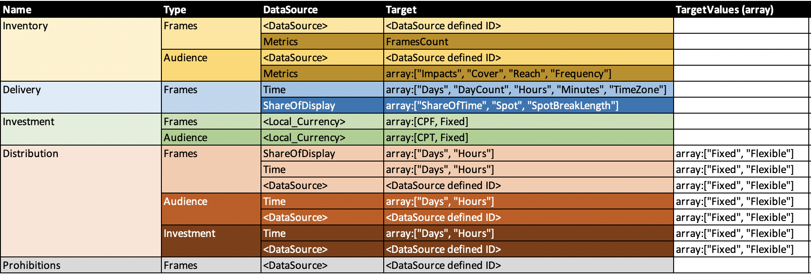
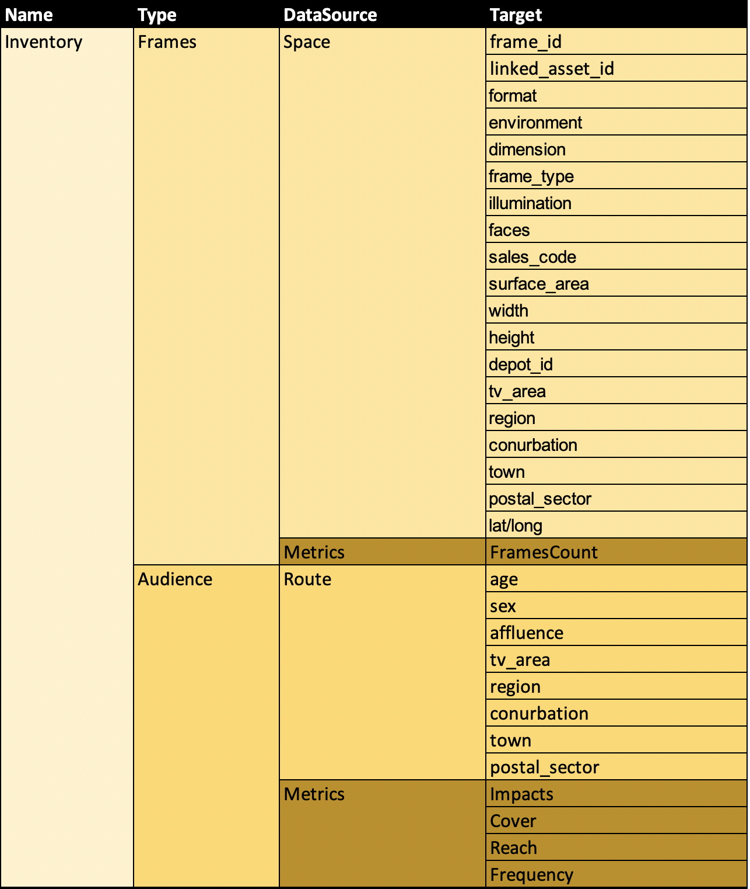
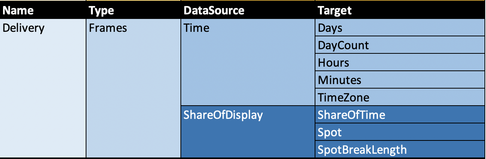
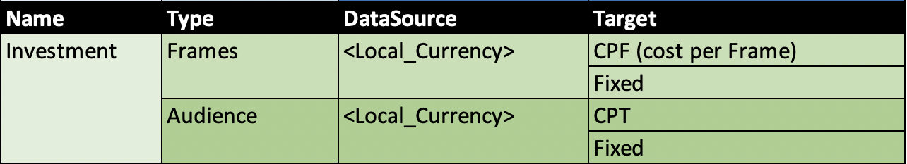
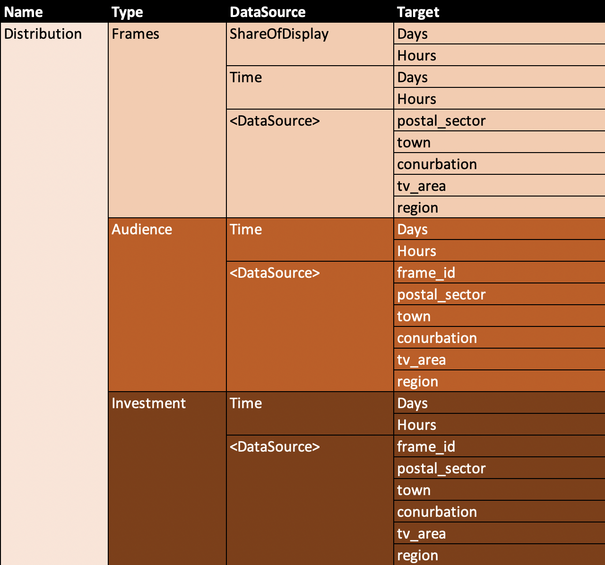
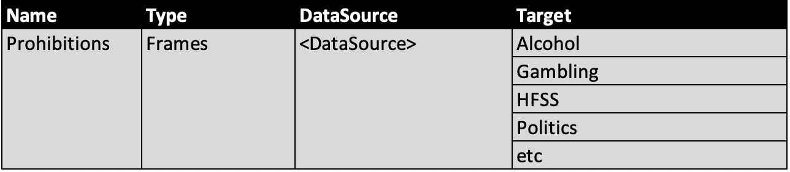

# **OpenDirect Specification v2.1**
# *** Under Review July2023 ***

**About the IAB Technology Lab**


The IAB Technology Laboratory (Tech Lab) is a non-profit research and development consortium that produces and provides standards, software, and services to drive growth of an effective and sustainable global digital media ecosystem. Comprised of digital publishers and ad technology firms as well as marketers, agencies, and other companies with interests in the interactive marketing arena, IAB Tech Lab aims to enable brand and media growth via a transparent, safe, effective supply chain, simpler and more consistent measurement, and better advertising experiences for consumers, with a focus on mobile and TV/digital video channel enablement. The IAB Tech Lab portfolio includes the DigiTrust real-time standardized identity service designed to improve the digital experience for consumers, publishers, advertisers, and third-party platforms.  Board members include AppNexus, ExtremeReach, Google, GroupM, Hearst Digital Media, Integral Ad Science, Index Exchange, LinkedIn, MediaMath, Microsoft, Moat, Pandora, PubMatic, Quantcast, Telaria, The Trade Desk, and Yahoo! Japan. Established in 2014, the IAB Tech Lab is headquartered in New York City with an office in San Francisco and representation in Seattle and London.

Learn more about IAB Tech Lab here: [www.iabtechlab.com](https://www.iabtechlab.com) 

**License**

OpenDirect Specification the IAB Tech Lab is licensed under a Creative Commons Attribution 3.0 License. To view a copy of this license, visit [creativecommons.org/licenses/by/3.0/](http://creativecommons.org/licenses/by/3.0/) or write to Creative Commons, 171 Second Street, Suite 300, San Francisco, CA 94105, USA.


# Table of Contents

- [OVERVIEW](#overview)
    - [OpenDirect](#opendirect)
    - [What’s New in Version 2.0](#whats_new)
    - [OpenMedia Mission](#openMedia_mission)
    - [OpenMedia Layers](#openmedia_layers)
- [INTRODUCTION](#introduction)
    - [How it works](#how_it_works)
    - [Authorization](#authorization)
- [SPECIFICATION](#specification)
    - [Object:  Account](#object_account)   
    - [Object:  AdUnit](#object_adunit)
    - [Object:  Address](#object_address)
    - [Object: AdvertiserBrand](#object_advertiserbrand)
    - [Object:  Assignment](#object_assignment)
    - [Object:  ChangeRequest](#object_changerequest)
    - [Object:  Contact](#object_contact)
    - [Object:  Creative](#object_creative)
    - [Object:  Line](#object_line)
    - [Object:  Message](#object_message)
    - [Object:  ProductTargeting](#object_producttargeting)
    - [Object:  Order](#object_order)
    - [Object:  Organization](#object_organization)
    - [Object:  Placement](#object_placement)
    - [Object:  Product](#object_product)
    - [Object:  ProductsAvailsSearch](#object_productavailssearch)
    - [Object:  Avails](#object_avails)
    - [Object:  ProductAvailability](#object_productavailability)
    - [Object:  ProductTargeting](#object_producttargeting)
    - [Object:  ProviderData](#object_providerdata)
    - [Object:  Stats](#object_stats)
    - [Object: EID](#object_eid)
    - [Object: TPID](#object_tpid)
    - [Collection Objects](#collection_objects)
    - [General Support Requirements](#general_support_requirements)
    - [Authentication](#authentication)
    - [Versioning](#versioning)
    - [HTTP Error Codes/Error Handling](#http_error_codes)
    - [Error Response](#error_response)
    - [Data Format](#data_format)
    - [Paging Query Parameters](#paging_query_parameters)
    - [Custom Headers](#custom_headers)
- [INTERFACES](#interfaces)
    - [URI Summary Table](#uri_summary_table)
    - [Path:  Accounts](#path_accounts)
    - [Path:  Accounts Assignments](#path_accounts_assignments)
    - [Path:  Accounts Creatives](#path_accounts_creatives)
    - [Path:  Accounts Orders](#path_accounts_orders)
    - [Path:  Accounts Orders Lines](#path_accounts_orders_lines)
    - [Path:  Organizations](#path_organizations)
    - [Path:  Products](#path_products)
    - [Path:  Accounts Change Requests](#path_accounts_change_requests)
    - [Path:  Accounts Change Requests Lines](#path_accounts_change_requests_lines)
    - [Path:  Account Messages](#path_accounts_messages)
- [WORKFLOW](#workflow)
    - [Onboarding a Provider](#onboarding_a_provider)
    - [Adding an Agency Organization](#adding_an_agency_organization)
    - [Adding an Advertiser Organization](#adding_an_advertiser_organization)
    - [Getting an OAuth 2.0 Access Token](#getting_an_oauth_2.0_access_token)
    - [Adding an Account](#adding_an_account)
    - [Get Product Inventory, Availability and Pricing](#get_product_inventory_availability_and_pricing)
    - [Creating an Order](#creating_an_order)
    - [Adding Lines to the Order](#adding_lines_to_the_order)
    - [Uploading a Creative and Assigning It to a Placement](#uploading_a_creative_and_assigning_i_to_a_placement)
    - [Reserving, Booking, and Canceling a Line](#beserving_booking_and_canceling_a_line)
    - [Diagrams](#diagrams)
    - [ProductTargeting for Physical Media](#producttargetingdetails)

# OVERVIEW <a name="overview"></a>

## OpenDirect <a name="opendirect"></a>
OpenDirect enables publishers to offer premium inventory using a programmatic interface that
partners and vendors build according to the OpenDirect specifications.

Every organization in the industry uses some kind of interface (or a combination thereof) to
manage inventory throughout the buying and selling of premium, reserved inventory. Each
system is different, which means if one partner wants to integrate their system with another
system, the integration is customized to that system. Further integrations all require
customization, each instance consuming valuable overhead. While the overhead enables more
business, cutting down on the cost of these integrations allows resources to be diverted to more
important ad operations tasks.

OpenDirect provides a standard way for publishers to make their inventory available in any
OpenDirect-compliant interface where agencies and advertisers can reserve premium inventory.

For publishers, this means that in a programmatic marketplace, publishers can make premium
guaranteed inventory available to more buyers. Tech providers can offer a greater variety of
premium inventory to their customers. For the industry, a marketplace that uses OpenDirect
means more fluid movement of inventory while greatly reducing the overhead involved when
integrating with partners.

Adoption of OpenDirect also opens the doorway to improved tracking of inventory across
systems, providing early visibility reporting and potentially reducing discrepancies down the
road. While OpenDirect does not directly enable improved impression counting between parties,
it does lay the foundation for opportunities to improve impression reporting between systems.

Publishers can begin using OpenDirect by modifying their systems to log Organizational IDs and
accounts consistent with the specs in this document. They also need to be able to respond to
API requests for inventory details as well as manage inventory in response to API requests.

Tech providers who want to use OpenDirect need to make use of the API in this spec as they
design and build their interfaces for offering automated guaranteed inventory.

As OpenDirect becomes more adopted in the marketplace, the movement of premium inventory
becomes more fluid.

## What’s New in Version 2.0 <a name="whats_new"></a>

OpenDirect 1.0 was released in January 2015. While a handful of companies have already started adopting the API, more features are needed to encourage wider adoption.

Version 1.5
added  more context, clarification, bug fixes, and feature updates

Version 2.0
Adopts the OpenMedia/AdCOM object definitions for consistency between protocols in addition to a basic messaging protocol for communication between buyers and sellers.

## OpenMedia Mission <a name="openmedia_mission"></a>


The mission of the OpenMedia project is to spur growth in programmatic marketplaces by providing open industry standards for communication between buyers of advertising and sellers of publisher inventory.  There are several aspects to these standards including but not limited to real-time bidding, ad and creative management, information taxonomies, and many more.

Over recent years, multiple IAB standards have reached considerable levels of success in the industry.  OpenMedia is the umbrella that pulls these standards into a coherent landscape and in doing so, it has become clear that there are many core concepts that are overlapping from these multiple specifications.  This document presents a standard that formalizes these common concepts for reuse by other standards so that they can focus on their distinctiveness and practitioners can find it easier to build systems that use multiple aspects of OpenMedia.

## OpenMedia Layers <a name="openmedia_layers"></a>

To assist in reuse of objects across different specifications and to enable specifications to evolve at different paces, a layered approach is being adopted.  Expressed informally, Layer-1 moves bytes among parties, Layer-2 expresses the language of these bytes, Layer-3 specifies a transaction using this language, and Layer-4 describes the concepts being transacted.


Given this layered concept, the IAB Tech Lab has defined an overall organization of related specifications as "OpenMedia".  The landscape of these specifications and how they may be organized into protocol layers is illustrated as follows.


There are a number of objects that are common to multiple transaction specifications. For example, both OpenRTB and OpenDirect share a common concept of a “site”, a “placement”, an “ad”, and other so-called domain objects. These objects describe the subject of a transaction; those concepts upon which the transaction operates. Factoring them into their own model enables multiple transaction protocol specifications to reuse these common objects rather than each of them redefining similar but needlessly different versions of core concepts.

# INTRODUCTION <a name="introduction"></a>

The OpenDirect API provides a standard way for publishers to integrate with tech provider
partners so that they can offer premium guaranteed inventory programmatically. Using the API,
buyers can build one system that can access inventory from multiple publishers without custom
integrations for each one.

Some of the features supported in OpenDirect are:
* Searching product inventory
* Determining price and availability
* Applying targeting and frequency constraints
* Creating orders and adding lines
* Uploading creative and assigning creative to lines
* Reserving and booking inventory
Additional features are added with each new update to further enable wider adoption and
support the needs of the industry.

## How it works <a name="how_it_works"></a>
At a high level, the workflow involves establishing a relationship between buyer and publisher,
setting up accounts, and placing orders on the buyer side while publisher systems respond to
API requests for order placement.

The following table outlines general steps for using the API:

| Buy Side | Sell Side |
| ---|--- |
| **1. Establish a relationship** <br />In order to buy inventory with publishers using OpenDirect systems, buyers must first obtain an ID from the publisher that can be used in any OpenDirect system for as long as you do business with the publisher. | **1. Establish a relationship** <br />To protect your premium inventory, buyers must first obtain an ID from you. This ID can be used in any OpenDirect system for as long as you maintain a business relationship with the buyer.|
| **2. Set up** <br />Buyers use with their publisher-obtained IDs and accounts to begin browsing inventory and placing orders. | **2. Set up** <br />Publishers create accounts for buyers to access in any OpenDirect system which the publisher has a working relationship. |
| **3. Place Orders** <br />After establishing accounts in the system, buyers can begin browsing publisher inventory and adding lines to orders. | **3. Respond to API Requests** <br />Once buyers are set up in their OpenDirect system(s), they can begin browsing and booking inventory. On the publisher side, this is received as API requests that publisher systems must respond to. |
| **4. Submit Creative and Book Inventory** <br />Once desired order is established, buyers can submit creative for approval using the OpenDirect system for approval. Once approved, the order can be booked to run. | **4. Test Creative and Approve Inventory** <br />Buyers can submit creative using the OpenDirect system. Once tested and approved, you can book the order to run. |


## Authorization <a name="authorization"></a>
The OpenDirect API is a RESTful API that supports paging query parameters and uses OAuth to authenticate users.

OpenDirect users include:  
* **Organization:** All organizations that work with the publisher must obtain an Organization ID, whether they are a buyer, or a brand advertiser.  
* **Buyer:** The buyer is the organization that places orders and usually represents an agency acting on behalf of the advertiser, or the advertiser that places orders directly. If the buyer represents advertisers, the buyer must obtain formal consent for acting on behalf of the advertiser and provide proof of that consent to the publisher.
* **Advertisers:** Advertisers represent the brands that purchase publisher inventory for advertising their brands. An advertiser may also be a buyer, but if the advertiser works with a buyer, the advertiser must provide formal consent to allow the buyer to act on its behalf. The Advertiser ID can be used to set up advertiser accounts in an agency or publisher’s OpenDirect system.
* **Intermediary:** An intermidiary is a non-advertiser organization upon who's behalf an order is being placed (e.g. a group media agency).


# SPECIFICATION <a name="specification"></a>


## Object: Account <a name="object_account"></a>

An account defines a buyer-advertiser relationship. A buyer is typically an agency that places orders on behalf of several advertisers. Each account associates a buyer with one advertiser and is used to manage orders for one publisher. An advertiser may also work with several buyers, and therefore, advertisers have a separate account for each buyer they work with. If an advertiser represents itself, the account identifies the advertiser as both the buyer and the advertiser.

Before an agency may create accounts and perform buys on behalf of the advertiser, the advertiser must give permissions to the agency. The process of giving or removing permissions is publisher-defined. Creating an account must fail if the advertiser has not given the agency permissions.

The Account owns the orders and creative.


|Attribute|Description|Type|
|---|---|---|
|**id*** | A system-generated opaque ID that uniquely identifies this resource.| string _(36)_ |
|**advertiserid***|An Id that identifies the organization that is acting as the advertiser. <p> Advertiser ID may be generated by the buyer (agency) or by the publisher if the advertiser is also the buyer. <p>An advertiser that is representing itself must have an AdvertiserId and BuyerId that match.|string _(36)_ |
|**buyerid*** |An Id that identifies the organization that is acting as the buyer. The Publisher generates the BuyerId. If the advertiser is performing their own buys, AdvertiserId and BuyerId must be the same.|string _(36)_ |
|**intermediaryid** |An ID that identifies the organization upon who's behalf an Order is being placed (e.g. a group media agency).|string _(36)_ |
|**name***|The name of the account. Used for display purposes. |string _(255)_ |
|**status** | A value that indicates the current state of the Account. The following are the possible values.<br>• Pending – The account is yet to be approved; however, the buyer may create a draft order and have the ability to reserve this order at the publishers discretion.<br>• Approved – The account is approved and can be used for trading.<br>• Disapproved – The account’s identity could not be verified. The account may not create and book orders. <br>  | enum (Pending, Approved, Disapproved)| 
|**ext**|Optional vendor-specific extensions. |ext object|

_* required_


## Object:  AdUnit <a name="object_adunit"></a>
Ad Unit contains exactly one AdCOM Ad Specification


|Attribute|Description|Type|
|---|---|---|
|**id***|An Id to uniquely identify this Ad Unit within the product|string _(36)_|
|**name** |A name to identify this Ad Unit |string _(255)_ |
|**spec*** |The technical specifications of this Ad Unit|[AdCOM **Placement** object](https://github.com/InteractiveAdvertisingBureau/AdCOM/blob/master/AdCOM%20v1.0%20FINAL.md#object_placement)


_* required_


## Object:  Address <a name="object_address"></a>

The address object is used to provide values for the [ORGANIZATION](#object:_organization) resource.


|Attribute|Description|Type|
|---|---|---|
|**city*** |The city name of an organization or contact for which this address is associated.|string _(255)_ |
|**country***|Country of the Organization |string _(255)_ |
|**addressline1***|The first line of the address of an organization or contact for which this address is associated. |string _(255)_ |
|**addressline2** |The optional second line of the address. |string _(255)_ |
|**postalcode**|The postal or ZIP code for the address. |string _(15)_ |
|**state** |The state or province for the address. |string _(36)_ |

_* required_


## Object: AdvertiserBrand <a name="object_advertiserbrand"></a>

Defines the details of a Brand associated with an organization

| Attribute            | Description                                                     | Type         |
| -------------------- | --------------------------------------------------------------- | ------------ |
| **id***                   | A system-generated opaque ID that uniquely identifies the brand | String (255) |
| **name***                 | The brand's display name                                        | String (255) |
| **organizationid***       | The ID of the organization that owns the brand                  | String (36)  |
| **eids**                | array of extended ids (EID) that detail third party datasources and ids that may be referenced to identify the AdvertiderBrand to the buyer                       | Array                                  |


## Object:  Assignment <a name="object_assignment"></a>
Defines an Assignment resource. An Assignment associates a creative with a line of the order. A creative may be assigned to one or more lines and a line may be assigned one or more creative.

Notes: The assignment must fail if the following are true.
- The language property for the creative does not match any of the languages in the language property for the product (products are defined in the LINE resource for an Order).
- The specified maturity level property for the creative does not match the maturity level property for the product specified in the LINE resource.

|Attribute|Description|Type|
|---|---|---
|**id** |A system-generated opaque ID that uniquely identifies this resource.|string _(36)_ |
|**creativeid***|The ID of the creative to display when the line runs.|string _(36)_ |
|**placementid***|The ID of the placement that will display the creative.|string _(36)_ |
|**status**|A value that determines whether the creative serves.<p>The status may not transition from Inactive to Active.|enum (Active, Inactive)
|**weight** |Determines how much the creative is displayed relative to the other creative assigned to the same line.<p>To provide even rotation, do not specify a weight.<p>If weight is specified, all assignments that specify the same line must specify a weight and the weight of all the assignments must add up to 100. If the weight of all assignments does not add up to 100, even rotation is applied.<p>Assignments with heavier weight get proportionally more rotation compared to those with lesser weight.<p>For example, if the line has 2 creative, A and B, assigned with the same dates, and A has weight 25 and B has weight 75, B will serve three times as often as A.| integer (1-100)
|**producttargeting**|Object that assigns creative to play at the right place at the right time |producttargeting array|
|**ext**|Optional vendor-specific extensions. |ext object|
_* required_


## Object:  ChangeRequest <a name="object_changerequest"></a>
When an order has already been placed and a change is needed, the ChangeRequest resource can be used to request a change and subsequently modify the order pending the approval of the change request.

The OrderSearch object can be used to search for orders that have an order status of “ChangePending.”

|Attribute|Description|Type|
|---|---|---|
|**id**|A system-generated opaque ID that uniquely identifies this resource.|string _(36)_ |
|**accountid***|The ID of the account that identifies the advertiser and buyer that own the Change. This must be the same as the AccountId for the Order.|string _(36)_ |
|**comments**|Optional comments as to why the Change is being requested/proposed. |string _(1000)_ |
|**contacts**|The list of contacts to use for this change. This list of contacts is in addition to the buyer’s and advertiser’s list of contacts.<p>The list must contain unique contact types (for example, only one billing contact).|[CONTACT](#object_contact) array
|**orderid***|The ID of the Order that the Change is Requested for.| string _(36)_ |
|**lineid**|The ID of the Line in the Order that the Change is Requested for (if the Change Request is needed at line level)| string _(36)_ |
|**requesterid***|The OrganisationID of the Change Requester usually the AgencyID if the change was requested by an Agency or the PublisherID if the change was requested by the Vendor. | string _(36)_ |
|**providerdata**|The ProviderData object is used for buyers to detail structured information that may be used to identify their order in a seller's system using their own IDs or references. |object|
|**status**|Specifies the Status of the Change Request. |enum (PENDING, APPROVED, REJECTED)
|**webhook**|URI which is called when the change is approved, rejected or modified by the Seller.<p>URI is called with a PUT request containing the Change Request ID. | string _(36)_ |
|**ext**|Optional vendor-specific extensions. |ext object|
_* required_


## Object:  Contact <a name="object_contact"></a>
Defines an agency or advertiser contact.

|Attribute|Description|Type|
|---|---|---|
|**address** |Required if TYPE is Billing and the preferred billing method for the organization or order is paper.|[ADDRESS object](#object_address)
|**email** |The contact’s email address.<p>Required if TYPE is Billing and the preferred billing method for the organization or order is electronic. |string _(255)_ |
|**honorific** |Honorific such as Mr. or Ms. |string _(20)_|
|**fax** |The contact’s fax number. |string _(20)_|
|**firstname***|The contact’s first name. |string _(20)_|
|**lastname*** |The contact’s last name. |string _(20)_|
|**phone** |The contact’s phone number |string _(20)_|
|**title** |The contact’s job title. |string _(30)_|
|**type** |Defines the possible types of Contacts.|enum (Billing, Buyer, Creative, Sales)|
_* required_

## Object:  Creative <a name="object_creative"></a>
Defines a Creative resource. The Creative provides information about the ad to be displayed for a line of the order. Creative are assigned to the [LINE](#object_line) resource of an order using the [ASSIGNMENT](#object_assignment) resource.

See Assignment for instructions on updating a creative.

|Attribute|Description|Type|
|---|---|---|
| **accountid*** | The ID of the account that owns the creative. |string _(36)_|
| **name** | Name used to identify this Creative |string _(255)_|
| **ad** | The metadata and content of this creative Ad|[AdCOM **Ad** object](https://github.com/InteractiveAdvertisingBureau/AdCOM/blob/master/AdCOM%20v1.0%20FINAL.md#object_ad)|
| **creativeapprovals** | Any array of pairs describing the approval status for each publisher in the form PublisherId : Status where the approval status is either:<p>- PENDING<p>- APPROVED<p>- REJECTED | Key/Value array |
|**ext**|Optional vendor-specific extensions. |ext object|
_* required_


## Object:  Line <a name="object_line"></a>
Line resources are included in an order and provide details about the product being booked, status, start and end dates, and other settings for the order item.

Creative are assigned to the [LINE](#object_line) resource of an order using the [ASSIGNMENT](#object_assignment) resource.

_Notes: The user may update a line only if it’s in the Draft state. If the line is in the Reserved or Declined state, the user may call Reset to move the line back to the Draft state in order to update the line._


|Attribute|Description|Type|
|---|---|---|
|**id** |A system-generated opaque ID that uniquely identifies this resource.|string _(36)_ |
|**name***|The line’s display name. <p>Should be unique.|string _(200)_ |
|**orderid***|The ID of the order that this line belongs to.|string _(36)_ |
|**productid***|The ID of the product where the creatives run.|string _(36)_ |
|**bookingstatus***| A value that determines whether the line is booked and is capable of delivering ads. If the line is reset, the StateChangeReason should be cleared.|enum (Draft, PendingReservation, Reserved, PendingBooking, Booked, InFlight, Finished, Stopped, Canceled, Pause, Expired, Declined, ChangePending)
|**statechangereason** |The reason why the state was changed by the publisher. <p>The reason must be specified if:<p>- The publisher declined the booking or reservation.<p>- The publisher or user canceled the flight.|string
|**startdate***|The date and time that the line will start.<p>If the time is missing, 12:00 AM (midnight) is assumed.<p>The date and time must be greater than or equal to now and should be greater than or equal to the order’s start date.<p>If the line start date is earlier than the order’s start date, the order’s start date should be moved to match the line’s start date. Both dates must be later than the present day.<p>Start dates that are in the past may not be updated.|string (date-time)
|**enddate***|The date and time that the line will stop.<p>If the time is missing, 11:59:59 PM is assumed.<p>The line end date must be later than the line start date and should be less than or equal to the order’s end date.<p>If the line end date is later than the order’s end date, the order’s end date should be extended to match the line’s end date.|string (date-time)
|**ratetype***|Defines a unit of measure that a cost (i.e. BasePrice) is expressed in. The API may support all or a subset of the specified values.|enum (CPM, CPMV, CPC, CPD, FlatRate)
|**rate***|The price per unit of impressions. For example, $10 per 1,000 impressions (CPM).<p>The rate is determined each time the line is saved (added, updated, booked, or reserved).<p>Value in currency for the order.|number
|**quantity***|The quantity requested for the specified date range. This value will differ based on various cost types. For CPM, for examples, the value would be impressions.<p>The line must contain a quantity before the user may reserve or book it. If the requested quantity is not available, reserving or booking the line must fail and bookingStatus must be set to Declined.|integer
|**cost***|The projected cost of the line is based on the specified quantity, rate and targeting. The actual cost (the amount billed) is based on the actual number of impressions.<p>The cost is specified in the currency for the order. If the order uses a different currency than what the product uses, the cost for the line must be converted to the order’s currency.<p>The cost is determined at the time the line is saved with the following statuses: Drafted, Reserved, or Booked.|number
|**comment** |User notes related to this line. |string _(255)_ |
|**frequencycount** |The maximum number of times that a unique user must see ads from this line during the specified interval (see FrequencyInterval).|integer
|**frequencyinterval**|Defines the frequency cap intervals that the API supports.<p>The frequency interval specifies the units in which the frequency count is expressed. For example, if a line’s frequency count is 2 and interval is Day, display the ad to the same user a Max 2 times in the same calendar day.|enum (Day, Month, Week, Hour, LineDuration)
|**reservedexpirydate** |The date and time that the reserved inventory will expire.<p>If the line is reserved, the expiry date must be set.|string (date-time)
|**targeting**|The creative assigned to the LINE resource is display when the line includes user segments and the delivery engine can determine whether the user matches the specified segments.|[AdCOM **Segment** object](https://github.com/InteractiveAdvertisingBureau/AdCOM/blob/master/AdCOM%20v1.0%20FINAL.md#object_segment) array |
|**producttargeting**|Array of objects used to determine product availability.|producttarget array |
|**providerdata**|The ProviderData object is used for buyers to detail structured information that may be used to identify their order in a seller's system using their own IDs or references. |object|
|**pmp** | | |
|**ext**|Optional vendor-specific extensions. |ext object|
_* required_

## Object:  Message <a name="object_message"></a>

Mesages are used for communication between a buyer are a seller around an Order or Change request


|Attribute|Description|Type|
|---|---|---|
|**id** |A system-generated opaque ID that uniquely identifies this resource.|string _(36)_
|**sender** |The sender of the message| [Contact](#object_contact) object |
|**recipient**|The intended recipient of the message|[Contact](#object_contact) object |
|**messagedate** |Time and date the mesage was sent|string (date-time)
|**status***|The status of the message|enum (New, Read, Deleted)
|**orderid** |The Id to the Order that this message is in relation to|string _(36)_
|**lineids** |Array of LineIds that this message is in relation to|string array
|**changerequestid** |The Id to the Change Request that this message is in relation to|string _(36)_
|**message** |The text of the message | string _(1024)_
|**replytomessageid** |Id of the message that this message is in reply to| string _(36)_
|**replywebhook** |URI which is called when there is a reply to this message.<p>URI is called with a PUT request containing the new MessageId in a JSON object. |string _(1024)_
|**ext**|Optional vendor-specific extensions. |ext object|
_* required_
    

## Object:  Order <a name="object_order"></a>
The Order resource specifies the plan’s start and end dates, estimated budget, currency, and preferred billing method for all line items in the order.

To specify the individual line item details of the order, use the [LINE](#object_line) resource.


|Attribute|Description|Type|
|---|---|---|
|**id** |A system-generated opaque ID that uniquely identifies this resource.| string _(36)_
|**name*** |The order’s display name.<p>Must be unique within the account’s list of orders.|string _(100)_
|**accountid*** |The ID of the account that identifies the advertiser and buyer that own the order.|string _(36)_
|**publisherid*** |The Id of the Publisher providing this Order| string _(36)_
|**brand** |A descriptive name for the brand being advertised. |string _(25)_
|**currency*** |The publisher may enforce that all lines of the order specify products that use the same currency.<p>Uses ISO-4217 currency codes|string _(3_)
|**budget** |The order’s estimated budget. The budget is directional; it is not used to limit the amount of money that the order spends. To determine the projected spend based on quantity, aggregate the Cost property for each line of the order.|number
|**orderstatus*** |Specifies the Status of the Order.|enum (PENDING, APPROVED, REJECTED)
|**packageonly** |Identifies whether the order is only available as a package or if specific items can be separated from the inventory.<p> A value of TRUE means the inventory is only available as a package.<p> A value of FALSE allows the buyer to select specific items from inventory.|boolean
|**preferredbillingmethod** |The preferred billing method for this order.<p>The default is Electronic.<p>If the billing contact is not specified in the order, the billing contact comes from buyer’s list of contacts.|enum (Electronic, Postal)
|**providerdata**|The ProviderData object is used for buyers to detail structured information that may be used to identify their order in a seller's system using their own IDs or references. |object|
|**advertiserbrand***|identification of the brand being advertised by the advertiser organisation |object|
|**startdate** |The date and time that the order will start. The start date is directional and may be updated by the publisher to match the earliest start date found in the order’s list of lines.<p>If the time is missing, 12:00 AM is assumed.<p>When creating the order, the date and time must be greater than or equal to now.<p>Start dates that have past may not be updated.|string (date-time)
|**enddate** |The date and time that the order will end. The end date is directional and may be updated by the publisher to match the latest end date found in the order’s lines.<p>If the time is missing, 11:59:59 PM is assumed.<p>The end date must be later than the start date.<p>End dates that have past cannot be updated.|string (date-time)
|**orderexpirydate**|The date and time for when the order expires. Publisher will only hold inventory up until the date and time indicated.|string (date-time)
|**contacts** |The list of contacts to use for this order. This list of contacts is in addition to the buyer’s and advertiser’s list of contacts.<p>The list must contain unique contact types (for example, only one billing contact).| [Contact](#object_contact) array
|**ext**|Optional vendor-specific extensions. |ext object|

_* required_


## Object:  Organization <a name="object_organization"></a>

The organization resource may represent an advertiser or agency (buyer). The Account determines the role that the organization plays by using the organization ID in place of the BuyerId or AdvertiserId. The organization’s role may vary by account. For example, the organization may be an advertiser in one account and a buyer in another. An advertiser may create one or more organizations to meet their business needs. For example, they may create a single organization and then create accounts for each brand, subsidiary, or division. Or, they may create an organization for each brand. It is up to the advertiser to determine how they use Organization and Account to meet their organizational needs.

A publisher may also create an organization for itself for the purpose of requesting a change to an order. To identify a publisher for a change request, the organization ID is supplied as the RequesterId for the ChangeRequest resource.

|Attribute|Description|Type|
|---|---|---|
|**id**|A system-generated opaque ID that uniquely identifies this resource.| string _(36)_
|**address** | The primary address of the organization|[Address](#object_address) object
|**contacts** |A list of one or more contacts within the organization. The list must contain unique contact types (for example, only one billing contact). At least one billing contact is required.|[Contact](#object_contact) array
|**disapprovalreason**|The reason why the organization was not registered. Must be specified if Status is Disapproved. |string _(255)_
|**fax**|The organization’s fax number. |string _(20)_
|**cat**|
|**name*** |The organization’s display name.<p>Cannot be an empty string. Must be unique. |string _(120)_
|**phone** |The organization’s phone number. |string _(20)_
|**status*** |A value that indicates the current state of the approval process. <p>The approval process confirms the organization’s identity. |enum (Pending, Approved, Disapproved, Limited)
|**organizationtype***| The core activity that an organisation undertakes as a business e.g. Advertiser, Intermediary or Agency| enum (advertiser, intermediary, agency)      |
| **eids**                | array of extended ids (EID) that detail third party datasources and ids that may be referenced to identify the organization to the buyer                       | Array                                  |
|**url** |A URL to the organization’s website. |string _(1024)_
|**ext**|Optional vendor-specific extensions. |ext object|
_* required_

## Object:  Placement <a name="object_placement"></a>
The Placement resource is usd to store the specifications for an individual AdUnit for a Line


|Attribute|Description|Type
|---|---|---|
|**id** |A system-generated opaque ID that uniquely identifies this resource.|string _(36)_
|**lineid*** |The Id of the line the placement belongs to|string _(36)_
|**adunitid*** |The Id of the Ad unit this placement is for|string _(36)_
|**spec** |The technical specifications for this line.<p>If empty, the technical specifications for the Ad Unit are used|[AdCOM **Placement** object](https://github.com/InteractiveAdvertisingBureau/AdCOM/blob/master/AdCOM%20v1.0%20FINAL.md#object_placement)|
|**ext**|Optional vendor-specific extensions. |ext object|
_* required_


## Object:  Product <a name="object_product"></a>
A Product resource identifies anything from an ad placement to a Run of Network product in the publisher’s product catalog. Values for all supported fields are provided by the publisher.

|Attribute|Description|Type
|---|---|---|
|**id*** |A system-generated opaque ID that uniquely identifies this resource.| string _(36)_
|**publisherid*** |The Id of the Publisher providing this Product|string _(36)_
|**name** |The product’s display name.<p>The name must be unique.|string _(100)_
|**description** |The product’s description. |string _(255)_
|**activedate** |The date and time, in UTC, that the product may become part of the bookable inventory.|string (date-time)
|**allownocreative** |A Boolean value that indicates whether line items assigned to this order may be booked before creative is assigned.<p> A value of TRUE allows lines to be booked without creative assigned.<p> Default value is FALSE and prevents lines from being booked when no creative is assigned.|boolean
|**currency*** |Identifies the currency for BasePrice and MinSpend.<p>Using ,ISO-4217 currency code|string _(3)_
|**baseprice*** |The product’s base retail price; this is not the rate card price.<p>The actual price may be more if targeting is specified.|number
|**deliverytype** |Defines the possible types of delivery.<br>• Exclusive – 100% share of voice.<br>• Guaranteed – Guaranteed delivery of all booked display and/or impressions<br>• Non-Guaranteed - Non-Guaranteed delivery of all booked display and/or impressions<br>| enum (exclusive, guaranteed, non-guaranteed)
|**estdailyavails** |An estimated range of available daily impressions.<p>The ranges should be of the form: Thousands, Tens of Thousands, Hundreds of Thousands, and so on.|string
|**domain** |Common definition for a domain name.| string _(1024)_
|**icon** |URL to a thumbnail icon of the product. May be used to display next to the product in the product catalog.<p>Publishers should support icons that are 150x150 or less. The maximum size is 10 KB.|string _(1024)_
|**languages** |A list of creative languages that the product supports from ISO-639-1|string array
|**leadtime** |The number of days (n) from today that a line that reference this product can begin running; the line’s start date must be equal to or later than today + n.|integer
|**minspend** |The minimum order value of this Product in the specified currency|number
|**minflight**|The minimum number of days that the product must be booked for. The line must enforce the duration.|integer
|**maxflight**|The maximum number of days that the product may be booked for. The line must enforce the duration.|integer
|**producttags**|List of tags used for searching the product catalog.| string  array
|**ratetype***|Defines a unit of measure that a cost (i.e. BasePrice) is expressed in. The API may support all or a subset of the specified values.|enum (CPM, CPMV, CPC, CPD, FlatRate)
|**adunit** | Details of the Ad Units comprising this Product | [AdUnit](#object_adunit) array
|**alladunits** |Describes whether all child Ad Units are severed together as a group or just one of the Ad Units is served|integer
|**retirementaate** |The date and time, in UTC, that the product may be removed from the bookable inventory.|string (date-time)
|**tz** |The time zone that the product runs in.|string
|**url** |A URL to the specification that describes the creative requirements.|string
|**context** |Indicates the type of content being used or consumed by the user in which ads may appear. This table has values derived from the TAG Inventory Quality Guidelines (IQG). | [AdCOM **Context** Object](https://github.com/InteractiveAdvertisingBureau/AdCOM/blob/master/AdCOM%20v1.0%20FINAL.md#list--content-contexts-)|
|**source** |This object describes the nature and behavior of the entity that is the source of the bid request upstream from the exchange. The primary purpose of this object is to define post-auction or upstream decisioning when the exchange itself does not control the final decision. A common example of this is header bidding, but it can also apply to upstream server entities such as another RTB exchange, a mediation platform, or an ad server combines direct campaigns with 3rd party demand in decisioning.|[OpenRTB Source](https://github.com/InteractiveAdvertisingBureau/openrtb2.x/blob/main/2.6.md#3222---object-segment-)
|**pmp** |This object is the private marketplace container for direct deals between buyers and sellers that may pertain to this Product|[OpenRTB PMP](https://github.com/InteractiveAdvertisingBureau/openrtb2.x/blob/main/2.6.md#3211---object-pmp-)
|**producttargeting** | Array of producttargeting objects used to describe the product inventory and sales rules                                                                                  | producttargeting object |
|**availsgroupby** | Array of producttargeting objects that describe the grouped fields that that the Availability data can be returned in                                                                                  | producttargeting object |
|**reservedexpirytime** | Defines the day of the week and time of day that represents the cut off point for expiry of a Line for the Product when it is “reserved”. | Date                    |
|**advertiseridaccess**| List of AdvertiserIDs with access to this Product. NULL = all accounts can access this product.                                           | Array                   |
|**buyeridaccess**| List of BuyerIDs with access to this Product. NULL = all accounts can access this product.                                                | Array                   |
|**intermediaryidaccess**| List of IntermediaryIDs with access to this Product. NULL = all accounts can access this product.                                           | Array                   |
|**ext**|Optional vendor-specific extensions. |ext object|
_* required_


## Object: ProductAvailsSearch <a name="object_productavailssearch"></a>

Defines search criteria used for requesting product availability and pricing within the given search criteria. 

| Attribute          | Description                                                                                                                                                      | Type               |
| ------------------ | ---------------------------------------------------------------------------------------------------------------------------------------------------------------- | ------------------ |
| **productids**         | A list of IDs that identify the products on which to get availability and pricing information                                                                    | Array              |
| **targeting**          | The segments to target. For example, behavioral, age, and gender segments.                                 | [AdCOM **Segment** object](https://github.com/InteractiveAdvertisingBureau/AdCOM/blob/master/AdCOM%20v1.0%20FINAL.md#object_segment) array |
| **producttargeting**          | The Inventory, Delivery, Investement and Distribution ProductTargeting objects to be targeted for the availability request                                             | producttargeting object array |
| **accountid**          | The ID of the account that identifies the buyer, advertiser and any other stakeholders                                                                           | String(36)         |
| **currency**           | The currency used to specify Price. Currency is set for the PRODUCT resource specified in section 2.7 and uses CURRENCY reference data specified in section 4.6. | Max 3 Char         |
| **advertiserbrandid**  | An ID that uniquely identifies the Brand being advertised                                                                                                        | String (36)        |
| **availabilityfields** | Defines the ProductTargeting object metrics that availability is returned as                                                                                                    | producttargeting object array |
| **grouping**           | Defines the ProductTargeting object metrics that the availability output is grouped as                                                                                           | producttargeting object array |
| **startdate**          | The desired start date for inventory delivery                                                                                                                    | ISO-8601           |
| **enddate**            | The desired end date for inventory delivery                                                                                                                      | ISO-8601           |


## Object: Avails <a name="object_avails"></a>

Defines the response to a request for product availability and pricing information at product Level

| Attribute    | Description                                                                                                                                                      | Type                    |
| ------------ | ---------------------------------------------------------------------------------------------------------------------------------------------------------------- | ----------------------- |
| **productid**    | ID that identifies the product for which availability and pricing information is provided                                                                        | String(36)              |
| **accountid**    | The ID of the account that identifies the buyer, advertiser and any other stakeholders.                                                                          | String(36)              |
| **availability** | The quantity available for booking for the specified date range. Availability for a given date range may vary. In order for products to be returned in a PRODUCT AVAILS SEARCH, product availability must be equal to or less than the value provided in the Quantity property of the PRODUCT AVAILS SEARCH object. For example, if Quantity is set to 500,000 in PRODUCT AVAILS SEARCH, impression availability for the product must be at least 500,000. However, if only 250,000 impressions are available, the product is not returned. Publishers may set an artificial limit on the maximum number of available impressions. If the quantity field in PRODUCT AVAILS SEARCH is not provided, all products matching other criteria are returned showing maximum availability.                                | Integer                 |
| **productavailability** | An object that groups the inventory availbility into Available, Partially Available and Unavailable arrays of ProductTargeting objects                                | productavailability Object                  |
| **currency**     | The currency used to specify Price. Currency is set for the PRODUCT resource specified in section 2.7 and uses CURRENCY reference data specified in section 4.6. | String (3) \[ISO-4217\] |
| **pric**e        | The product’s price                                                                                                                  | Decimal                 |
| **startdate**          | The requested start date for inventory delivery                                                                                                                    | ISO-8601           |
| **enddate**            | The requested end date for inventory delivery                                                                                                                      | ISO-8601           |


## Object: ProductAvailability <a name="object_productavailability"></a>

An object that groups the inventory availbility into Available, Partially Available and Unavailable arrays of producttargeting objects

| Attribute | Description                                                                                                                                               | Type   |
| --------- | --------------------------------------------------------------------------------------------------------------------------------------------------------- | ------ |
| **status**    | Summary definition of the inventory described in the Targeting Array as <ul><li>Available</li><li>Partially Available</li><li>Unavailable</li></ul> | String |
| **reason**    | State the reason if Partially Available or Unavailable from the list <ul><li>Booked</li><li>Optioned</li><li>Excluded</li><li>OutOfCharge</li><li>Prohibited</li><li>Manual Trade Only</li><li>InvalidPeriodLength</li><li>InvalidFrameID</li><li>InvalidBudget</li><li>InvalidPrice</li><li>ClientDuplication</li><li>LocationDuplication</li><li>LocationJuxta</li></ul>| String |
| **comment**   | Free text for an availability comment                                                                                                                     | String |
| **context**   | Array of ProductTargeting objects describing the context of any Partially Available or Unavailable status e.g. this could be a frame that is causing a duplication error | Object |
| **producttargeting** | Array of ProductTargeting objects describing the inventory that is at Available,  Partially Available or Unavailable status                                               | Object |

## Object:  ProductTargeting <a name="object_producttargeting"></a>
    
OpenDirect (and OpenRTB) trades with real time Audience impressions, whereas physical media such as Out-Of-Home can be sold in the wider dimensions of time, share of time, location and audience.

Physical media manifests itself as display of the advert on a 'frame' at a defined location and time which then gives an audience in the vicinity of that event an opportunity to see the advertising.

The producttargeting object is used to discover and target the real-life dimensional aspect of physical media. Full details on the use of the ProductTargeting object can be found in the section [ProductTargeting for Physical Media](#producttargetingdetails)

| Attribute    | Description                                                                                                                                                                                                                                                                                                                                                                                                                                                                                                                                                                                                                                                                                                             | Type                                                               |
| ------------ | ----------------------------------------------------------------------------------------------------------------------------------------------------------------------------------------------------------------------------------------------------------------------------------------------------------------------------------------------------------------------------------------------------------------------------------------------------------------------------------------------------------------------------------------------------------------------------------------------------------------------------------------------------------------------------------------------------------------------- | ------------------------------------------------------------------ |
| name         | The key objects for describing physical media campaigns and products are:<br>• Inventory: What a media owner / publisher sells in terms of Audience or Frames.<br>• Delivery: How adverts are displayed from a start and end time, and the share of that display time.<br>• Distribution: How the adverts are distributed across the times and locations booked by audience and/or investment.<br>• Investment: How the campaign is quantified for trading purposes (Fixes price, Cost Per Thousand Audience, Cost Per Frame).<br>• Prohibitions: Information about any brand safety prohibitions that will affect the playout of certain brand types in certain locations e.g. fast food prohibitions on certain locations. | enum (Inventory, Delivery, Distribution, Investment, Prohibitions) |
| type         | How the producttargeting is being quantified:<br>• Frames<br>• Audience<br>• Investment                                                                                                                                                                                                                                                                                                                                                                                                                                                                                                                                                                                                                                         | enum (Frames, Audience, Investment, Total)                         |
| datasource   | The identification and inclusion of third party data sources into the schema, which both buyside and sell side may use to describe and discover their available Inventory, location and audiences in accordance with the third party schema                                                                                                                                                                                                                                                                                                                                                                                                                                                                | String (255)                                                       |
| target       | Description of the producttargeting Metric                                                                                                                                                                                                                                                                                                                                                                                                                                                                                                                                                                                                                                                                                      | String (255)                                                       |
| targetvalues | Array of one or more values                                                                                                                                                                                                                                                                                                                                                                                                                                                                                                                                                                                                                                                                                             | String (255) Array                                                              |
| selectable   | Defines whether a Buyer can select from the given list of targetvalues or whether the targetvalues are fixed                                                                                                                                                                                                                                                                                                                                                                                                                                                                                                                                                                                                            | Boolean                                                            |
| count        | Count of targetvalues                                                                                                                                                                                                                                                                                                                                                                                                                                                                                                                                                                                                                                                                                                   | number                                                             |
| minimum      | Defines the minimum number of targetvalues that must be selected                                                                                                                                                                                                                                                                                                                                                                                                                                                                                                                                                                                                                                                        | number                                                             |
| maximum      | Defines the maximum number of targetvalues that must be selected                                                                                                                                                                                                                                                                                                                                                                                                                                                                                                                                                                                                                                                        | number                                                             |
| increment    | Defines the increments that are permitted for the targeting values                                                                                                                                                                                                                                                                                                                                                                                                                                                                                                                                                                                                                                                      | number                                                             |
| default      | Defines the default targetvalues(s) that are selected if the Buyer does not specify any TargetValue(s) or the target is not selectable                                                                                                                                                                                                                                                                                                                                                                                                                                                                                                                                                                                   | String (255) or Number                                             |


## Object:  ProviderData <a name="object_providerdata"></a>

The ProviderData object is used for Buyers to detail information that may be used to identify their order in a Seller&#39;s system using their own IDs or references. This would be mainly used for manually identifying orders in the event of the automated process needing manual intervention.

At Order level, ProviderData is generated by the buyer when the order is created. At Line level, ProviderData created by the buyer when Line is created. Both objects can then be updated by the Buyer via a change request.

If the Seller has their own commercial rules that requires a Order and/or Line to have a Purchase Order Number attached to make a booking, the Sell Side can send an explicit error response if the buyer tries to book without a Purchase Order Number.

It is proposed that a Seller should publish such commercial rules in a text file accessible via the Collection Objects facility e.g. call URI / collectionobjects/businessrules

| Attribute            | Description                                                                                                                                                                                                                                                                                                                                          | Type         |
| -------------------- | ---------------------------------------------------------------------------------------------------------------------------------------------------------------------------------------------------------------------------------------------------------------------------------------------------------------------------------------------------- | ------------ |
| campaignid           | Provided by the Buyer to uniquely identify the Advertising Campaign for which the Order is being placed                                                                                                                                                                                                                                              | String (255) |
| campaignname         | A descriptive name provided by the Buyer which is associated with the Advertising Campaign for which the Order is being placed                                                                                                                                                                                                                       | String (255) |
| ponumber             | Provided by Buyer as a reference to be used by Buyers for any offline contact related to the Order                                                                                                                                                                                                                                                   | String (255) |
| salesorderreference  | Provided by the Media Owner as a reference to be used by Buyers for any offline contact related to the Order                                                                                                                                                                                                                                         | String (255) |
| barterorganizationid | The OrganizationID of a Barter Company can be added here to flag a Barter transaction                                                                                                                                                                                                                                                                | String (255) |
| other                | An opaque CLOB of provider-defined data. Providers may use this field as needed (for example, to store an ID that correlates this object with resources within their system). Note that any provider that edits this object may override the data in this field. The data should include a marker that you can identify to ensure the data is yours. | CLOB (10000) |    


## Object:  Stats <a name="object_stats"></a>
The Stats resource contains reporting data about a Line.


|Attribute|Description|Type|
|---|---|---|
|**reportdate**|A system-generated opaque ID that uniquely identifies this resource.|string _datetime_ |
|**impressions**| The number of impressions served to date.<p />The value must be zero if no impressions have been served | integer
|**clicks**|The number of clicks to date. The value must be zero if no clicks have occurred.| integer
|**ctr**|The click through rate to date. The formula to calculate CTR is (clicks / impressions) x 100 | number
|**spend**|The amount spent to date. | number
|**frame_id**                | The Publisher Frame ID                                                                                                                                                                                                            | String (128)             |
|**player_ref**               | The MAC Address or other reference uniquely identifying a digital player or frame                                                                                                                                                 | Max length 32 characters |
|**spot_start_utc**           | The UTC start time of the spot.                                                                                                                                                                                                   | ISO-8601                 |
|**spot_start_tz**            | Time zone offset for the spot start time (e.g. +01:00 for BST; Z or :00:00 can be used for GMT.)                                                                                                                                  | ±hh:mm<br>Z              |
|**spot_end_utc**             | The UTC end time of the spot.                                                                                                                                                                                                     | ISO-8601                 |
|**spot_end_tz**              | Time zone offset for the spot end time. (e.g. +01:00 for BST; Z or :00:00 can be used for GMT.)                                                                                                                                   | ±hh:mm<br>Z              |
|**spot_length**              | Spot Length in milliseconds.                                                                                                                                                                                                      | number                   |
|**share_of_time**            | Share of time. This must be provided for scrollers, but its presence is not policed by Playout. Media Owners must determine when this must be supplied.                                                                           | number (decimal)         |
|**creative_id**              | Media Owner-defined creative identifier.                                                                                                                                                                                          | String (64)              |
|**creative_name**            | Creative title, to assist with reporting. Usually a filename.                                                                                                                                                                     | String (128)             |
|**third_party_creative_ref** | Creative reference provided by a third-party such as the creative agency. This might be a URL or a GUID, for example.                                                                                                             | String (128)             |
|**creative_trigger_event**   | The creative trigger event, indicating what prompted the given creative to be used.                                                                                                                                               | String (64)              |
|**media_owner_playout_ref**  | Media Owner-defined reference representing this record. For the Media Owner, this should uniquely identify this record across all time. (Note that records supplied by other Media Owners may happen to use the same ID however.) | String (48)              |

## Object: EID <a name="object_eid"></a>

Extended identifiers support in the OpenDirect specification allows buyers to use third party identifiers in ther trading process. This object can contain one or more TPIDs from a single source or a technology provider. The publisher should ensure that business agreements allow for the sending of this data.


<table>
  <tr>
    <td><strong>Attribute&nbsp;&nbsp;&nbsp;&nbsp;&nbsp;&nbsp;&nbsp;&nbsp;</strong></td>
    <td><strong>Type&nbsp;&nbsp;&nbsp;&nbsp;&nbsp;&nbsp;&nbsp;&nbsp;&nbsp;&nbsp;&nbsp;&nbsp;&nbsp;&nbsp;&nbsp;&nbsp;&nbsp;&nbsp;&nbsp;&nbsp;</strong></td>
    <td><strong>Description</strong></td>
  </tr>
  <tr>
    <td><code>source</code></td>
    <td>string</td>
    <td>Source or technology provider responsible for the set of included IDs. Expressed as a top-level domain.</td>
  </tr>
  <tr>
    <td><code>name</code></td>
    <td>string</td>
    <td>Name of Source or technology provider responsible for the set of included IDs.</td>
  </tr>
  <tr>
    <td><code>tpids</code></td>
    <td>object array</td>
    <td>Array of third party IDs <code>TPID</code> objects from the given source. Refer to 3.11 Extended Identifier UIDs</td>
 </tr>
  <tr>
    <td><code>ext</code></td>
    <td>object</td>
    <td>Placeholder for exchange-specific extensions to OpenDirect.</td>
     </td>
     </td>
  </tr>
</table>


## Object: TPID <a name="object_tpid"></a>

This object contains a single third party identifier provided as part of extended identifiers. The publisher should ensure that business agreements allow for the sending of this data.


<table>
  <tr>
    <td><strong>Attribute&nbsp;&nbsp;&nbsp;&nbsp;&nbsp;&nbsp;&nbsp;&nbsp;</strong></td>
    <td><strong>Type&nbsp;&nbsp;&nbsp;&nbsp;&nbsp;&nbsp;&nbsp;&nbsp;&nbsp;&nbsp;&nbsp;&nbsp;&nbsp;&nbsp;&nbsp;&nbsp;&nbsp;&nbsp;&nbsp;&nbsp;</strong></td>
    <td><strong>Description</strong></td>
  </tr>
  <tr>
    <td><code>id</code></td>
    <td>string</td>
    <td>The identifier for the Third Party.</td>
  </tr>
  <tr>
    <td><code>ext</code></td>
    <td>object</td>
    <td>Placeholder for specific extensions to this object.</td>
     </td>
     </td>
  </tr>
</table>


# Collection Objects <a name="collection_objects"></a>

For GET calls that return a collection of resources, such as /accounts/{id}/orders, the response must be an object that contains an array of the requested resources. The array must be named according to the type of resource it contains. The following table identifies the property name that must be used for each collection call.

| Call | Property Name | Resource |
| ---- | ------------- | -------- |
| /organizations<br />/organizations?$filter | organizations | Organization |
| /advertiserbrands<br />/advertiserbrands?$filter | advertiserbrands | AdvertiserBrand |
| /accounts<br />/accounts?$filter | accounts | Account |
| /accounts/{id}/assignments<br />/accounts/{id}/assignments?$filter | assignments | Assignment |
| /accounts/{id}/creatives<br />/accounts/{id}/creatives?$filter | creatives | Creative_Assignment |
| /accounts/{id}/orders<br />/accounts/{id}/orders?$filter | orders | Order_Campaign_Assignment |
| /accounts/{id}/orders/{id}/lines<br />/accounts/{id}/orders/lines?$filter | lines | Lines_Assignment |
| /accounts/{id}/orders/{id}/lines/{id}/placements<br />/accounts/{id}/orders/lines{id}/placements?$filter | placements | Placement_Assignment |
| /products<br />/products/search (POST) | products | Product_Assignment |
| /products/avails (POST) | avails | ProductAvails_Assignment

The following shows an example response for _**/accounts**_.
```json
{
    "Accounts":[
        {
            "AdvertiserId": "B7EBC7F3-­‐FBB3-­‐4250-­‐99F1-­‐8D001088434B",
            "AgencyId":"4AA837B7-­‐1A27-­‐421E-­‐9DDD-­‐CAEF1AE884B5",
            "Id":"9B0878BE-­‐7254-­‐49BE-­‐AFD4-­‐B0A67C7C3D26"
        },
        {
            "AdvertiserId":"16B55667-­‐37CF-­‐4447-­‐A79D-­‐88E6DAC4D7C2",
            "AgencyId":"4AA837B7-­‐1A27-­‐421E-­‐9DDD-­‐CAEF1AE884B5",
            "Id":"EAC93F5D-­‐F448-­‐44D6-­‐8333-­‐4E530D14C9DA"
        }
    ]
}
```
The collection object may include additional publisher-defined properties.

If there are no resources to return, the array must be empty.


# General Support Requirements <a name="general_support_requirements"></a>
OpenDirect-compliant systems must support the following:

## Authentication <a name="authentication"></a>
Publishers must support authenticating advertiser and agency users. Publishers must use OAuth 2.0 for user authentication. Publishers must support the implicit and authorization code grant flows.

Each request must include an AccessToken header that is set to the user’s access token. If the token is not valid, the request must fail with HTTP status code 401 Unauthorized. 

## Versioning <a name="versioning"></a>
Versioning occurs at the API level and is URI based. All services that make up the API must use the same version number. The version may fall anywhere in the path before the resource and must have the form vn, where n is a positive integer. For example, in the URI https://\<host\>/api/v1/accounts/{id}, v1 indicates version 1 of the API.

## HTTP Error Codes/Error Handling <a name="http_error_codes"></a>
The publisher must support the following HTTP status codes.

| Status Code | Description |
| ----------- | ----------- |
| **200 Ok** | Return for a successful GET, POST, PUT, or PATCH request. |
| **400 Bad Request** | Return for a POST, PUT or PATCH request that contains invalid data, or when the requested action (i.e. book) is not valid.<p />The response must include the reasons for the error. For details, see _**Error Response**_. |
| **401 Unauthorized** | Return if the user is not authorized to make the request. |
| **404 Not found** | Return if the requested resource is not found. |
| **500 Internal server error** | Return for server-related errors. |

The API may support the following HTTP status codes.

| Status Code | Description |
| ----------- | ----------- |
| **302 Found** |  Return if the resource has moved. The Location header must include the new URI. |
| **304 Not modified** |  Return for requests that include the If-None-Match header (to support ETags) and the resource has not changed. |
| **412 Precondition failed** | Return for requests that include the If-Match header (to support ETags) and the resource has changed. |

## Error Response <a name="error_response"></a>

If the request generates a 400 Bad Request status code, the response must contain a collection object; the collection object must contain a single field named errors. The value of errors is an array of one or more error objects. The following table defines the properties of the error object.

| Property | Type | Required/Optional | Description |
| -------- | ---- | ----------------- | ----------- |
| **ErrorCode** | String | Required | A symbolic string constant that identifies the error. |
| **Context** | Dictionary\<string,object\> | Optional | A list of Publisher-defined key/value pairs that provide additional context about the error. For example, an ID that identifies a log entry. |
| **Link** | String | Optional | A URL to additional help text that may help the caller solve the issue. |
| **ErrorMessage** | String | Required | A string that describes the error that occurred.

The following shows the body of an example error response.
```json
{
    "errors": [
        {
            "context": {"logId":"123abc"},
            "message": "The requested impressions are not available.",
            "errorCode": "ImpressionsNotAvailable",
            "link": "https:\\<host>\help\impressions.aspx"
        },
        {
            "context": {},
            "message": "",
            "errorCode": "",
            "link": ""
        }
    ]
}
```

## Data Format <a name="data_format"></a>

Supported mime type: _**application/json**_

## Paging Query Parameters <a name="paging_query_parameters"></a>
For any resource that returns lists of data, these resources should support paging. Two resource parameters—count and offset—will be required in order to support paging. If the parameters aren’t included, the total number of available data might not be returned.

* **count**: Indicates the number of desired records to be returned in the response.
* **offset**: Indicates the starting point from which the number of records should be returned in the response. If you wish to start with the first record, you must provide 0. Always use the number prior to the record position that is desired.

For example, you have 100 records and wish to return 25 per page, you would specify it this way:
* count= 25, offset 0
* count= 25, offset 25
* count= 25, offset 50
* count= 25, offset 75

Recommended Count Limit: _**250**_

## Custom Headers <a name="custom_headers"></a>

When using paging, the consumer may need to know how many total records there are so this should be part of the response. There are two options here. One would be to return the total count in an outer json object to the request. The other is to use a custom header. The custom header is preferable because it does not become part of the model represented by the json. The con is, many frown upon custom headers.

Header Name: _**X-Total-Count**_


# INTERFACES <a name="INTERFACES"></a>

## URI Summary Table <a name="uri_summary_table"></a>

| Resource | URI | Verbs | Required |
| -------- | --- | ----- | -------- |
| Account | /accounts | GET, POST | Yes |
| Account | /accounts/{id} | GET | Yes |
| Account | /accounts?$filter= | GET | Yes |
| Assignment | /accounts/{id}/assignments | GET, POST | Yes |
| Assignment | /accounts/{id}/assignments/{id} | GET, PUT or<br />PATCH, DELETE | Yes |
| Assignment | /accounts/{id}/assignments/{id}?disable | PUT or PATCH | Yes |
| Assignment | /accounts/{id}/assignments?$filter= | GET | No |
| Creative | /accounts/{id}/creatives | GET, POST | Yes |
| Creative | /accounts/{id}/creatives/{id} | GET, PUT or<br />PATCH, DELETE | Yes |
| Creative | /accounts/{id}/creatives?$filter= | GET | No |
| Order | /accounts/{id}/orders | GET, POST | Yes |
| Order | /accounts/{id}/orders{id} | GET, PUT or<br />PATCH, DELETE | Yes |
| Order | /accounts/{id}/orders?$filter= | GET | YES |
| Line | /accounts/{id}/orders/{id}/lines | GET, POST | Yes |
| Line | /accounts/{id}/orders/{id}/lines/{id} | GET, PUT or<br />PATCH, DELETE | Yes |
| Line | /accounts/{id}/orders/{id}/lines/{id}?book | PUT or PATCH | Yes |
| Line | /accounts/{id}/orders/{id}/lines/{id}?reserve | PUT or PATCH | Yes
| Line | /accounts/{id}/orders/{id}/lines/{id}?cancel | PUT or PATCH | Yes
| Line | /accounts/{id}/orders/{id}/lines/{id}?reset | PUT or PATCH | Yes
| Organizations | /organizations | GET, POST | Yes |
| Organizations | /organizations/{id} | GET, PUT or<br />PATCH, DELETE | Yes |
| Organizations | /organizations?$filter= | GET | No |
| Products | /products | GET | Yes |
| Products | /products/{id} | GET | Yes |
| Products | /products/search | POST | Yes |
| Products | /products/avails | POST | Yes |
| ChangeRequest | /accounts/{id}/changerequest | GET, POST | Yes |
| ChangeRequest | /accounts/{id}/changesrequests/{id} | GET, PUT or<br />PATCH, DELETE | Yes |
| ChangeRequest | /accounts/{id}/changerequest?$filter= | GET | Yes |
| ChangeRequest | /accounts/{id}/changesrequests/{id}/approve | PUT | Yes |
| ChangeRequest | /accounts/{id}/changesrequests/{id}/reject | PUT | Yes |
| ChangeRequestLine | /accounts/{id}/changesrequests/{id}/lines | GET, POST | Yes |
| ChangeRequestLine | /accounts/{id}/changesrequests//lines/{id} | GET, PUT or<br />PATCH | Yes |
| ChangeRequestLine | /accounts/{id}/changesrequests//lines?$filter= | GET | Yes |


## Path:  Accounts <a name="path_accounts"></a>
The account resource associates an organization ID for a buyer with an organization ID for an advertiser. Account URIs enable account creation and account search.

### /accounts ###
Adds an Account or gets a list of accounts that the user has access to. The response must support pagination. See Paging Query Parameters.

#### Verbs ####

* **GET**: Gets a list of all accounts.
* **POST**: Adds an account.

#### Rules ####
An advertiser or agency may add accounts to only the organization they own; an agency may not add accounts to an advertiser’s organization. If an advertiser wants an agency to manage an account on their behalf, the advertiser must add the account and set the account’s BuyerId to the agency’s organization ID.

An organization may add as many accounts as needed to create a buying structure that supports their needs. For example, the organization may create a single account, an account for each region, an account for each brand, and so on.

For an advertiser, the list of accounts will include only accounts that they own. However, for an agency, the list of accounts will include the accounts that they own and the accounts that they manage on behalf of advertisers.

#### Example POST Request #####
```json
POST https://<host>/<path>/<version>/accounts HTTP/1.1
Content-Type: application/json
AccessToken: <OAuth token>
{
    "advertiserid":"1234987",
    "buyerid":"34587",
    "intermediaryid":"9876543",
    "name":"Brand A"
}
```

#### Example POST Response ####
```json
HTTP/1.1 200 OK
Location: https://<host>/<path>/<version>/accounts/23873345
Content-Type: application/json
Content-Length: 379
{
    "advertiserid":"1234987",
    "buyerid":"34587",
    "intermediaryid":"9876543",
    "name":"Brand A",
    "status":"approved",
    "id":"23873345"
}
```


#### Example GET Request ####
```json
GET https://<host>/<path>/<version>/accounts HTTP/1.1
Accept: application/json
AccessToken: <OAuth token>
```


#### Example GET Response ####
```json
HTTP/1.1 200 OK
Content-Type: application/json
Content-Length: 187
{
    "accounts":[
        {
            "advertiserid":"1234987",
            "buyerid":"1234987",
            "name":"Brand B",
            "status":"pending",
            "id":"9876542"
        },
        {
            "advertiserid":"1234987",
            "buyerid":"34587",
            "intermediaryid":"9876543",
            "name":"Brand A",
            "status":"approved",
            "id":"23873345"
        }
    ]
}
```

### /accounts/{id} ###
Gets the specified Account.

#### Verb ####
* **GET**: Gets the specified account.

#### Rules ####
The user must have permissions to perform the requested action. For example, advertisers and agencies may get the accounts that they own. In addition, an agency may get the accounts that they manage on behalf of advertisers.

#### Example GET Request ####
```json
GET https://<host>/<path>/<version>/accounts/23873345 HTTP/1.1
Accept: application/json
AccessToken: <OAuth token>
```

#### Example GET Response ####
```json
HTTP/1.1 200 OK
Content-Type: application/json
Content-Length: 187
{
    "advertiserid":"1234987",
    "buyerid":"34587",
    "intermediaryid":"9876543",
    "name":"Brand A",
    "status":"approved",
    "id":"23873345"
}
```

### /accounts?$filter= ###
The response must support pagination. See Paging Query Parameters.

#### Verb ####
* **GET**: Gets a list of accounts that match the specified filter criteria. The user may use filter expressions with any of the Account properties:
    * AdvertiserId
    * BuyerId
    * intermediaryid
    * name
    * status
    * id

May also support getting a list of IDs.

#### Rules ####
Only an advertiser or a buyer who own the accounts can issue the request. User should be able to filter the accounts by any of the fields or field values of the owned account. Logical AND/OR condition of the fields may be allowed.

#### Example Request ####
```json
GET https://<host>/<path>/<version>/accounts?name=*Brand*  HTTP/1.1
Accept: application/json
AccessToken: <OAuth token>
```

#### Example Response ####
```json
HTTP/1.1 200 OK
Content-Type: application/json
Content-Length: 187
{
    "Accounts":[
        {
            "advertiserid":"1234987",
            "buyerid":"1234987",
            "name":"Brand B",
            "status":"pending",
            "id":"9876542"
        },
        {
            "advertiserid":"1234987",
            "buyerid":"34587",
            "intermediaryid":"9876543",
            "name":"Brand A",
            "status":"approved",
            "id":"23873345"
        }
    ]
}
```

## Path:  Accounts Assignments <a name="path_accounts_assignments"></a>

Account assignments associate a creative with a line.

### /accounts/{id}/assignments ###

Adds an Assignment or gets a list of assignments that the user has access to.

#### Verbs ####
* **GET**: Gets a list of all assignments that belong to the account.

* **POST**: Adds an assignment to the specified account. To add an assignment, the creative must be approved. An assignment may be added at any time prior to the order finishing its flight.

#### Rules ####
An advertiser or agency may add assignments to accounts that they own. In addition; an agency may add assignments to accounts that they manage on behalf of advertisers.

For advertisers, the list will include only assignments that they own. For agencies, the list will include the assignments that they own and the assignments that belong to accounts that they manage on behalf of advertisers.

#### Example POST Request ####
```json
POST https://<host>/<path>/<version>/accounts/23873345/assignments HTTP/1.1
Content-Type: application/json
AccessToken: <OAuth token>
{
    "creativeid":"394857",
    "placementid":"394578",
    "weight":75,
    "producttargeting": [
        {
            "name": "inventory",
            "type": "frames",
            "dataSource": "Space",
            "target": "tv_area",
            "targetvalues": [
                "North East"
            ]
        },
        {
            "name": "delivery",
            "type": "frames",
            "datasource": "time",
            "target": "days",
            "targetvalues": [
                "1",
                "2",
                "3",
                "8",
                "9",
                "10"
            ]
        }
    ]
}
```

#### Example POST Response ####
```json
HTTP/1.1 200 OK
Location: https://<host>/<path>/<version>/accounts/23873345/assignments/34534
Content-Type: application/json
Content-Length: 689
{
    "creativeid":"394857",
    "placementid":"394578",
    "weight":75,
    "producttargeting": [
        {
            "name": "inventory",
            "type": "frames",
            "dataSource": "Space",
            "target": "tv_area",
            "targetvalues": [
                "North East"
            ]
        },
        {
            "name": "delivery",
            "type": "frames",
            "datasource": "time",
            "target": "days",
            "targetvalues": [
                "1",
                "2",
                "3",
                "8",
                "9",
                "10"
            ]
        }
    ],
    "id":"34534",
    "status":"Active"
}
```

#### Example GET Request ####
```json
GET https://<host>/<path>/<version>/accounts/23873345/assignments HTTP/1.1
Accept: application/json
AccessToken: <OAuth token>
```

#### Example GET Response ####
```json
HTTP/1.1 200 OK
Content-Type: application/json
Content-Length: 1171
{
    "assignments":[
        {
            "creativeid":"394857",
            "placementid":"394578",
            "weight":75,
            "producttargeting": [
                {
                    "name": "inventory",
                    "type": "frames",
                    "dataSource": "Space",
                    "target": "tv_area",
                    "targetvalues": [
                        "North East"
                    ]
                },
                {
                    "name": "delivery",
                    "type": "frames",
                    "datasource": "time",
                    "target": "days",
                    "targetvalues": [
                                "1",
                                "2",
                                "3",
                                "8",
                                "9",
                                "10"
                    ]
                }
            ],
            "id":"34534",
            "status":"Active"
        },
        {
            "creativeid":"54345",
            "placementid":"394578",
            "id":"453365",
            "status":"Active"
        }
    ]
}
```

### /accounts/{id}/assignments/{id} ###
Gets, updates, or deletes the specified Assignment.

#### Verbs ####
* **GET**: Gets the specified assignment.
* **PUT** or **PATCH**: Updates the specified assignment.
* **DELETE**: Deletes the specified assignment. May delete an assignment only if it has never delivered impressions.

#### Rules ####
The user must have permissions to perform the requested action. For example, advertisers and agencies may get, update, and delete the assignments that they own. In addition, an agency may get, update, and delete assignments that belong to the accounts that they manage on behalf of advertisers.

An assignment may be deleted only if it has never delivered impressions.

#### Example GET Request ####
```json
GET https://<host>/<path>/<version>/accounts/23873345/assignments/453365 HTTP/1.1
Accept: application/json
AccessToken: <OAuth token>
```

#### Example GET Response ####
```json
HTTP/1.1 200 OK
Content-Type: application/json
Content-Length: 108
{
    "creativeid":"54345",
    "placementid":"394578",
    "id":"453365",
    "status":"Active"
}
```
#### Example PATCH Request ####
```json
PATCH https://<host>/<path>/<version>/accounts/23873345/assignments/34534 HTTP/1.1
Content-Type: application/json
AccessToken: <OAuth token>
{
    "weight":80
}
```

#### Example PATCH Response ####
```json
HTTP/1.1 200 OK
Content-Type: application/json
Content-Length: 689
{
    "creativeid":"394857",
    "placementid":"394578",
    "weight":80,
    "producttargeting": [
        {
            "name": "inventory",
            "type": "frames",
            "dataSource": "Space",
            "target": "tv_area",
            "targetvalues": [
                "North East"
            ]
        },
        {
            "name": "delivery",
            "type": "frames",
            "datasource": "time",
            "target": "days",
            "targetvalues": [
                "1",
                "2",
                "3",
                "8",
                "9",
                "10"
            ]
        }
    ],
    "id":"34534",
    "status":"Active"
}
```

### /accounts/{id}/assignments/{id}?disable ###
Prevents a creative from running or stops a creative that is currently running.

#### Verbs ####
* **PUT** or **PATCH**: Changes the status to “Inactive.”

#### Rules ####
The user must have permissions to access the assignment. For example, advertisers and agencies may disable Assignments that they own. In addition, an agency may disable assignments that belong to the accounts that they manage on behalf of advertisers.

#### Example Request ####
```json
PATCH https://<host>/<path>/<version>/accounts/23873345/assignments/453365?disable HTTP/1.1
Content-Type: application/json
AccessToken: <OAuth token>
```

#### Example Response ####
```json
HTTP/1.1 200 OK
Content-Type: application/json
Content-Length: 108
{
    "creativeid":"54345",
    "placementid":"394578",
    "id":"453365",
    "status":"Inactive"
}
```

### /accounts/{id}/assignments?$filter= ###

Gets a list of Assignments that match the specified filter criteria.

#### Verb ####
* **GET**: The response must support pagination. See Paging Query Parameters. The user may use filter expressions with any of the Assignment properties:
    * creativeid
    * placementid
    * status
    * weight
    * producttargeting


#### Rules ####
The user must have permissions to access the assignment. For example, advertisers and agencies may get assignments that they own. In addition, an agency may get assignments that belong to the accounts that they manage on behalf of advertisers.

#### Example GET Request ####
```json
GET https://<host>/<path>/<version>/accounts/23873345/assignments?placementid=394578 HTTP/1.1
Accept: application/json
AccessToken: <OAuth token>
```

#### Example GET Response ####
```json
HTTP/1.1 200 OK Content-Type: application/json
Content-Length: 1171
{
    "assignments":[
        {
            "creativeid":"394857",
            "placementid":"394578",
            "weight":75,
            "producttargeting": [
                {
                    "name": "inventory",
                    "type": "frames",
                    "dataSource": "Space",
                    "target": "tv_area",
                    "targetvalues": [
                        "North East"
                    ]
                },
                {
                    "name": "delivery",
                    "type": "frames",
                    "datasource": "time",
                    "target": "days",
                    "targetvalues": [
                                "1",
                                "2",
                                "3",
                                "8",
                                "9",
                                "10"
                    ]
                }
            ],
            "id":"34534",
            "status":"Active"
        },
        {
            "creativeid":"54345",
            "placementid":"394578",
            "id":"453365",
            "status":"Active"
        }
    ]
}
```


## Path:  Accounts Creatives <a name="path_accounts_creatives"></a>

Account creative hold all creative for the advertiser identified for an account. These creative can be assigned to one or more lines for one or more orders under the account using the assignment object.

### /accounts/{id}/creatives

Adds a Creative or gets a list of creatives that the user has access to. The response must support pagination. See Paging Query Parameters.

#### Verbs

* **GET**: (required) Gets a list of all creatives that belong to the account.
* **POST**: (required) Adds a creative to the account.

#### Rules

An advertiser or agency may add creatives to accounts that they own. In addition; an agency may add creatives to accounts that they manage on behalf of advertisers.

For advertisers, the list will include only creatives that they own. For agencies, the list will include the creatives that they own and the creatives that belong to accounts that they manage on behalf of advertisers.

#### Example POST Request

```json
POST https://<host>/<path>/<version>/accounts/23873345/creatives HTTP/1.1 Content-Type: application/json
AccessToken: <OAuth token>
{
  "accountid":"23873345",
  "name":"My Creative",
  "ad" : {
      "adomain": [ "somebuyer.com" ],
      "secure": 1,
      "display": {
          "mime": "image/jpeg",
          "ctype": 3,
          "w": 300,
          "h": 250,
          "banner": {
              "img": "https://somebuyer.com/cretive",
              "link": {
                  "url": "https://somebuyer.com/click"
              }
          },
          "event": [
              {
                  "type": 1,
                  "method": 1,
                  "url": "https://somebuyer.com/pixel"
              }
          ]
      }
  },
  "creativeapprovals": {
      "987654": "Approved",
      "987655": "Rejected"
  }
}
```

#### Example POST Response

```json
HTTP/1.1 200 OK
Location: https://<host>/<path>/<version>/accounts/23873345/creatives/53444
Content-Type: application/json Content-Length: 108

{
  "id":"53444",
  "accountid":"23873345",
  "name":"My Creative",
  "ad" : {
      "adomain": [ "somebuyer.com" ],
      "secure": 1,
      "display": {
          "mime": "image/jpeg",
          "ctype": 3,
          "w": 300,
          "h": 250,
          "banner": {
              "img": "https://somebuyer.com/cretive",
              "link": {
                  "url": "https://somebuyer.com/click"
              }
          },
          "event": [
              {
                  "type": 1,
                  "method": 1,
                  "url": "https://somebuyer.com/pixel"
              }
          ]
      }
  },
  "creativeapprovals": {
      "987654": "Approved",
      "987655": "Rejected"
  }
}
```
#### Example GET Request

```json
GET https://<host>/<path>/<version>/accounts/23873345/creatives HTTP/1.1 Accept: application/json
AccessToken: <OAuth token>
```

#### Example GET Response

```json
HTTP/1.1 200 OK Content-Type: application/json Content-Length: 187
{
  "creatives":[
    {
    "id":"53444",
    "accountid":"23873345",
    "name":"My Creative",
    "ad" : {
        "adomain": [ "somebuyer.com" ],
        "secure": 1,
        "display": {
            "mime": "image/jpeg",
            "ctype": 3,
            "w": 300,
            "h": 250,
            "banner": {
                "img": "https://somebuyer.com/cretive",
                "link": {
                    "url": "https://somebuyer.com/click"
                }
            },
            "event": [
                {
                    "type": 1,
                    "method": 1,
                    "url": "https://somebuyer.com/pixel"
                }
            ]
        }
    },
    "creativeapprovals": {
        "987654": "Approved",
        "987655": "Rejected"
    }
    }
  ]
}
```

### /accounts/{id}/creatives/{id}

Gets, updates, or deletes the specified Creative.

#### Verbs

* **GET**: (required) Gets the specified creative.
* **PUT** or **PATCH**: (required) Updates the properties of the creative object; however, the user may not update the following properties:

    * ad
* **DELETE**: (required) Deletes the specified creative. May delete a creative only if it has no assignments.

#### Rules

The user must have permissions to perform the requested action. For example, advertisers and agencies may get, update, and delete the creatives that they own. In addition, an agency may get, update, and delete the creatives that belong to the accounts that they manage on behalf of advertisers.

A creative may be deleted only if it has no assignments.

#### Example GET Request

```json
GET https://<host>/<path>/<version>/accounts/23873345/creatives/53444 HTTP/1.1 
Accept: application/json
AccessToken: <OAuth token>
```

#### Example GET Response

```json
HTTP/1.1 200 OK Content-Type: application/json Content-Length: 308
{
  "id":"53444",
  "accountid":"23873345",
  "name":"My Creative",
  "ad" : {
      "adomain": [ "somebuyer.com" ],
      "secure": 1,
      "display": {
          "mime": "image/jpeg",
          "ctype": 3,
          "w": 300,
          "h": 250,
          "banner": {
              "img": "https://somebuyer.com/cretive",
              "link": {
                  "url": "https://somebuyer.com/click"
              }
          },
          "event": [
              {
                  "type": 1,
                  "method": 1,
                  "url": "https://somebuyer.com/pixel"
              }
          ]
      }
  },
  "creativeapprovals": {
      "987654": "Approved",
      "987655": "Rejected"
  }
}
```

#### Example PATCH Request

```json
PATCH https://<host>/<path>/<version>/accounts/23873345/creatives/53444 HTTP/1.1 
Content-Type: application/json
AccessToken: <OAuth token>
{
  "name":"New Name"
}
```

#### Example PATCH Response

```json
HTTP/1.1 200 OK
Content-Type: application/json Content-Length: 308
{
  "id":"53444",
  "accountid":"23873345",
  "name":"New Name",
  "ad" : {
      "adomain": [ "somebuyer.com" ],
      "secure": 1,
      "display": {
          "mime": "image/jpeg",
          "ctype": 3,
          "w": 300,
          "h": 250,
          "banner": {
              "img": "https://somebuyer.com/cretive",
              "link": {
                  "url": "https://somebuyer.com/click"
              }
          },
          "event": [
              {
                  "type": 1,
                  "method": 1,
                  "url": "https://somebuyer.com/pixel"
              }
          ]
      }
  },
  "creativeapprovals": {
      "987654": "Approved",
      "987655": "Rejected"
  }
}
```

### /accounts/{id}/creatives?$filter=

The response must support pagination. See Paging Query Parameters.

#### Verbs

* **GET**: (optional) Gets a list of creatives that match the specified filter criteria. The user may use OData expressions with the following Creative properties:
    * name

May support getting a list by IDs.

#### Rules

Users that own the account and creative can issue the request. Filter shall include AND/OR condition of the fields and field values.

#### Example GET Request

```json
GET https://<host>/<path>/<version>/accounts/23873345/creatives?name=My%20Creative HTTP/1.1
Accept: application/json
AccessToken: <OAuth token>
```

#### Example GET Response

```json
HTTP/1.1 200 OK Content-Type: application/json Content-Length: 308
{
  "id":"53444",
  "accountid":"23873345",
  "name":"My Creative",
  "ad" : {
      "adomain": [ "somebuyer.com" ],
      "secure": 1,
      "display": {
          "mime": "image/jpeg",
          "ctype": 3,
          "w": 300,
          "h": 250,
          "banner": {
              "img": "https://somebuyer.com/cretive",
              "link": {
                  "url": "https://somebuyer.com/click"
              }
          },
          "event": [
              {
                  "type": 1,
                  "method": 1,
                  "url": "https://somebuyer.com/pixel"
              }
          ]
      }
  },
  "creativeapprovals": {
      "987654": "Approved",
      "987655": "Rejected"
  }
}
```

## Path:  Accounts Orders <a name="path_accounts_orders"></a>

Account orders hold a collection of lines. The account owns the orders and the order owns the lines.

### /accounts/{id}/orders

Adds an Order or gets a list of orders that the user has access to. The response must support pagination. See Paging Query Parameters.

#### Verbs

* **GET**: (required) Gets a list of all orders that belong to the account.
* **POST**: (required) Adds an order to the account.

#### Rules

An advertiser or agency may add orders to accounts that they own. In addition; an agency may add orders to accounts that they manage on behalf of advertisers.
For advertisers, the list will include only orders that they own. For agencies, the list will include the orders that they own and the orders that belong to accounts that they manage on behalf of advertisers.

#### Example POST Request

```json
POST https://<host>/<path>/<version>/accounts/23873345/orders HTTP/1.1 
Content-Type: application/json
AccessToken: <OAuth token>
{
  "accountid":"23873345",
  "publisherid":"7987654",
  "brand":"Four Wakes",
  "advertiserbrand": [
        {
            "Id": "1173",
            "Name": "Four Wakes",
            "OrganizationId": "345",
            "eids": [
                {
                    "source": "https://oohspace.co.uk",
                    "name": "SPACE",
                    "tpids": [
                        {
                            "id": "14789"
                        }
                    ]
                }
            ]
        },
      ]
  "budget":50000,
  "currency":"USD",
  "enddate":"2014-12-24T18:00:00.000Z",
  "name":"My Order",
  "startdate":"2014-11-24T06:00:00.000Z",
}
```

#### Example POST Response

```json
HTTP/1.1 200 OK
Location: https://<host>/<path>/<version>/accounts/23873345/orders/1235872 
Content-Type: application/json
Content-Length: 108
{
  "id":"1235872",
  "accountid":"23873345",
  "publisherid":"7987654",
  "brand":"Four Wakes",
  "advertiserbrand": [
        {
            "Id": "1173",
            "Name": "Four Wakes",
            "OrganizationId": "345",
            "eids": [
                {
                    "source": "https://oohspace.co.uk",
                    "name": "SPACE",
                    "tpids": [
                        {
                            "id": "14789"
                        }
                    ]
                }
            ]
        },
      ]
  "budget":50000,
  "currency":"USD",
  "enddate":"2014-12-24T18:00:00.000Z",
  "name":"My Order",
  "orderstatus":"PENDING",
  "preferredbillingmethod":"Electronic",
  "startdate":"2014-11-24T06:00:00.000Z"
}
```

#### Example GET Request

```json
GET https://<host>/<path>/<version>/accounts/23873345/orders HTTP/1.1
Accept: application/json
AccessToken: <OAuth token>
```

#### Example GET Response

```json
HTTP/1.1 200 OK Content-Type: application/json Content-Length: 187
{
  "orders":[
    {
      "id":"1235872",
      "accountid":"23873345",
      "publisherid":"7987654",
      "brand":"Four Wakes",
      "advertiserbrand": [
        {
            "Id": "1173",
            "Name": "Four Wakes",
            "OrganizationId": "345",
            "eids": [
                {
                    "source": "https://oohspace.co.uk",
                    "name": "SPACE",
                    "tpids": [
                        {
                            "id": "14789"
                        }
                    ]
                }
            ]
        },
      ]
      "budget":50000,
      "currency":"USD",
      "enddate":"2014-12-24T18:00:00.000Z",
      "name":"My Order",
      "orderstatus":"PENDING",
      "preferredbillingmethod":"Electronic",
      "startdate":"2014-11-24T06:00:00.000Z"
    },
    {
      "id":"1235873",
      "accountid":"23873345",
      "publisherid":"7987654",
      "brand":"Four Candles",
      "advertiserbrand": [
        {
            "Id": "1174",
            "Name": "Four Candles",
            "OrganizationId": "345",
            "eids": [
                {
                    "source": "https://oohspace.co.uk",
                    "name": "SPACE",
                    "tpids": [
                        {
                            "id": "14790"
                        }
                    ]
                }
            ]
        },
      ]
      "budget":100000,
      "currency":"USD",
      "enddate":"2014-12-24T18:00:00.000Z",
      "name":"Two Ronnies Trading",
      "orderstatus":"APPROVED",
      "preferredbillingmethod":"Electronic",
      "startdate":"2014-11-24T06:00:00.000Z"
      "providerdata": {
            "campaignid":"A00123",
            "campaignname":"Goodnight From Him",
            "ponumber":"PO80X",
            "salesorderreference":"SO678",
            "barterorganisationid":"BO808",
            "other":{}
       }
     }
  ]
}
```

### /accounts/{id}/orders/{id}

Gets, updates or deletes the specified Order.

#### Verbs

* **GET**: (required) Gets the specified order.
* **PUT** or **PATCH**: (required) Updates the specified order.
* **DELETE**: (required) Deletes the specified order. May delete the order only if all lines in the order are in the Draft state. Must also delete assignments that reference the line.

#### Rules

The user must have permissions to perform the requested action. For example, advertisers and agencies may get, update, and delete the orders that they own. In addition, an agency may get, update, and delete the orders that belong to the accounts that they manage on behalf of advertisers.

Only orders in the Draft booking state may be deleted.

#### Example GET Request

```json
GET https://<host>/<path>/<version>/accounts/23873345/orders/1235872 HTTP/1.1 
Accept: application/json
AccessToken: <OAuth token>
```

#### Example GET Response

```json
HTTP/1.1 200 OK Content-Type: application/json Content-Length: 158
{
  "id":"1235872",
  "accountid":"23873345",
  "brand":"Four Wakes",
  "advertiserbrand": [
        {
            "Id": "1173",
            "Name": "Four Wakes",
            "OrganizationId": "345",
            "eids": [
                {
                    "source": "https://oohspace.co.uk",
                    "name": "SPACE",
                    "tpids": [
                        {
                            "id": "14789"
                        }
                    ]
                }
            ]
        },
      ]
  "budget":50000,
  "currency":"USD",
  "enddate":"2014-12-24T18:00:00.000Z",
  "name":"My Order",
  "orderstatus":"PENDING",
  "preferredbillingmethod":"Electronic",
  "startdate":"2014-11-24T06:00:00.000Z"
}
```

#### Example PATCH Request

```json
PATCH https://<host>/<path>/<version>/accounts/23873345/orders/1235872 HTTP/1.1 
Content-Type: application/json
AccessToken: <OAuth token>
{
  "startdate":"2014-12-05T18:00:00.000Z",
  "name":"My Better Order Name"
}
```

#### Example PATCH Response

```json
HTTP/1.1 200 OK Content-Type: application/json Content-Length: 358
{
  "id":"1235872",
  "accountid":"23873345",
  "brand":"Four Wakes",
  "advertiserbrand": [
        {
            "Id": "1173",
            "Name": "Four Wakes",
            "OrganizationId": "345",
            "eids": [
                {
                    "source": "https://oohspace.co.uk",
                    "name": "SPACE",
                    "tpids": [
                        {
                            "id": "14789"
                        }
                    ]
                }
            ]
        },
      ]
  "budget":50000,
  "currency":"USD",
  "enddate":"2014-12-24T18:00:00.000Z",
  "name":"My Better Order Name",
  "orderstatus":"PENDING",
  "preferredbillingmethod":"Electronic",
  "startdate":"2014-12-05T18:00:00.000Z "
}
```

### /accounts/{id}/orders?$filter=

The response must support pagination. See Paging Query Parameters.

#### Verbs

* **GET**: (optional) Gets a list of orders that match the specified filter criteria. The user may use expressions with the following Order properties:
    * accountid
    * publisherid
    * orderstatus
    * currency
    * name
    * startdate
    * enddate

May support getting a list by IDs.

#### Rules

User should be either an advertiser or buyer who owns the orders.

#### Example Request

```json
GET https://<host>/<path>/<version>/accounts/23873345/orders?accountid=235634&currency=USD HTTP/1.1
Accept: application/json
AccessToken: <OAuth token>
```

#### Example Response

Returns a list of all the orders setup for the specified AccountId in USD currency.

```json
HTTP/1.1 200 OK Content-Type: application/json Content-Length: 187
{
  "orders":[
    {
      "id":"1235872",
      "accountid":"23873345",
      "publisherid":"7987654",
      "brand":"Four Wakes",
      "advertiserbrand": [
        {
            "Id": "1173",
            "Name": "Four Wakes",
            "OrganizationId": "345",
            "eids": [
                {
                    "source": "https://oohspace.co.uk",
                    "name": "SPACE",
                    "tpids": [
                        {
                            "id": "14789"
                        }
                    ]
                }
            ]
        },
      ]
      "budget":50000,
      "currency":"USD",
      "enddate":"2014-12-24T18:00:00.000Z",
      "name":"My Order",
      "orderstatus":"PENDING",
      "preferredbillingmethod":"Electronic",
      "startdate":"2014-11-24T06:00:00.000Z"
    },
    {
      "id":"1235873",
      "accountid":"23873345",
      "publisherid":"7987654",
      "brand":"Four Candles",
      "advertiserbrand": [
        {
            "Id": "1174",
            "Name": "Four Candles",
            "OrganizationId": "345",
            "eids": [
                {
                    "source": "https://oohspace.co.uk",
                    "name": "SPACE",
                    "tpids": [
                        {
                            "id": "14790"
                        }
                    ]
                }
            ]
        },
      ]
      "budget":100000,
      "currency":"USD",
      "enddate":"2014-12-24T18:00:00.000Z",
      "name":"Two Ronnies Trading",
      "orderstatus":"APPROVED",
      "preferredbillingmethod":"Electronic",
      "startdate":"2014-11-24T06:00:00.000Z"
      "providerdata": {
            "campaignid":"A00123",
            "campaignname":"Goodnight From Him",
            "ponumber":"PO80X",
            "salesorderreference":"SO678",
            "barterorganisationid":"BO808",
            "other":{}
       }
     }
  ]
}
```

## Path:  Accounts Orders Lines <a name="path_accounts_orders_lines"></a>

Lines hold the product details that are added to an order for an account. 


### /accounts/{id}/orders/{id}/lines

Adds a Line to an order or gets a list of lines that the user has access to. The response must support pagination. See Paging Query Parameters.

#### Verbs

* **GET**: (required) Gets a list of all lines in the order.
* **POST**: (required) Adds a line to the order.

#### Rules

An advertiser or agency may add lines to orders that they own. In addition; an agency may add lines to orders that they manage on behalf of advertisers.
For advertisers, the list will include only lines that they own. For agencies, the list will include the lines that they own and the lines that belong to accounts that they manage on behalf of advertisers.

#### Example POST Request (Display)

```json
POST https://<host>/<path>/<version>/accounts/23873345/orders/1235872/lines HTTP/1.1
Content-Type: application/json
AccessToken: <OAuth token>
{
  "comment":"Free form comment",
  "enddate":"2014-12-10T18:00:00.000Z",
  "frequencycount":3,
  "frequencyinterval":"Day",
  "name":"My Line 1",
  "productid":"888899",
  "ratetype":"CPM",
  "rate":25.00,
  "quantity":3000000,
  "cost": 75000.00,
  "startdate":"2014-12-05T06:00:00.000Z",
  "targeting":[
    {
      "id":"ABCD1234",
      "name":"Age",
      "value":"25-34"
    },
    {
      "id":"ABCD1235",  
      "name":"Gender",
      "value":"Male"
    }
  ]
}
```

#### Example POST Response (Display)

```json
HTTP/1.1 200 OK
Location: https://<host>/<path>/<version>/accounts/23873345/orders/1235872/lines/345234 
Content-Type: application/json
Content-Length: 878
{
  "id":"345234",
  "bookingstatus":"Draft",
  "comment":"Free form comment",
  "enddate":"2014-12-10T18:00:00.000Z",
  "frequencycount":3,
  "frequencyinterval":"Day",
  "name":"My Line 1",
  "productid":"888899",
  "ratetype":"CPM",
  "rate":25.00,
  "quantity":3000000,
  "cost": 75000.00,
  "startdate":"2014-12-05T06:00:00.000Z",
  "targeting":[
    {
      "id":"ABCD1234",
      "name":"Age",
      "value":"25-34"
    },
    {
      "id":"ABCD1235",  
      "name":"Gender",
      "value":"Male"
    }
  ]
}
```


#### Example POST Request (OOH)

```json
POST https://<host>/<path>/<version>/accounts/23873345/orders/1235872/lines HTTP/1.1
Content-Type: application/json
AccessToken: <OAuth token>
{
    "comment": "Free form comment",
    "enddate": "2014-12-10T18:00:00.000Z",
    "name": "My Line 1",
    "productid": "456366",
    "providerdata":  { "ponumber": "88873" } ,
    "startdate": "2014-12-05T06:00:00.000Z",
    "producttargeting": [
        {
            "name": "inventory",
            "type": "frames",
            "datasource": "SPACE",
            "target": "frame_id",
            "targetvalues": [
                "1234931339",
                "1235190735",
                "1234931338",
                "1235191547"
            ]
        },
        {
            "name": "delivery",
            "type": "frames",
            "datasource": "time",
            "target": "days",
            "targetvalues": [ "5", "6" ]

        },
        {
            "name": "delivery",
            "type": "frames",
            "datasource": "shareofdisplay",
            "target": "shareoftime",
            "targetvalues": ["20"]

        },
        {
            "name": "delivery",
            "type": "frames",
            "datasource": "shareofdisplay",
            "target": "spot",
            "targetvalues": ["5"]

        }

    ]
} 
```

#### Example POST Response

```json
HTTP/1.1 200 OK
Location: https://<host>/<path>/<version>/accounts/23873345/orders/1235872/lines/345233 
Content-Type: application/json
Content-Length: 1234
{
  "id":"345233",
  "bookingstatus":"Draft",
  "comment": "Free form comment",
  "enddate": "2014-12-10T18:00:00.000Z",
  "name": "My Line 1",
  "productid": "456366",
  "providerdata":  { "ponumber": "88873" } ,
  "startdate": "2014-12-05T06:00:00.000Z",
  "producttargeting": [
        {
            "name": "inventory",
            "type": "frames",
            "datasource": "SPACE",
            "target": "frame_id",
            "targetvalues": [
                "1234931339",
                "1235190735",
                "1234931338",
                "1235191547"
            ]
        },
        {
            "name": "delivery",
            "type": "frames",
            "datasource": "time",
            "target": "days",
            "targetvalues": [ "5", "6" ]

        },
        {
            "name": "delivery",
            "type": "frames",
            "datasource": "shareofdisplay",
            "target": "shareoftime",
            "targetvalues": ["20"]

        },
        {
            "name": "delivery",
            "type": "frames",
            "datasource": "shareofdisplay",
            "target": "spot",
            "targetvalues": ["5"]

        }

    ]
} 
```

#### Example GET Request

```json
GET https://<host>/<path>/<version>/accounts/23873345/orders/1235872/lines 
HTTP/1.1 Accept: application/json
AccessToken: <OAuth token>
```

#### Example GET Response

```json
HTTP/1.1 200 OK Content-Type: application/json Content-Length: 1240
{
  "lines":[
    {
      "id":"345233",
      "bookingstatus":"Draft",
      "comment": "Free form comment",
      "enddate": "2014-12-10T18:00:00.000Z",
      "name": "My Line 1",
      "productid": "456366",
      "providerdata":  { "ponumber": "88873" } ,
      "startdate": "2014-12-05T06:00:00.000Z",
      "producttargeting": [
         {
            "name": "inventory",
            "type": "frames",
            "datasource": "SPACE",
            "target": "frame_id",
            "targetvalues": [
                "1234931339",
                "1235190735",
                "1234931338",
                "1235191547"
            ]
         },
         {
            "name": "delivery",
            "type": "frames",
            "datasource": "time",
            "target": "days",
            "targetvalues": [ "5", "6" ]

         },
         {
            "name": "delivery",
            "type": "frames",
            "datasource": "shareofdisplay",
            "target": "shareoftime",
            "targetvalues": ["20"]

         },
         {
            "name": "delivery",
            "type": "frames",
            "datasource": "shareofdisplay",
            "target": "spot",
            "targetvalues": ["5"]

         }
        ]
      },
      {
        "id":"345234",
        "bookingstatus":"Draft",
        "comment":"Free form comment",
        "enddate":"2014-12-10T18:00:00.000Z",
        "frequencycount":3,
        "frequencyinterval":"Day",
        "name":"My Line 1",
        "productid":"888899",
        "ratetype":"CPM",
        "rate":25.00,
        "quantity":3000000,
        "cost": 75000.00,
        "startdate":"2014-12-05T06:00:00.000Z",
        "targeting":[
                {
                  "id":"ABCD1234",
                  "name":"Age",
                  "value":"25-34"
                },
                {
                  "id":"ABCD1235",  
                  "name":"Gender",
                  "value":"Male"
                }
              ]
        }
    ]
}
```

### /accounts/{id}/orders/{id}/lines/{id}

Gets, updates, or deletes the specified Line.

#### Verbs

* **GET**: (required) Gets the specified line from the order.
* **PUT** or **PATCH**: (required) Updates the specified line. To update a line, the line must be in the Draft state.
* **DELETE**: (required) Deletes the specified line. May delete a line only if it’s in the Draft state. Must also delete assignments that reference the line.

#### Rules

The user must have permissions to perform the requested action. For example, advertisers and agencies may get, update, and delete the Lines that they own. In addition, an agency may get, update, and delete the lines that belong to the accounts that they manage on behalf of advertisers.

A line may be deleted only if it’s in the Draft state. In addition, all assignments that reference the line must be deleted.

#### Example GET Request

```json
GET https://<host>/<path>/<version>/accounts/23873345/orders/1235872/lines/345233 HTTP/1.1
Accept: application/json
AccessToken: <OAuth token>
Example GET Response
HTTP/1.1 200 OK Content-Type: application/json Content-Length: 1234
{
  "id":"345233",
  "bookingstatus":"Draft",
  "comment": "Free form comment",
  "enddate": "2014-12-10T18:00:00.000Z",
  "name": "My Line 1",
  "productid": "456366",
  "providerdata":  { "ponumber": "88873" } ,
  "startdate": "2014-12-05T06:00:00.000Z",
  "producttargeting": [
        {
            "name": "inventory",
            "type": "frames",
            "datasource": "SPACE",
            "target": "frame_id",
            "targetvalues": [
                "1234931339",
                "1235190735",
                "1234931338",
                "1235191547"
            ]
        },
        {
            "name": "delivery",
            "type": "frames",
            "datasource": "time",
            "target": "days",
            "targetvalues": [ "5", "6" ]

        },
        {
            "name": "delivery",
            "type": "frames",
            "datasource": "shareofdisplay",
            "target": "shareoftime",
            "targetvalues": ["20"]

        },
        {
            "name": "delivery",
            "type": "frames",
            "datasource": "shareofdisplay",
            "target": "spot",
            "targetvalues": ["5"]

        }

    ]
} 
```

#### Example PATCH Request

```json
PATCH https://<host>/<path>/<version>/accounts/23873345/orders/1235872/lines/345233 HTTP/1.1
Content-Type: application/json
AccessToken: <OAuth token>
{
  "producttargeting": [
        {
            "name": "delivery",
            "type": "frames",
            "datasource": "time",
            "target": "days",
            "targetvalues": [ "5", "6", "7","8" ]

        },
        {
            "name": "delivery",
            "type": "frames",
            "datasource": "shareofdisplay",
            "target": "shareoftime",
            "targetvalues": ["30"]

        },
        {
            "name": "delivery",
            "type": "frames",
            "datasource": "shareofdisplay",
            "target": "spot",
            "targetvalues": ["10"]

        }

    ]
}
```

#### Example PATCH Response

```json
HTTP/1.1 200 OK Content-Type: application/json Content-Length: 1240
{
  "id":"345233",
  "bookingstatus":"Draft",
  "comment": "Free form comment",
  "enddate": "2014-12-10T18:00:00.000Z",
  "name": "My Line 1",
  "productid": "456366",
  "providerdata":  { "ponumber": "88873" } ,
  "startdate": "2014-12-05T06:00:00.000Z",
  "producttargeting": [
        {
            "name": "inventory",
            "type": "frames",
            "datasource": "SPACE",
            "target": "frame_id",
            "targetvalues": [
                "1234931339",
                "1235190735",
                "1234931338",
                "1235191547"
            ]
        },
        {
            "name": "delivery",
            "type": "frames",
            "datasource": "time",
            "target": "days",
            "targetvalues": [ "5", "6", "7", "8" ]

        },
        {
            "name": "delivery",
            "type": "frames",
            "datasource": "shareofdisplay",
            "target": "shareoftime",
            "targetvalues": ["30"]

        },
        {
            "name": "delivery",
            "type": "frames",
            "datasource": "shareofdisplay",
            "target": "spot",
            "targetvalues": ["10"]

        }

    ]
} 
```

### /accounts/{id}/orders/{id}/lines?$filter=

#### Description

The response must support pagination. See Paging Query Parameters.

#### Verbs

* **GET**: (required) Gets a list of lines that match the specified filter criteria. The user may use OData expressions and method calls with the following Line properties:
    * name
    * bookingstatus
    * startdate
    * enddate

May also support getting a list by IDs.

### accounts/{id}/orders/{id}/lines/{id}?book

Books the line.

#### Verbs

* **PUT** or **PATCH**: (required) Begins the booking process for the line. The booking process may be asynchronous.
To book a line, the line must:

    * Be in the Draft or Reserved state.
    * Have a creative assigned.
    * Have available impressions.

If successfully booked, the line moves to the Booked state; otherwise, it moves to Declined and sets StateChangedReason.

#### Rules

The user must have permissions to book the line. For example, advertisers and agencies may book Lines that they own. In addition, an agency may book lines that belong to the accounts that they manage on behalf of advertisers.

Only organizations that have an Approved or Limited status may book lines.

To book a line, the line must:

* Be in the Draft or Reserved booking state.
* Have available quantity/impressions

The booking process may be asynchronous. If asynchronous, set the BookingStatus field to PendingBooking until the line is booked or declined. If successfully booked, set the BookingStatus field to Booked; otherwise, set the BookingStatus field to Declined and specify why the request was declined in the StateChangedReason field.

#### Example Request

```json
PATCH
https://<host>/<path>/<version>/accounts/23873345/orders/1235872/lines/345233?book HTTP/1.1
Content-Type: application/json
AccessToken: <OAuth token>
```

#### Example Response

```json
HTTP/1.1 200 OK Content-Type: application/json Content-Length: 1239
{
  "id":"345233",
  "bookingstatus":"PendingBooking",
  "comment": "Free form comment",
  "enddate": "2014-12-10T18:00:00.000Z",
  "name": "My Line 1",
  "productid": "456366",
  "providerdata":  { "ponumber": "88873" } ,
  "startdate": "2014-12-05T06:00:00.000Z",
  "producttargeting": [
        {
            "name": "inventory",
            "type": "frames",
            "datasource": "SPACE",
            "target": "frame_id",
            "targetvalues": [
                "1234931339",
                "1235190735",
                "1234931338",
                "1235191547"
            ]
        },
        {
            "name": "delivery",
            "type": "frames",
            "datasource": "time",
            "target": "days",
            "targetvalues": [ "5", "6", "7", "8" ]

        },
        {
            "name": "delivery",
            "type": "frames",
            "datasource": "shareofdisplay",
            "target": "shareoftime",
            "targetvalues": ["30"]

        },
        {
            "name": "delivery",
            "type": "frames",
            "datasource": "shareofdisplay",
            "target": "spot",
            "targetvalues": ["10"]

        }

    ]
} 
```

### /accounts/{id}/orders/{id}/lines/{id}?reserve

Reserves the line.

#### Verbs

* **PUT** or **PATCH**: (required) Reserves the line. The reserve process may be asynchronous. To reserve a line, the line must be in the Draft state. If successfully reserved, the line moves to the Reserved state; otherwise, it moves to Declined and StateChangedReason is set.

#### Rules

The user must have permissions to reserve the line. For example, advertisers and agencies may reserve Lines that they own. In addition, an agency may reserve lines that belong to the accounts that they manage on behalf of advertisers.

Only organizations that have an Approved or Limited status may reserve lines. To reserve a line, the line must be in the Draft booking state.

The reservation process may be asynchronous. If asynchronous, set the BookingStatus field to PendingReservation until the line is reserved or declined. If successfully reserved, set the BookingStatus field to Reserved and the ReservedExpiryDate field to the date and time that the reservation expires. If the line was not reserved, set the BookingStatus field to Declined and specify why the request was declined in the StateChangedReason field.

Supporting reserve is optional.

#### Example Request

```json
PATCH
https://<host>/<path>/<version>/accounts/23873345/orders/1235872/lines/345233?reserve HTTP/1.1
Content-Type: application/json
AccessToken: <OAuth token>
```

#### Example Response

```json
HTTP/1.1 200 OK Content-Type: application/json Content-Length: 458
{
  "id":"345233",
  "bookingstatus":"PendingReservation",
  "comment": "Free form comment",
  "enddate": "2014-12-10T18:00:00.000Z",
  "name": "My Line 1",
  "productid": "456366",
  "providerdata":  { "ponumber": "88873" } ,
  "startdate": "2014-12-05T06:00:00.000Z",
  "producttargeting": [
        {
            "name": "inventory",
            "type": "frames",
            "datasource": "SPACE",
            "target": "frame_id",
            "targetvalues": [
                "1234931339",
                "1235190735",
                "1234931338",
                "1235191547"
            ]
        },
        {
            "name": "delivery",
            "type": "frames",
            "datasource": "time",
            "target": "days",
            "targetvalues": [ "5", "6", "7", "8" ]

        },
        {
            "name": "delivery",
            "type": "frames",
            "datasource": "shareofdisplay",
            "target": "shareoftime",
            "targetvalues": ["30"]

        },
        {
            "name": "delivery",
            "type": "frames",
            "datasource": "shareofdisplay",
            "target": "spot",
            "targetvalues": ["10"]

        }

    ]
} 
```

### /accounts/{id}/orders/{id}/lines/{id}?cancel

Cancels the line.

#### Verbs

* **PUT** or **PATCH**: (required) Cancels the line. To cancel a line, the line must be in the Reserved, Booked, or InFlight state. If successfully canceled, the line moves to the Canceled state. If the status was InFlight, StateChangedReason is set.

#### Rules

The user must have permissions to cancel the line. For example, advertisers and agencies may cancel Lines that they own. In addition, an agency may cancel lines that belong to the accounts that they manage on behalf of advertisers.

To cancel a line, the line must be in the Reserved, Booked, or InFlight state. If successfully canceled, set the BookingStatus field to Canceled. If the previous status was InFlight, set the StateChangedReason field as appropriate (for example, “User canceled”).

#### Example Request

```json
PATCH
https://<host>/<path>/<version>/accounts/23873345/orders/1235872/lines/345233?cancel HTTP/1.1
Content-Type: application/json
AccessToken: <OAuth token>
```

#### Example Response

```json
HTTP/1.1 200 OK Content-Type: application/json Content-Length: 658
{
  "id":"345233",
  "bookingstatus":"Cancelled",
  "comment": "Free form comment",
  "enddate": "2014-12-10T18:00:00.000Z",
  "name": "My Line 1",
  "productid": "456366",
  "providerdata":  { "ponumber": "88873" } ,
  "startdate": "2014-12-05T06:00:00.000Z",
  "producttargeting": [
        {
            "name": "inventory",
            "type": "frames",
            "datasource": "SPACE",
            "target": "frame_id",
            "targetvalues": [
                "1234931339",
                "1235190735",
                "1234931338",
                "1235191547"
            ]
        },
        {
            "name": "delivery",
            "type": "frames",
            "datasource": "time",
            "target": "days",
            "targetvalues": [ "5", "6", "7", "8" ]

        },
        {
            "name": "delivery",
            "type": "frames",
            "datasource": "shareofdisplay",
            "target": "shareoftime",
            "targetvalues": ["30"]

        },
        {
            "name": "delivery",
            "type": "frames",
            "datasource": "shareofdisplay",
            "target": "spot",
            "targetvalues": ["10"]

        }

    ]
} 
```

### /accounts/{id}/orders/{id}/lines/{id}?reset

Moves the line back to the Draft state.

#### Verbs

PUT or PATCH: (required) Resets a line back to the Draft state. To reset a line, the line must be in the Reserved or Declined state.

#### Rules

The user must have permissions to reset the line. For example, advertisers and agencies may reset Lines that they own. In addition, an agency may reset lines that belong to the accounts that they manage on behalf of advertisers.

To reset a line, the line must be in the Reserved, Declined, or Expired booking state. If successfully reset, set the BookingStatus field to Draft.

#### Example Request

```json
PATCH
https://<host>/<path>/<version>/accounts/23873345/orders/1235872/lines/345233?reset HTTP/1.1
Content-Type: application/json
AccessToken: <OAuth token>
```

#### Example Response

```json
HTTP/1.1 200 OK Content-Type: application/json Content-Length: 458
{
  "id":"345233",
  "bookingstatus":"Draft",
  "comment": "Free form comment",
  "enddate": "2014-12-10T18:00:00.000Z",
  "name": "My Line 1",
  "productid": "456366",
  "providerdata":  { "ponumber": "88873" } ,
  "startdate": "2014-12-05T06:00:00.000Z",
  "producttargeting": [
        {
            "name": "inventory",
            "type": "frames",
            "datasource": "SPACE",
            "target": "frame_id",
            "targetvalues": [
                "1234931339",
                "1235190735",
                "1234931338",
                "1235191547"
            ]
        },
        {
            "name": "delivery",
            "type": "frames",
            "datasource": "time",
            "target": "days",
            "targetvalues": [ "5", "6", "7", "8" ]

        },
        {
            "name": "delivery",
            "type": "frames",
            "datasource": "shareofdisplay",
            "target": "shareoftime",
            "targetvalues": ["30"]

        },
        {
            "name": "delivery",
            "type": "frames",
            "datasource": "shareofdisplay",
            "target": "spot",
            "targetvalues": ["10"]

        }

    ]
} 
```

## Path:  Organizations <a name="path_organizations"></a>

Organizations are used to define a group of users. A unique ID is generated for each organization and organization IDs are used to identify the buyer and the advertiser for an account.

### /organizations

Gets a list of Organizations that the user has access to. The response must support pagination. See Paging Query Parameters.

#### Verbs

* **GET**: (required) Gets a list of all organizations that the user has access to. The list may contain both advertiser and agency organizations depending on the caller’s access. For example, if the caller is an advertiser, the list might contain only the advertiser’s organization objects; however, if the caller is an agency, the list will contain the agency’s organization objects and the organization objects of the advertisers whose accounts that they manage.

* **POST**: (required) Adds an organization. Note that POST is not supported in the public API; it is included here for completeness. The process of adding advertiser and agency organizations and providing credentials is platform defined. Once the platform creates an organization for an agency, the agency may create organizations for its clients. Advertisers that represent themselves may also create organizations for other verticals within the advertiser's company if publisher-approved. However, all Organizations on an Account must be in an "Approved" or "Limited" state before inventory can be searched and booked.


#### Rules

The list will contain a single organization for advertisers; however, for agencies, the list will include the agency’s organization and the organizations of the advertisers whose accounts they manage

#### Example Request

```json
GET https://<host>/<path>/<version>/organizations HTTP/1.1 Accept: application/json
AccessToken: <OAuth token>
```

#### Example Response

```json
HTTP/1.1 200 OK Content-Type: application/json Content-Length: 1879
{
  "organizations":[
    {
      "address":{
        "addressline1":"1234 Tiger Blvd",
        "city":"Redmond",
        "country":"US",
        "postalcode":"98123",
        "state":"WA"
      },
      "contacts":[
        {
          "address":{
            "addressline1":"1234 Tiger Blvd",
            "city":"Redmond",
            "country":"US",
            "postalcode":"98123",
            "state":"WA"
          },
          "email":"jsilver@contoso.com",
          "honorific":"Ms",
          "fax":"2065551212",
          "firstname":"Janet",
          "lastname":"Silver",
          "phone":"2065550101",
          "title":"Comptroller",
          "type":"Billing"
        }
      ],
      "Fax":"2065551212",
      "id":"12345678",
      "cat": [ 599, 602, 611 ],
      "name":"Contoso",
      "phone":"2065550100",
      "status":"Approved",
      "url":"http://contoso.com"
      "organizationtype":"advertiser",
      "eids": [
                {
                    "source": "https://oohspace.co.uk",
                    "name": "SPACE",
                    "tpids": [
                        {
                            "id": "14789"
                        }
                    ]
                }
       ]
    }
  ]
}
```

### /organization/{id}

Gets the specified organization.

#### Verbs

* **GET**: (required) Gets the specified organization.
* **PUT** or **PATCH**: (required) Updates the specified organization.The caller must have permissions to update the organization. For example, an advertiser and agency may update their organization object but an agency may not update an advertiser’s Organization object.
* **DELETE**: (required) The process of deleting an organization is publisher defined; however, deleting an organization via the API is not supported.

#### Rules

The user must have permissions to perform the requested action. For example, advertisers and agencies may get and update the Organization that they own; however, an agency may only get the organization of the advertisers whose accounts they manage.

An agency may not update an advertiser’s organization.

#### Example GET Request

```json
GET https://<host>/<path>/<version>/organizations/12345678 HTTP/1.1 Accept: application/json
AccessToken: <OAuth token>
```

#### Example GET Response

```json
HTTP/1.1 200 OK Content-Type: application/json Content-Length: 1879
{
    "address":{
        "addressline1":"1234 Tiger Blvd",
        "city":"Redmond",
        "country":"US",
        "postalcode":"98123",
        "state":"WA"
    },
    "contacts":[
        {
            "address":{
                "addressline1":"1234 Tiger Blvd",
                "city":"Redmond",
                "country":"US",
                "postalcode":"98123",
                "state":"WA"
            },
            "email":"jsilver@contoso.com",
            "honorific":"Ms",
            "fax":"2065551212",
            "firstname":"Janet",
            "lastname":"Silver",
            "phone":"2065550101",
            "title":"Comptroller",
            "type":"Billing"
        }
    ],
    "Fax":"2065551212",
    "id":"12345678",
    "cat": [ 599, 602, 611 ],
    "name":"Contoso",
    "phone":"2065550100",
    "status":"Approved",
    "url":"http://contoso.com"
    "organizationtype":"advertiser",
    "eids": [
                {
                    "source": "https://oohspace.co.uk",
                    "name": "SPACE",
                    "tpids": [
                        {
                            "id": "14789"
                        }
                    ]
                }
     ]
}
```

#### Example PATCH Request

```json
PATCH https://<host>/<path>/<version>/organizations/12345678 HTTP/1.1 Content-Type: application/json
AccessToken: <OAuth token>
{
  "contacts":[
    {
      "email":"bnicks@contoso.com",
      "honorific":"Mr",
      "fax":"2065551212",
      "firstname":"Bill",
      "lastname":"Nicks",
      "phone":"2065550105",
      "title":"Comptroller",
      "type":"Billing"
    }
  ]
}
```

#### Example PATCH Response

```json
HTTP/1.1 200 OK
Content-Type: application/json Content-Length: 1879
{
    "address":{
        "addressline1":"1234 Tiger Blvd",
        "city":"Redmond",
        "country":"US",
        "postalcode":"98123",
        "state":"WA"
    },
    "contacts":[
        {
            "address":{
                "addressline1":"1234 Tiger Blvd",
                "city":"Redmond",
                "country":"US",
                "postalcode":"98123",
                "state":"WA"
            },
            "email":"jsilver@contoso.com",
            "honorific":"Ms",
            "fax":"2065551212",
            "firstname":"Janet",
            "lastname":"Silver",
            "phone":"2065550101",
            "title":"Comptroller",
            "type":"Billing"
        },
        {
            "email":"bnicks@contoso.com",
            "honorific":"Mr",
            "fax":"2065551212",
            "firstname":"Bill",
            "lastname":"Nicks",
            "phone":"2065550105",
            "title":"Comptroller",
            "type":"Billing"
        }
    ],
    "Fax":"2065551212",
    "id":"12345678",
    "cat": [ 599, 602, 611 ],
    "name":"Contoso",
    "phone":"2065550100",
    "status":"Approved",
    "url":"http://contoso.com"
    "organizationtype":"advertiser",
    "eids": [
                {
                    "source": "https://oohspace.co.uk",
                    "name": "SPACE",
                    "tpids": [
                        {
                            "id": "14789"
                        }
                    ]
                }
     ]
}
```

### /organizations?$filter=

The response must support pagination. See Paging Query Parameters.

#### Verbs

* **GET**: (optional) Gets a list of organizations that match the specified filter criteria. The user may use OData expressions and method calls with the following Organization properties:

    * Name
    * Status
    * One or more organization IDs


## Path:  Products <a name="path_products"></a>

Products are defined by the publisher with details as specified in the Product object.

### /products

Gets the list of Products from the product catalog. The response must support pagination. See Paging Query Parameters.

#### Verbs

* **GET**: (required) Gets a list of all products from the publisher’s product catalog.

#### Rules

Only buyers/advertisers who have obtained an Organization ID and Account ID (Buyer ID/Advertiser ID) from the publisher shall issue this request. Requests from buyers and advertisers who do not have the publisher obtained IDs shall return an error (define error code and/or message).

#### Example Request

```json
GET https://<host>/<path>/<version>/products HTTP/1.1 Accept: application/json
AccessToken: <OAuth token>
```

#### Example Response

```json
HTTP/1.1 200 OK Content-Type: application/json Content-Length: 5899
{
  "products":[
    {
      "id":"456366",
      "publisherid":"7987654",
      "name":"Unique Product Name",
      "descripion":"Mrec and Skyscraper combination",
      "producttags":"Foo Bar Zoo",
      "ratetype":"CPM",
      "currency":"USD",
      "baseprice":25.00,
      "deliveryyype":"guaranteed",
      "domain":"mydomain.com",
      "estdailyavails":"Hundreds of Thousands",
      "icon":"http://<domain>/<path>/icon.jpg",
      "languages":["EN"],
      "minspend":1000.00,
      "adunits":[
        {
          "id": "1",
          "name": "MRec",
          "spec": {
              "display": {
                  "pos": 6,
                  "w": 300,
                  "h": 250,
              }
          }
        },
        {
          "id": "2",
          "name": "Skyscraper",
          "spec": {
              "display": {
                  "pos": 6,
                  "w": 160,
                  "h": 600,
              }
          }
        }
      ],
      "alladunits":1,
      "context":{
          "regs": {
              "gdpr": 0,
              "coppa": 0
          },
          "site": {
              "name": "Awesome Example Site",
              "domain": "examplesitedomain.com",
              "amp": 0,
          }

      },
      "tz":"Eastern Standard Time",
      "url":"http://<domain>/<path>/creativespec.aspx"
    },
    {
        "activedate": "2012-12-10T18:00:00.000Z",
        "allownocreative": true,
        "baseprice": 10000,
        "currency": "GBP",
        "deliverytype": "guaranteed",
        "description": "All Digital 6-sheets in Metropolis",
        "id": "456367",
        "languages": ["EN"],
        "leadtime": 1,
        "name": "Metro",
        "reservedexpirytime": "P7D",
        "advertiseridaccess": ["adid1","adid2","adid3"],
        "buyeridaccess": ["Buyidx"],
        "intermediaryidaccess": [],
        "producttargeting": [
            {
                "name": "inventory",
                "type": "frames",
                "datasource": "SPACE",
                "target": "frame_id",
                "targetvalues": [
                    "1234931339",
                    "1235190735",
                    "1234931338",
                    "1235191547",
                    "1234931569",
                    "1235202465"
                ],
                "selectable": false
            },
            {
                "name": "delivery",
                "type": "frames",
                "datasource": "shareofdisplay",
                "target": "shareoftime",
                "selectable": false,
                "default": 16.6
            },
            {
                "name": "delivery",
                "type": "frames",
                "datasource": "shareofdisplay",
                "target": "spot",
                "selectable": false,
                "default": 5
            },
            {
                "Name": "prohibitions",
                "Type": "frames",
                "datasource": "SPACE",
                "target": "Schools",
                "targetvalues": [
                    "1234931339",
                    "1235190735"
                ]
            },
            {
                "Name": "Prohibitions",
                "Type": "Frames",
                "DataSource": "Space",
                "Target": "HFSS",
                "TargetValues": [
                    "1234931569",
                    "1235202465"
                ]
            }
        ],
        "availsgroupby": [
            {
                "name": "inventory",
                "type": "frames",
                "datasource": "SPACE",
                "target": "frame_id"
            },
            {
                "name": "inventory",
                "type": "frames",
                "datasource": "SPACE",
                "target": "frame_type"
            },
            {
                "name": "inventory",
                "type": "frames",
                "datasource": "SPACE",
                "target": "format"
            }
        ],
        "tz": "GMT",
        "url": "http://<domain>/<path>/creativespec.aspx"
        "adunits":[
            {
                "id": "HDPS",
                "name": "HD Portrait Static",
                "spec": {
                    "display": {
                        "pos": 7,
                        "w": 1080,
                        "h": 1920,
                    }
                }
            },
            {
                "id": "HDPV",
                "name": "HD Portrait Video",
                "spec": {
                    "video": {
                        "pos": 7,
                        "w": 1080,
                        "h": 1920,
                    }
                }
            }
        ],
    }
  ]
}
```

### /product/{id}

Gets the specified Product from the product catalog.

#### Verbs

* **GET**: (required) Gets the specified product from the publisher’s product catalog.

#### Rules

Only the buyers/advertisers who have obtained an Organization ID and Buyer ID/Advertiser ID from the publisher shall issue this request. The ID issued should be a valid product id previously retrieved from the publisher, for example, with /products. Invalid IDs should return an error (define error code/message)

#### Example Request

```json
GET https://<host>/<path>/<version>/products/456366 HTTP/1.1 Accept: application/json
AccessToken: <OAuth token>
```

#### Example Response

```json
HTTP/1.1 200 OK Content-Type: application/json Content-Length: 5899
{
    "id":"456366",
    "publisherid":"7987654",
    "name":"Unique Product Name",
    "descripion":"Mrec and Skyscraper combination",
    "producttags":"Foo Bar Zoo",
    "ratetype":"CPM",
    "currency":"USD",
    "baseprice":25.00,
    "deliveryyype":"Guaranteed",
    "domain":"mydomain.com",
    "estdailyavails":"Hundreds of Thousands",
    "icon":"http://<domain>/<path>/icon.jpg",
    "languages":["EN"],
    "minspend":1000.00,
    "adunits":[
        {
            "id": "1",
            "name": "MRec",
            "spec": {
                "display": {
                    "pos": 6,
                    "w": 300,
                    "h": 250,
                }
            }
        },
        {
            "id": "2",
            "name": "Skyscraper",
            "spec": {
                "display": {
                    "pos": 6,
                    "w": 160,
                    "h": 600,
                }
            }
        }
    ],
    "alladunits":1,
    "context":{
        "regs": {
            "gdpr": 0,
            "coppa": 0
        },
        "site": {
            "name": "Awesome Example Site",
            "domain": "examplesitedomain.com",
            "amp": 0,
        }

    },
    "tz":"Eastern Standard Time",
    "url":"http://<domain>/<path>/creativespec.aspx"
}
```

### /products/search

Gets a list of Products from the product catalog that matches the specified filter criteria (see ProductSearch). The response must support pagination. See Paging Query Parameters.

#### Verbs

* **POST**: (required) Gets a list of products from the publisher’s product catalog based on the criteria specified in the body of the request. For a list of the filter criteria that a caller may specify, see ProductSearch. The body of the response contains a collection of Product objects that match the filter criteria.

#### Rules

Product selection uses a logical AND between fields and a logical OR between field values. For example, the product is selected if it supports the Flash OR Image OR Text ad format, AND supports USD currency, AND specifies the foo OR bar product tag.

_**Note: Where possible, use a simple GET call with filter that supports logical AND/OR functions. For example:**_
> GET https://\<host>/\<path>/\<version>/products?publisherid=7987654&producttags=Foo

#### Example Request

```json
POST https://<host>/<path>/<version>/products/search HTTP/1.1 Accept: application/json
AccessToken: <OAuth token>
{
    "spec": {
        "display": {
            "w": 300,
            "h": 250,
        }
    }
}
```

#### Example Response

```json
HTTP/1.1 200 OK Content-Type: application/json Content-Length: 5899
{
  "products":[
    {
      "id":"456366",
      "publisherid":"7987654",
      "name":"Unique Product Name",
      "descripion":"Mrec and Skyscraper combination",
      "producttags":"Foo Bar Zoo",
      "ratetype":"CPM",
      "currency":"USD",
      "baseprice":25.00,
      "deliveryyype":"Guaranteed",
      "domain":"mydomain.com",
      "estdailyavails":"Hundreds of Thousands",
      "icon":"http://<domain>/<path>/icon.jpg",
      "languages":["EN"],
      "minspend":1000.00,
      "adunits":[
        {
          "id": "1",
          "name": "MRec",
          "spec": {
              "display": {
                  "pos": 6,
                  "w": 300,
                  "h": 250,
              }
          }
        },
        {
          "id": "2",
          "name": "Skyscraper",
          "spec": {
              "display": {
                  "pos": 6,
                  "w": 160,
                  "h": 600,
              }
          }
        }
      ],
      "alladunits":1,
      "context":{
          "regs": {
              "gdpr": 0,
              "coppa": 0
          },
          "site": {
              "name": "Awesome Example Site",
              "domain": "examplesitedomain.com",
              "amp": 0,
          }

      },
      "tz":"Eastern Standard Time",
      "url":"http://<domain>/<path>/creativespec.aspx"
    }
  ]
}
```

### /products/avails

Gets pricing and avails information (see ProductAvails) for the specified products (see ProductAvailsSearch). The response must support pagination. See Paging Query Parameters.

#### Verbs

* **POST**: (required) Gets the availability and pricing information for a specified list of products based on flight dates, quantity and targeting. The body of the request contains the list of products and flight details (See ProductAvailsSearch). The body of the response contains a collection of 

ProductAvails objects (one for each product specified in the request).

#### Rules

Only organizations that have an Approved or Limited status may search for avails.

#### Example Request (Out-Of-Home)

```json
POST https://<host>/<path>/<version>/products/avails HTTP/1.1 Accept: application/json
AccessToken: <OAuth token>
{
    "AccountId": "23873345",
    "EndDate": "2014-12-10T18:00:00.000Z",
    "ProductIds": [ "456367" ],
    "StartDate": "2014-12-05T06:00:00.000Z",

    "availabilityfields": [

        {
            "name": "inventory",
            "type": "frames",
            "datasource": "SPACE",
            "target": "frame_id"
        },
        {
            "name": "inventory",
            "type": "frames",
            "datasource": "time",
            "target": "days"
        },
        {
            "name": "inventory",
            "type": "frames",
            "datasource": "time",
            "target": "hours"
        },
        {
            "name": "delivery",
            "type": "frames",
            "dataSource": "shareofdisplay",
            "target": "shareoftime"
        },
        {
            "name": "inventory",
            "type": "audience",
            "datasource": "metrics",
            "target": "impacts"
        },
        {
            "name": "investment",
            "type": "frames",
            "datasource": "GBP",
            "target": "fixed"
        }


    ],


    "grouping": [
        {
            "name": "inventory",
            "type": "frames",
            "datasource": "SPACE",
            "target": "frame_id"
        }
    ],

    "producttargeting": [
        {
            "name": "inventory",
            "type": "frames",
            "dataSource": "SPACE",
            "target": "frame_id",
            "targetvalues": [
                "1234931339",
                "1235190735",
                "1234931338",
                "1235191547"
            ]
        },
        {
            "name": "delivery",
            "type": "frames",
            "datasource": "time",
            "target": "days",
            "targetvalues": [ "5", "6" ]

        },
        {
            "name": "delivery",
            "type": "frames",
            "datasource": "shareofdisplay",
            "target": "shareoftime",
            "targetvalues": ["20"]

        },
        {
            "name": "delivery",
            "type": "frames",
            "datasource": "shareofdisplay",
            "target": "spot",
            "targetvalues": ["5"]

        }

    ]
} 
```

#### Example Response (Out-Of-Home)

```json
HTTP/1.1 200 OK Content-Type: application/json Content-Length: 5899
{
    "avails": [
        {
            "currency": "GBP",
            "productid": "456366",
            "productavailability": [
                {
                    "status": "available",
                    "reason": "",
                    "comment": "",
                    "context": [],
                    "producttargeting": [
                        [
                            {
                                "name": "inventory",
                                "type": "frames",
                                "datasource": "SPACE",
                                "target": "frame_id",
                                "targetvalues": [
                                    "1234931339"
                                ]
                            },
                            {
                                "name": "delivery",
                                "type": "frames",
                                "dataSource": "shareofdisplay",
                                "Target": "shareoftime",
                                "targetvalues": [
                                    "20"
                                ]
                            },
                            {
                                "name": "inventory",
                                "type": "audience",
                                "datasource": "metrics",
                                "target": "impacts",
                                "targetvalues": [
                                    "15000"
                                ]
                            },
                            {
                                "name": "investment",
                                "type": "frames",
                                "datasource": "GBP",
                                "target": "fixed",
                                "targetvalues": [
                                    "150"
                                ]
                            }
                        ],
                        [
                            {
                                "name": "inventory",
                                "type": "frames",
                                "datasource": "SPACE",
                                "target": "frame_id",
                                "targetvalues": [
                                    "1235190735"
                                ]
                            },
                            {
                                "name": "delivery",
                                "type": "frames",
                                "dataSource": "shareofdisplay",
                                "Target": "shareoftime",
                                "targetvalues": [
                                    "20"
                                ]
                            },
                            {
                                "name": "inventory",
                                "type": "audience",
                                "datasource": "metrics",
                                "target": "impacts",
                                "targetvalues": [
                                    "25000"
                                ]
                            },
                            {
                                "name": "investment",
                                "type": "frames",
                                "datasource": "GBP",
                                "target": "fixed",
                                "targetvalues": [
                                    "250"
                                ]
                            }
                        ],
                        [
                            {
                                "name": "inventory",
                                "type": "frames",
                                "datasource": "SPACE",
                                "target": "frame_id",
                                "targetvalues": [
                                    "1234931338"
                                ]
                            },
                            {
                                "name": "delivery",
                                "type": "frames",
                                "dataSource": "shareofdisplay",
                                "Target": "shareoftime",
                                "targetvalues": [
                                    "20"
                                ]
                            },
                            {
                                "name": "inventory",
                                "type": "audience",
                                "datasource": "metrics",
                                "target": "impacts",
                                "targetvalues": [
                                    "10000"
                                ]
                            },
                            {
                                "name": "investment",
                                "type": "frames",
                                "datasource": "GBP",
                                "target": "fixed",
                                "targetvalues": [
                                    "100"
                                ]
                            }
                        ],
                        [
                            {
                                "name": "inventory",
                                "type": "frames",
                                "datasource": "SPACE",
                                "target": "frame_id",
                                "targetvalues": [
                                    "1235191547"
                                ]
                            },
                            {
                                "name": "delivery",
                                "type": "frames",
                                "dataSource": "shareofdisplay",
                                "Target": "shareoftime",
                                "targetvalues": [
                                    "20"
                                ]
                            },
                            {
                                "name": "inventory",
                                "type": "audience",
                                "datasource": "metrics",
                                "target": "impacts",
                                "targetvalues": [
                                    "30000"
                                ]
                            },
                            {
                                "name": "investment",
                                "type": "frames",
                                "datasource": "GBP",
                                "target": "fixed",
                                "targetvalues": [
                                    "300"
                                ]
                            }
                        ]
                    ]
                }
            ],
            "price": 800
        }
    ]
}
```

#### Example Request (Display)

```json
POST https://<host>/<path>/<version>/products/avails HTTP/1.1 Accept: application/json
AccessToken: <OAuth token>
{
  "accountid":"23873345",
  "startdate":"2014-12-05T06:00:00.000Z",
  "enddate":"2014-12-10T18:00:00.000Z",
  "frequencycount":3,
  "frequencyinterval":"Day",
  "Quantity":3000000,
  "productids":["456366"],
  "targeting":[
    {
      "id":"ABCD1234",
      "name":"Age",
      "value":"25-34"
    },
    {
      "id":"ABCD1235",  
      "name":"Gender",
      "value":"Male"
    }
  ]
}
```

#### Example Response (Display)

```json
HTTP/1.1 200 OK Content-Type: application/json Content-Length: 5899
{
  "avails":[
    {
      "availability":5000000,
      "currency":"USD",
      "productId":"456366",
      "price":25.00
    }
  ]
}
```


## Path:  Accounts Change Requests <a name="path_accounts change requests"></a>

Change requests are used to make a change to the order.

### /accounts/{id}/changerequests

Gets all change requests for an account.

#### Verbs

* **GET**: Gets a list of all change requests that belong to the account.
* **POST**: Adds a change request to the account.

#### Example POST Request

```json
POST https://<host>/<path>/<version>/accounts/23873345/changerequests HTTP/1.1 Accept: application/json
AccessToken: <OAuth token>
{
    "accountid": "23873345",
    "orderid":"345233",  
    "requesterid":"7987654",
    "comments":"Need to move dates back by 2 days",
    "webhook":"https://<domain>/<path>",
    "contacts": [
        {
            "email":"jsilver@contoso.com",
            "honorific":"Ms",
            "fax":"2065551212",
            "firstname":"Janet",
            "lastname":"Silver",
            "phone":"2065550101",
            "title":"Comptroller",
            "type":"Billing"
        }
    ]
}
```

#### Example POST Response

```json
HTTP/1.1 200 OK Content-Type: application/json Content-Length: 5899
{
    "id":"67853",
    "accountid": "23873345",
    "orderid":"345233",  
    "requesterid":"7987654",
    "comments":"Need to move dates back by 2 days",
    "status":"PENDING",
    "webhook":"https://<domain>/<path>",
    "contacts": [
        {
            "email":"jsilver@contoso.com",
            "honorific":"Ms",
            "fax":"2065551212",
            "firstname":"Janet",
            "lastname":"Silver",
            "phone":"2065550101",
            "title":"Comptroller",
            "type":"Billing"
        }
    ]
}
```


#### Example GET Request

```json
GET https://<host>/<path>/<version>/accounts/23873345/changerequests HTTP/1.1 Accept: application/json
AccessToken: <OAuth token>
```

#### Example GET Response

```json
HTTP/1.1 200 OK Content-Type: application/json Content-Length: 5899
{
  "changerequests":[
    {
      "id": "67853",  
      "accountid": "23873345",
      "orderid":"345233",  
      "requesterid":"7987654",
      "status":"PENDING",
      "webhook":"https://<domain>/<path>",
      "contacts": [
        {
            "email":"jsilver@contoso.com",
            "honorific":"Ms",
            "fax":"2065551212",
            "firstname":"Janet",
            "lastname":"Silver",
            "phone":"2065550101",
            "title":"Comptroller",
            "type":"Billing"
        }
      ]
    }
  ]
}
```


### /accounts/{id}/changesrequests/{id}

Gets a specified change request.

#### Verbs

* **GET**: Gets the specified change request.
* **PUT** or **PATCH**: Updates the specified change request.
* **DELETE**: Deletes the specified change request. May delete the change request only if the request is in a “PENDING” state.

#### Example GET Request

```json
GET https://<host>/<path>/<version>/accounts/23873345/changesrequests/67853 HTTP/1.1 
Accept: application/json
AccessToken: <OAuth token>
```

#### Example GET Response

```json
HTTP/1.1 200 OK Content-Type: application/json Content-Length: 158
{
    "id":"67853",
    "accountid": "23873345",
    "orderid":"345233",  
    "requesterid":"7987654",
    "comments":"Need to move dates back by 2 days",
    "status":"PENDING",
    "webhook":"https://<domain>/<path>",
    "contacts": [
        {
            "email":"jsilver@contoso.com",
            "honorific":"Ms",
            "fax":"2065551212",
            "firstname":"Janet",
            "lastname":"Silver",
            "phone":"2065550101",
            "title":"Comptroller",
            "type":"Billing"
        }
    ]
}
```

#### Example PATCH Request

```json
PATCH https://<host>/<path>/<version>/accounts/23873345/changesrequests/67853/ HTTP/1.1 
Content-Type: application/json
AccessToken: <OAuth token>
{
  "comments":"Need to move dates back by 4 days"
}
```

#### Example PATCH Response

```json
HTTP/1.1 200 OK Content-Type: application/json Content-Length: 358
{
    "id":"67853",
    "accountid": "23873345",
    "orderid":"345233",  
    "requesterid":"7987654",
    "comments":"Need to move dates back by 4 days",
    "status":"PENDING",
    "webhook":"https://<domain>/<path>",
    "contacts": [
        {
            "email":"jsilver@contoso.com",
            "honorific":"Ms",
            "fax":"2065551212",
            "firstname":"Janet",
            "lastname":"Silver",
            "phone":"2065550101",
            "title":"Comptroller",
            "type":"Billing"
        }
    ]
}
```


### /accounts/{id}/changerequest?$filter=

Searches for change requests.

#### Verbs

* **GET**: Gets a list of change requests that match the specified filter criteria. The user may use OData expressions and method calls with the following Order properties.

    * Status
    * OrderId

May support getting a list by IDs.


### /accounts/{id}/changesrequests/{id}/approve

Approves a achange requests for an account.

#### Verbs

* **PUT**: Approves the Change Request

#### Example PUT Request

```json
PUT https://<host>/<path>/<version>/accounts/23873345/changesrequests/67853/approve HTTP/1.1 
Content-Type: application/json
AccessToken: <OAuth token>
```

#### Example PUT Response

```json
HTTP/1.1 200 OK Content-Type: application/json Content-Length: 358
{
    "id":"67853",
    "accountid": "23873345",
    "orderid":"345233",  
    "requesterid":"7987654",
    "comments":"Need to move dates back by 4 days",
    "status":"APPROVED",
    "webhook":"https://<domain>/<path>",
    "contacts": [
        {
            "email":"jsilver@contoso.com",
            "honorific":"Ms",
            "fax":"2065551212",
            "firstname":"Janet",
            "lastname":"Silver",
            "phone":"2065550101",
            "title":"Comptroller",
            "type":"Billing"
        }
    ]
}
```


### /accounts/{id}/changesrequests/{id}/reject

Rejects a change request for an account.

#### Verbs

* **PUT**: Rejects the Change Request

#### Example PUT Request

```json
PUT https://<host>/<path>/<version>/accounts/23873345/changesrequests/67853/reject HTTP/1.1 
Content-Type: application/json
AccessToken: <OAuth token>
```

#### Example PUT Response

```json
HTTP/1.1 200 OK Content-Type: application/json Content-Length: 358
{
    "id":"67853",
    "accountid": "23873345",
    "orderid":"345233",  
    "requesterid":"7987654",
    "comments":"Need to move dates back by 4 days",
    "status":"REJECTED",
    "webhook":"https://<domain>/<path>",
    "contacts": [
        {
            "email":"jsilver@contoso.com",
            "honorific":"Ms",
            "fax":"2065551212",
            "firstname":"Janet",
            "lastname":"Silver",
            "phone":"2065550101",
            "title":"Comptroller",
            "type":"Billing"
        }
    ]
}
```

## Path:  Accounts Change Requests Lines <a name="path_accounts change requests_lines"></a>

Change requests at the line level for an order.

### /accounts/{id}/changerequests/{id}/lines

Gets all change requests for a specified line.

#### Verbs

* **GET**: Gets a list of all lines in the change request.
* **POST**: Adds a line to the change request.

#### Example POST Request

```json
POST https://<host>/<path>/<version>/accounts/23873345/changerequests/67853/lines HTTP/1.1 
Content-Type: application/json
AccessToken: <OAuth token>
{
  "comment":"Free form comment",
  "enddate":"2014-12-14T18:00:00.000Z",
  "frequencycount":3,
  "frequencyinterval":"Day",
  "name":"My Line 1",
  "productid":"456366",
  "ratetype":"CPM",
  "rate":25.00,
  "quantity":3000000,
  "cost": 75000.00,
  "startdate":"2014-12-09T06:00:00.000Z",
  "targeting":[
    {
      "id":"ABCD1234",
      "name":"Age",
      "value":"25-34"
    },
    {
      "id":"ABCD1235",  
      "name":"Gender",
      "value":"Male"
    }
  ]
}

```

#### Example POST Response
```json
{
  "id":"8787456",
  "bookingstatus":"Draft",
  "comment":"Free form comment",
  "enddate":"2014-12-14T18:00:00.000Z",
  "frequencycount":3,
  "frequencyinterval":"Day",
  "name":"My Line 1",
  "productid":"456366",
  "ratetype":"CPM",
  "rate":25.00,
  "quantity":3000000,
  "cost": 75000.00,
  "startdate":"2014-12-09T06:00:00.000Z",
  "targeting":[
    {
      "id":"ABCD1234",
      "name":"Age",
      "value":"25-34"
    },
    {
      "id":"ABCD1235",  
      "name":"Gender",
      "value":"Male"
    }
  ]
}
````


#### Example GET Request

```json
GET https://<host>/<path>/<version>/accounts/23873345/changesrequests/67853/lines HTTP/1.1 
Content-Type: application/json
AccessToken: <OAuth token>
```

#### Example GET Response
```json
{
    "lines": [
        {
            "id":"8787456",
            "bookingstatus":"Draft",
            "comment":"Free form comment",
            "enddate":"2014-12-14T18:00:00.000Z",
            "frequencycount":3,
            "frequencyinterval":"Day",
            "name":"My Line 1",
            "productid":"456366",
            "ratetype":"CPM",
            "rate":25.00,
            "quantity":3000000,
            "cost": 75000.00,
            "startdate":"2014-12-09T06:00:00.000Z",
            "targeting":[
                {
                "id":"ABCD1234",
                "name":"Age",
                "value":"25-34"
                },
                {
                "id":"ABCD1235",  
                "name":"Gender",
                "value":"Male"
                }
            ]
        }
    ]
}
```


### /accounts/{id}/changesrequests/{id}/line{id}

Gets a specified change request for an account.

#### Verbs

* **GET**: Gets the specified line from the change request.

* **PUT** or **PATCH**: Updates the specified line in the change request. To update a line, the line must be in the Pending state.

* **POST**: Deletes the specified line from the change request. May delete a line only if it’s in the Pending state. Must also delete assignments that reference the line.

* **DELETE**: Deletes the specified line from the change request. May delete a line only if it’s in the Pending state. Must also delete assignments that reference the line.

#### Example GET Request
```json
GET https://<host>/<path>/<version>/accounts/23873345/changesrequests/67853/lines/8787456 HTTP/1.1 
Content-Type: application/json
AccessToken: <OAuth token>
```

#### Example GET Response
```json
{
  "id":"8787456",
  "bookingstatus":"Draft",
  "comment":"Free form comment",
  "enddate":"2014-12-14T18:00:00.000Z",
  "frequencycount":3,
  "frequencyinterval":"Day",
  "name":"My Line 1",
  "productid":"456366",
  "ratetype":"CPM",
  "rate":25.00,
  "quantity":3000000,
  "cost": 75000.00,
  "startdate":"2014-12-09T06:00:00.000Z",
  "targeting":[
    {
      "id":"ABCD1234",
      "name":"Age",
      "value":"25-34"
    },
    {
      "id":"ABCD1235",  
      "name":"Gender",
      "value":"Male"
    }
  ]
}
````

#### Example PUT Request
```json
PUT https://<host>/<path>/<version>/accounts/23873345/changesrequests/67853/lines/8787456 HTTP/1.1 
Content-Type: application/json
AccessToken: <OAuth token>
{
    "comment":"Moved back 4 days",
    "startdate":"2014-12-13T06:00:00.000Z",
    "enddate":"2014-12-18T18:00:00.000Z"
}
```

#### Example PUT Response
```json
{
  "id":"8787456",
  "bookingstatus":"Draft",
  "comment":"Moved back 4 days",
  "enddate":"2014-12-18T18:00:00.000Z",
  "frequencycount":3,
  "frequencyinterval":"Day",
  "name":"My Line 1",
  "productid":"456366",
  "ratetype":"CPM",
  "rate":25.00,
  "quantity":3000000,
  "cost": 75000.00,
  "startdate":"2014-12-03T06:00:00.000Z",
  "targeting":[
    {
      "id":"ABCD1234",
      "name":"Age",
      "value":"25-34"
    },
    {
      "id":"ABCD1235",  
      "name":"Gender",
      "value":"Male"
    }
  ]
}
````

### /accounts/{id}/changesrequests/lines?$filter=

Searches for lines that have a ChangeRequestPending status within a specified account.

#### Verbs

* **GET**: Gets a list of lines that match the specified filter criteria. The user may use OData expressions and method calls with the following Line properties.

    * Name
    * StartDate • EndDate

May support getting a list by IDs.

## Path: Account Order Line Stats

### /accounts/{id}/order/{id}/line/{id}/stats

Get the delivery statistics for a specific Line in an Order

#### Verbs
* **GET**: Gets the delivery information

#### Example GET Request (Display)
```json
GET https://<host>/<path>/<version>/accounts/23873345/orders/1235872/lines/345233/stats HTTP/1.1 
Content-Type: application/json
AccessToken: <OAuth token>
```
#### Example GET Response (Display)
```json
HTTP/1.1 200 OK Content-Type: application/json Content-Length: 658
stats:[
    {
    "reportdate": "2014-12-25T18:00:00.000Z",
    "impressions": 2853232,
    "clicks": 25434,
    "ctr": 0.8914,
    "spend": 71330.80
    }
]

```
#### Example GET Request (DOOH)
```json
GET https://<host>/<path>/<version>/accounts/23873345/orders/1235873/lines/345234/stats HTTP/1.1 
Content-Type: application/json
AccessToken: <OAuth token>
```
#### Example GET Response (DOOH)
```json
HTTP/1.1 200 OK Content-Type: application/json Content-Length: 658
stats : [
    {
    "reportdate": "2023-08-05T00:00:00Z",
    "frame_id":"1234567890"
    "player_ref":"001B638445E6"
    "spot_start_utc":"2023-07-05T11:00:00Z"
    "spot_start_tz":"+01:00Z"
    "spot_end_utc":"2023-07-05T11:00:10Z"
    "spot_end_tz":"+01:00Z"
    "spot_length":"10"
    "share_of_time":""
    "creative_id":"C73839587"
    "creative_name":"Balloon Door"
    "third_party_creative_ref":"Balloon Door Final Final Final"
    "creative_trigger_event":"Windy Weather"
    "media_owner_playout_ref":"123456789020230705T110000"
    },
    {
    "reportdate": "2023-08-05T00:00:00Z",
    "frame_id":"1234567890"
    "player_ref":"001B638445E6"
    "spot_start_utc":"2023-07-05T11:01:00Z"
    "spot_start_tz":"+01:00Z"
    "spot_end_utc":"2023-07-05T11:01:10Z"
    "spot_end_tz":"+01:00Z"
    "spot_length":"10"
    "share_of_time":""
    "creative_id":"C73839588"
    "creative_name":"Parma Door"
    "third_party_creative_ref":"Parma Door Final Final Final Final"
    "creative_trigger_event":"Hot Weather"
    "media_owner_playout_ref":"123456789020230705T110100"
    },
    {...}
]
```

#### Example GET Request (Traditional OOH)
```json
GET https://<host>/<path>/<version>/accounts/23873345/orders/1235874/lines/345235/stats HTTP/1.1 
Content-Type: application/json
AccessToken: <OAuth token>
```
#### Example GET Response (Traditional OOH)
```json
HTTP/1.1 200 OK Content-Type: application/json Content-Length: 658
stats : [
    {
    "reportdate": "2023-08-05T00:00:00Z",
    "frame_id":"1234567890"
    "player_ref":""
    "spot_start_utc":"2023-07-05T00:00:00Z"
    "spot_start_tz":"+01:00Z"
    "spot_end_utc":"2023-07-18T00:00:00Z"
    "spot_end_tz":"+01:00Z"
    "spot_length":""
    "share_of_time":"33.33"
    "creative_id":"P73839588"
    "creative_name":"Balloon Door Print"
    "third_party_creative_ref":"Balloon_Door_Final.pdf"
    "creative_trigger_event":""
    "media_owner_playout_ref":"123456789020230705T000000"
    }
]


## Path:  Account Messages <a name="path_accounts_messages"></a>

### /accounts/{id}/messages

Gets or creates messages in the platform.

#### Verbs
* **GET**: Gets a list of all messages for an account.
* **POST**: Creates a new message for an account.

#### Example POST Request
```json
POST https://<host>/<path>/<version>/accounts/23873345/messages HTTP/1.1 
Content-Type: application/json
AccessToken: <OAuth token>
{
    "sender": {
        "email":"jsilver@contoso.com",
        "honorific":"Ms",
        "fax":"2065551212",
        "firstname":"Janet",
        "lastname":"Silver",
        "phone":"2065550101",
        "title":"Comptroller",
        "type":"Billing"
    },
    "recipient": {
        "email":"another@domain.com",
        "honorific":"Mr",
        "firstname":"Andrew",
        "lastname":"Other"
    },
    "orderid": "1235872",
    "message": "Credit has been approved for this order",
    "webhook": "https://<domain>/<path>"
}
```

#### Example POST Response
```json
{
    "id": "456574",
    "status": "New",
    "sender": {
        "email":"jsilver@contoso.com",
        "honorific":"Ms",
        "fax":"2065551212",
        "firstname":"Janet",
        "lastname":"Silver",
        "phone":"2065550101",
        "title":"Comptroller",
        "type":"Billing"
    },
    "recipient": {
        "email":"another@domain.com",
        "honorific":"Mr",
        "firstname":"Andrew",
        "lastname":"Other"
    },
    "orderid": "1235872",
    "message": "Credit has been approved for this order",
    "webhook": "https://<domain>/<path>"
}
```


#### Example GET Request
```json
GET https://<host>/<path>/<version>/accounts/23873345/messages HTTP/1.1 
Content-Type: application/json
AccessToken: <OAuth token>
```

#### Example GET Response
```json
{
    "messages": [
        {
            "id": "456574",
            "status": "New",
            "sender": {
                "email":"jsilver@contoso.com",
                "honorific":"Ms",
                "fax":"2065551212",
                "firstname":"Janet",
                "lastname":"Silver",
                "phone":"2065550101",
                "title":"Comptroller",
                "type":"Billing"
            },
            "recipient": {
                "email":"another@domain.com",
                "honorific":"Mr",
                "firstname":"Andrew",
                "lastname":"Other"
            },
            "orderid": "1235872",
            "message": "Credit has been approved for this order",
            "webhook": "https://<domain>/<path>"
        }
    ]
}
```

### /accounts/{id}/messages/{id}

Gets or updates a single messages in the platform.

#### Verbs
* **GET**: Gets a list of all messages for an account.
* **POST**: Creates a new message for an account.

#### Example GET Request
```json
GET https://<host>/<path>/<version>/accounts/23873345/messages/456574/ HTTP/1.1 
Content-Type: application/json
AccessToken: <OAuth token>
```

#### Example GET Response
```json
{
    "id": "456574",
    "status": "New",
    "sender": {
        "email":"jsilver@contoso.com",
        "honorific":"Ms",
        "fax":"2065551212",
        "firstname":"Janet",
        "lastname":"Silver",
        "phone":"2065550101",
        "title":"Comptroller",
        "type":"Billing"
    },
    "recipient": {
        "email":"another@domain.com",
        "honorific":"Mr",
        "firstname":"Andrew",
        "lastname":"Other"
    },
    "orderid": "1235872",
    "message": "Credit has been approved for this order",
    "webhook": "https://<domain>/<path>"
}
```

#### Example PUT Request
```json
PUT https://<host>/<path>/<version>/accounts/23873345/messages/456574/ HTTP/1.1 
Content-Type: application/json
AccessToken: <OAuth token>
{
    "status":"Read"
}
```

#### Example PUT Response
```json
{
    "id": "456574",
    "status": "Read",
    "sender": {
        "email":"jsilver@contoso.com",
        "honorific":"Ms",
        "fax":"2065551212",
        "firstname":"Janet",
        "lastname":"Silver",
        "phone":"2065550101",
        "title":"Comptroller",
        "type":"Billing"
    },
    "recipient": {
        "email":"another@domain.com",
        "honorific":"Mr",
        "firstname":"Andrew",
        "lastname":"Other"
    },
    "orderid": "1235872",
    "message": "Credit has been approved for this order",
    "webhook": "https://<domain>/<path>"
}
```

# WORKFLOW <a name="WORKFLOW"></a>


The following describes the calls that a client would make to get product avails and pricing, create an order and add lines to it, upload creatives and associate them with a line, and get a performance report. For a diagram that shows the flow, see Workflow Diagram.

## Onboarding a Provider <a name="onboarding_a_provider"></a>


A provider is a business that develops the platform and interface that agencies and advertisers use to buy premium guaranteed ad inventory from the publisher. Onboarding the provider is a manual process that is dependent on the publisher assigning IDs to agencies and advertisers and creating accounts for them to access.

## Adding an Agency Organization <a name="adding_an_agency_organization"></a>

Agencies sign up directly with the publisher. The process is publisher-defined and varies by publisher. Once an organization has been added for the agency, the agency may create organizations for their advertising clients. Each user within an organization should have their own credentials.

## Adding an Advertiser Organization <a name="adding_an_advertiser_organization"></a>

Advertisers may sign up directly with the publisher, or an agency may represent the advertiser. Once an organization has been added for the advertiser, the advertiser may create one or more organizations. For example, they may create a single organization and then create accounts for each brand, subsidiary, or division. It is up to the advertiser to determine how they use Organization and Account to meet their organizational needs.

Each user in an organization should have their own credentials.

## Getting an OAuth 2.0 Access Token <a name="getting_an_oauth_2.0_access_token"></a>

Providers must use OAuth 2.0 to authenticate the user. Each API call requires an AccessToken header that is sent to the OAuth access token.

The provider may choose to use either the implicit grant flow or authorization code grant flow depending on their usage. For one time or short-term access, use the implicit grant flow. The token is short lived and will expire in minutes or seconds as determined by the authentication service. Web applications should not use the implicit flow.

For repeat or long term access, use the authorization code grant flow. The authentication service returns an access token, refresh token, and expiration time. Before the access token expires, use the refresh token to get a new access token.

## Adding an Account <a name="adding_an_account"></a>

An advertiser may create one or more accounts based on how they organize their buys. For example, they could create accounts for each brand, subsidiary, or division. The account associates the buyer with an advertiser. If the advertiser represents itself, the account identifies the advertiser as also the buyer (the organization for both advertiser and buyer is the same).

An agency that acts on behalf of the advertiser must have permission to do so. The process of granting an agency permission to manage an advertiser’s accounts is publisher-defined.

In addition to defining the relationship between the advertiser and buyer, an account also owns Order and Creative objects.

To create an account, POST a request to /accounts. The body of the request is an Account resource object. The Account object contains the buyer’s ID and the advertiser’s ID. The response includes the Location header that contains the URI to the new account.

## Get Product Inventory, Availability and Pricing <a name="get_product_inventory_availability_and_pricing"></a>

The following provides several options for getting product inventory details. Typically, you’d use the first two options to present a product catalog and the last option to add and book a line.

To get a product catalog to display to the user, send a GET request to /products. The response includes a collection object that contains an array of Product objects. The Product object contains the product’s base rate and estimated daily impressions (for example, hundreds of thousands). Providers should not use the avails search method (option 3) to determine estimated avails.

* To get a specific product from the catalog, send a GET request to /products/{id}. The response contains a Product object.

To search the product catalog, send a POST request to /products/search. The body of the request is a ProductSearch object that contains the search criteria. For example, the client may search the catalog for products that use a specific ad format. The response includes a collection object that contains an array Product objects that match the search criteria. If no products match the search criteria, the array is empty.

To get product availability and pricing information for specific products, send a POST request to /products/avails. You should make this call only to determine actual availability just before adding and booking a line; you should not use this call to present availability as part of a product catalog.

* The body of the request is a ProductAvailsSearch object. The client must specify a date range, quantity, list of product IDs and may optionally specify frequency and targeting information. To get custom rates and availability for an advertiser, include the account ID, which identifies the advertiser and agency.

The response includes a collection object that contains an array of ProductAvails objects. Each ProductAvails object contains the available quantity and pricing information for a product. The number of available impressions returned will be either the specified quantity, if the requested quantity is available, or less if there is fewer quantity available.

Note that the caller should not use this call to determine the maximum available impressions. Instead, they should use /products or /products/search which returns the estimated daily availability and base pricing details. If they use the avails search for product catalog purposes, they will likely display inaccurate pricing information to the user. For example, the pricing for 500,000,000 impressions may be less than the pricing for 100,000 impressions, which may lead the user to mistakenly believe that they’re getting the impressions for $5.00 CPM instead of $15.00 CPM.

## Creating an Order <a name="creating_an_order"></a>

An order is the parent container for lines. To add an order, send a POST request to /accounts/{id}/orders. The body of the request is an Order object, which specifies directional start and end dates, estimated budget, currency, and preferred billing method. The response includes the Location header that contains the URI to the new order.

## Adding Lines to the Order <a name="adding_lines_to_the_order"></a>

A line specifies the ad product to book, quantity, targeting details, and a date range of when the line runs. To add a line to the order, send a POST request to /accounts/{id}/orders/{id}/lines. The body of the request is a Line resource object. Typically, the client should specify the same details on the line that were used to search for product availability.

The response includes the Location header that contains the URI to the new line. The state of the line is Draft.

The line may be updated only in the Draft state. To update a line, send a PATCH or PUT request to /accounts/{id}/orders/{id}/lines/{id}. The body of the request is either a full or partial Line resource object depending on whether the publisher supports PUT or PATCH.

## Uploading a Creative and Assigning It to a Placement <a name="uploading_a_creative_and_assigning_i_to_a_placement"></a>

To upload a creative, send a POST request to /accounts/{id}/creatives. The body of the request is a Creative resource object. The Creative object specifies the creative’s format, size, language, and the creative itself.

In most cases, the creative must pass editorial review before it may be assigned to a line. The requirement to add creative before assignment is specified for the product. To determine whether the creative passed editorial review, send a GET request to /accounts/{id}/creative/{id}. The response contains a Creative object. The creative passed editorial review if AdStatus is set to Approved.

To assign the creative to a line after it passes editorial review, send a POST request to /accounts/{id}/assignments. The body of the request is an Assignment object. The Assignment object specifies the creative ID and placement ID. If you assign more than one creative to a line, the creatives are rotated evenly. To control the rotation, set the optional weight property.

Note that a line must have a creative assigned to it before it may be booked. The creative may be the actual creative that the advertiser plans to run or a placeholder creative that is later replaced with the actual creative when it becomes available. However, the line will run with whichever creative is assigned to it (the actual creative or placeholder creative).

## Reserving, Booking, and Canceling a Line <a name="beserving_booking_and_canceling_a_line"></a>

To reserve, book, or cancel a line, send a PATCH or PUT request to the following URIs, respectively.
> /accounts/{id}/orders/{id}/lines/{id}?reserve

> /accounts/{id}/orders/{id}/lines/{id}?book

> /accounts/{id}/orders/{id}/lines/{id}?cancel

Each call initiates an asynchronous process to perform the work. To determine whether the request succeeded, send a GET request to /accounts/{id}/orders/{id}/lines/{id} to get the specified line. Access the BookingStatus property to verify that the status changed accordingly. For example, if the request was reserve, confirm that BookingStatus is Reserved. If the reservation or booking process failed, the status will be Declined. To determine why the request was declined, access the StateChangeReason property.

## Diagrams <a name="diagrams"></a>

The following diagrams illustrate key aspects of OpenDirect workflow and system dependencies.

### Publisher Workflow Diagram

The following diagram outlines the publisher workflow.


### Agency and Advertiser Workflow Diagram

The following diagram outlines the workflow for creating an order.


### Booking State Diagram

The following diagram shows the state changes of a Line resource. For details about each state, see BookingStatus.


### Resource Model Diagram

The following diagram shows the relationships between the OpenDirect resources. This model allows a buyer to work with many advertisers and an advertiser to work with many buyers. If the advertiser does their own buying, they'd be both the advertiser and the buyer. For details about the resource objects, see Resources.


## ProductTargeting for Physical Media <a name="producttargetingdetails"></a>

OpenDirect (and OpenRTB) trades with real time Audience impressions, whereas Physical Media such as Out-Of-Home (OOH) media can be sold in the wider dimensions of time, share of time, location and audience.

OOH Media physically manifests itself as display of the advert on a frame at a defined location and time which then gives an audience in the vicinity of that event an opportunity to see the advertising.

OpenDirect 2.1 introduces the ProductTargeting object to discover and target the multidimensional aspect of physical media.

The use of an array of ProductTargeting objects to describe an OpenDirect Product is at the discretion of the media owner/publisher. The simplest Physical Media OpenDirect Product could be described as display time on a single frame.

The ProductTargeting Object has a core structure which acts as a matrix that accommodates the core physical, temporal and monetary dimensions of Physical Media trading


```json
"producttargeting": [
    {
        "name": "",
        "type": "",
        "datasource": "",
        "target": "",
        "targetvalues":[]
    }
]
```





The primary **name** dimensions for Physical Media trading are:

- inventory: What a media owner / publisher sells in terms of Audience or Frames.
- delivery: How adverts are displayed from a start and end time, and the share of that display time.
- distribution: How the adverts are distributed across the times and locations booked by audience and/or investment.
- investment: How the campaign is quantified for trading purposes (Fixes price, Cost Per Thousand Audience, Cost Per Frame).
- prohibitions: Information about any brand safety prohibitions that will affect the playout of certain brand types in certain locations e.g. fast food prohibitions on certain locations.

The use of the **datasource** in the ProductTargeting object allows the identification and inclusion of third party data sources into the OpenDirect schema, which both buyside and sell side may use to describe and discover their available Inventory, location and audiences in accordance with the third party schema. The third party schema may also be published and made discoverable as a collection object as detailed in Section 5 of this document.

Examples of third-party **datasource** for Physical Media includes:

- SPACE (UK OOH Industry frame inventory registry)
- ROUTE (UK OOH Industry audience measurement JIC)
- Geopath (US OOH Industry audience measurement)
- Nielson Total Audience Framework
- Quividi /AdMobilize computer vision analytics segment


### ProductTargeting: Inventory

The Inventory **name** ProductTargeting Object allows a Physical Media owner to describe (and Physical Media buyer to understand) their inventory in terms of *frames* and *audience* then define the audience metrics that are available to targeted.

#### Summary



#### inventory,frames,SPACE,x

```json
"producttargeting": [
    {
        "name": "inventory",
        "type": "frames",
        "datasource": "SPACE",
        "target": "FrameID",
        "targetvalues": ["2000118775", "2000152956", "2000152957"]
    }
]
```

As the initial implementation of OpenDirect 2.1 is in the UK, this object would use the UK Outsmart industry bodies&#39; SPACE register for the identification of Frame inventory.

SPACE has created a single source data point to coordinate and categorise the unique identification characteristics of all UK OOH inventory. This register identifies a frame with a common id and also allows media owners to attach frame details to the record in terms of dimension, media type, format and location.

Further information can be found at [https://www.outsmart.org.uk/news/welcome-space](https://www.outsmart.org.uk/news/welcome-space)

These classifications could be taken and used as a common format in countries/markets where no common standards currently exist.

Alternatively, the Inventory.Frames ProductTargeting Object can reference a Media Owner / Publisher's own description of inventory e.g. 
Inventory.Frames.<MediaOwnerName>.TramWraps

#### inventory,audience,Route,x

```json
"producttargeting": [
    {
        "name": "inventory",
        "type": "audience",
        "datasource": "Route",
        "target": "demographic_custom",
        "targetvalues":["sex=1 AND marital_status=1 AND social_grade<=3"]
    }
]
```

As the initial implementation of OpenDirect 2.1 is in the UK, this object would use the Route dataset to describe and segment OOH audiences.

Route produces audience estimates for out-of-home advertising in Britain. The data Route publishes tell subscribers how many and what type of people see an advertising campaign, and how often they do so. The information is used as the currency for planning, trading and valuing advertising investment in the medium at frame level.

The trade associations for the buyers and sellers of the medium underwrite Route jointly. The IPAO represents the interests of the specialist OOH agencies (or planners &amp; buyers) working on behalf of advertisers. Outsmart represents the interests of the media owners (or sellers).

The underwriting agencies are [Kinetic Worldwide](http://www.kineticww.com/), [Mediacom Outdoor](http://www.mediacom.com/en/home), [Posterscope](http://www.posterscope.com/), [Rapport Worldwide](http://www.rapportww.com/uk/) and [Talon Outdoor](http://talonoutdoor.com/). The media owner guarantors are [Clear Channel Outdoor](http://www.clearchannel.co.uk/),  [JCDecaux](http://www.jcdecaux.co.uk/)  and [Global](http://global.com/outdoor/).

Route has over 400 categories of audience classification and reports the audience metrics at both pedestrian and vehicular level as impacts, ratings, reach and cover.

Further information on route can be found at [www.route.org.uk](http://www.route.org.uk/)

#### inventory,frames,metrics,framecount

```json
"producttargeting": [
    {
        "name": "inventory",
        "type": "frames",
        "datasource": "metrics",
        "target": "framecount",
        "targetvalues":[]
    }
]
```

Allows the Media Owner / Publisher to define the total number of frames to be targeted and allows the buyer to specify this metric when performing an availability check or setting up an order line.
 
#### inventory,audience,metrics,x

```json
"producttargeting": [
    {
        "name": "inventory",
        "type": "audience",
        "datasource": "metrics",
        "target": "impacts",
        "targetvalues":[]
    }
]
```

Allows the Media Owner / Publisher to define the audience metrics that are available to targeted and allows the buyer to specify these metrics when performing an availability check or setting up an order line. 
These metrics may be identified as:
* impacts
* cover
* reach
* frequency


### ProductTargeting: Delivery

The Delivery ProductTargeting Object allows a Physical Media owner to describe (and media buyer to understand) how their campaign is delivered to selected inventory.

#### Summary



#### delivery,frames,time,days

If this is made available, this dynamic ProductTargeting Object details an array of numbered days that can be targeted within in the product. This dynamic array takes the form of the days available from the booking line start and end date

e.g.

Booking line date 08/11/20 to 17/11/20

```json
"producttargeting": [
    {
        "name": "delivery",
        "type": "frames",
        "datasource": "time",
        "target": "days",
        "targetvalues":["0","1","2","3","4","5","6"]
    }
]
```

The ProductTargeting Object field *Selectable* indicates if this array based on ISO 8601 is further targetable e.g. the days array of ["0","1","2","3","4","5","6"] is returned, and if the days are flagged as *selectable*, the buyer may select days ["5","6"].

#### delivery,frames,time,hours

If this is made available, this dynamic ProductTargeting Object details an array of numbered hours that can be targeted within in the product. This dynamic array takes the form of the hours available from the specified booking line start and end date

e.g.

Booking line date 08/11/20 00:00 to 17/11/20 00:00

```json
"producttargeting": [
    {
        "name": "delivery",
        "type": "frames",
        "datasource": "time",
        "target": "days",
        "targetvalues":["0","1","2","3","4",……,"24","25","26",…..,"48",……,"72",…..,"96",……,"120",….,"144","145",….,"167"]
    }
]
```

The OOHbject field *Selectable* indicates if this array is further targetable e.g. the hours array is returned, and if the hours are flagged as *selectable*, the buyer may select Hours ["6","7","8","9","30","31","32","33"].

The example below shows how the hours of 10am to 2pm on Day 1 and Day 2 would be targeted as an array selection.

Hours["10","11","12","13","34","35","36","37"]


Practically, the booking UI should convert the days/hours selected from a calendar based UI into the hour array in the background.

#### delivery,frames,time,timezone

```json
"producttargeting": [
    {
        "name": "delivery",
        "type": "frames",
        "datasource": "time",
        "target": "timezone",
        "targetvalues":["Local"]
    }
]
```

This ProductTargeting Object can be used in the targeting array to indicate if the days and/or hour delivery of the campaign happens in the local time zone (e.g. the local time of where the advert is displayed) or Coordinated Universal Time (e.g. UTC playout would ensure the advert plays at the same exact moment around the world).
The TargetValues are "Local" or "UTC". The default is "Local" time

#### delivery,frames,shareofdisplay,shareoftime

```json
"producttargeting": [
    {
        "name": "delivery",
        "type": "frames",
        "datasource": "shareofdisplay",
        "target": "shareoftime",
        "targetvalues":["25"]
    }
]
```

This ProductTargeting Object details the *shareoftime* that can be targeted within the product. The *shareoftime* can be described as the percentage of time the advert appears on screen vs the time the advert does not appear on screen over the flight of the campaign.

e.g.

A fixed 1 in 4 loop/scrolling billboard will have a *shareoftime* value of 25

A classic paper/vinyl billboard will have a *shareoftime* value of 100

#### delivery,frames,shareofdisplay,spot

```json
"producttargeting": [
    {
        "name": "delivery",
        "type": "frames",
        "datasource": "shareofdisplay",
        "target": "spot",
        "targetvalues":["10"]
    }
]
```

This ProductTargeting Object details the *Spot* length (or array of lengths) in seconds that a digital advert can run for each time it appears on a frame. The *Spot* length will affect the frequency of play out within the campaign flight.

e.g. if the Campaign flight is 10 hours, the *shareoftime* value is 20(%) and the creative is 1 hour long, the *spot* will play 2 times.

if the Campaign flight is 10 hours, the *shareoftime* value is 20(%) and the creative is 10s long, the *spot* will play 720 times.

If the Campaign flight is 10 hours, the *shareoftime* value is 100(%) and the creative is 10s long, the *spot* will play 3600 times.

#### delivery,frames,shareofdisplay,spotbreaklength (Optional)

```json
"producttargeting": [
    {
        "name": "delivery",
        "type": "frames",
        "datasource": "shareofdisplay",
        "target": "spotbreaklength",
        "targetvalues":["50"]
    }
]
```

If the product delivers the campaign within a fixed loop, the *spotbreaklength* ProductTargeting Object details the length of time in seconds between the Spots being played.

e.g. in a 30 second loop where the Spot length is 5 Seconds:

Spot = 5

SpotBreakLength = 25

#### delivery,audience,datasource,shareofimpacts

```json
"producttargeting": [
    {
        "name": "delivery",
        "type": "audience",
        "datasource": "Route",
        "target": "shareofimpacts",
        "targetvalues":["30"]
    }
]
```

An average % share of viewed impacts across the targeted ProductTargeting Object according to the Audience DataSource identified.

e.g. the campaign needs to be delivered to 30% of the available 'Affluent Female Shopper Audience' over the flight of the campaign


### ProductTargeting: Investment

The Investment ProductTargeting Object allows a Physical Media owner to describe (and a media buyer to discover) their inventory in terms of *Frames* and *Audience* Investment.

#### Summary



*local_currency* is defined as the currency that the order is going to be transacted in to ISO 4217 currency codes e.g. GBP, USD, EUR

#### investment,frames,local_currency,CPF

```json
"producttargeting": [
    {
        "name": "investment",
        "type": "frames",
        "datasource": "local_currency",
        "target": "CPF",
        "targetvalues":["100"]
    }
]
```

If this is made available, this dynamic ProductTargeting Object details (in terms of the local currency) the requested *cost per frame* price or a target *cost per frame* price based on the other ProductTargeting Object values given.
 
#### investment,frames,local_currency,fixed

```json
"producttargeting": [
    {
        "name": "investment",
        "type": "frames",
        "datasource": "local_currency",
        "target": "fixed",
        "targetvalues":["5000"]
    }
]
```

If this is made available, this dynamic ProductTargeting Object details (in terms of the local currency) the requested total Product price or given total Product price based on the other ProductTargeting Object values given.

#### investment,audience,local_currency,CPT

```json
"producttargeting": [
    {
        "name": "investment",
        "type": "frames",
        "datasource": "local_currency",
        "target": "CPT",
        "targetvalues":["18"]
    }
]
```

If this is made available, this dynamic ProductTargeting Object details (in terms of the local currency) the requested *cost per thousand* price or a target *cost per thousand* price based on the other ProductTargeting Object values given.
 
#### investment,audience,local_currency,fixed

```json
"producttargeting": [
    {
        "name": "investment",
        "type": "audience",
        "datasource": "local_currency",
        "target": "fixed",
        "targetvalues":["6000"]
    }
]
```

If this is made available, this dynamic ProductTargeting Object details (in terms of the local currency) the requested total Product price or given total Product price based on the other ProductTargeting Object values given.


### ProductTargeting: Distribution

The Distribution ProductTargeting Object allows an Physical Media owner to describe (and a media buyer to understand and specify) if their campaign Delivery is Distributed evenly or flexibly across the Campaign flight in terms of Time, audience and/or investment.

Specific targets for Audience, Location and Display Time would be made using arrays of Inventory and Delivery ProductTargeting Objects, rather than the Distribution ProductTargeting Object itself.

#### Summary



The segment array for every Distribution.z.x.y object gives a choice of an even *fixed* distribution or a *flexible* distribution that achieves the Campaign Inventory and Delivery targets over the campaign flight.

#### Distribution,Frames,x,y

```json
"producttargeting": [
    {
        "name": "distribution",
        "type": "frames",
        "datasource": "shareofdisplay",
        "target": "day"
    }
]
```

This ProductTargeting Object describes how the delivery of the campaign display is distributed over the campaign to frames, times or (DataSource) locations.

The default setting for this Distribution ProductTargeting Object is *flexible* meaning that the targeted *shareofdisplay* and/or frame volumes will be achieved in total over the campaign flight.

e.g.
- shareofdisplay,day = Fixed, the ShareOfTime and/or total Spot Frequency will be delivered over each selected Day over the campaign flight
- shareofdisplay,hour = Fixed, the averaged ShareOfTime and/or total Spot Frequency will be delivered on each selected Hour over the campaign flight
- time,days = fixed, the same volume of Frames will be delivered on each selected Day over the campaign flight
- time,hours = fixed, the same volume of Frames will be delivered on each selected Hour over the campaign flight
- (datasource),frame_id = Fixed, a fixed volume of frames will deliver the campaign targeting objectives.
- (datasource),region = Fixed, a fixed volume of frames per region will deliver the campaign targeting objectives (there will be fliexibility within the region which frames are actually used to deliver the campaign targets)

#### Distribution,Audience,x,y

```json
"producttargeting": [
    {
        "name": "distribution",
        "type": "audience",
        "datasource": "time",
        "target": "day"
    }
]
```

This ProductTargeting Object describes how the delivery of the targeted campaign audience is distributed over the campaign flight to audience, time or (DataSource) locations.

The default setting for this Distribution ProductTargeting Object is *flexible*; meaning that the total targeted audience impact volume will be delivered over the campaign flight time, but different days, hours and/or locations may have different audience delivery volumes.

e.g.
- time,day = fixed, the same volume of audience impacts will be delivered on each day to achieve the total audience target
- time,hour = fixed, the same volume of audience impacts will be delivered on hour
- (datasource),frame_id = Fixed, the same volume of audience impacts will be delivered at each Frame location over the campaign flight.
- (datasource),postal_sector = Fixed, the same volume of audience impacts will be delivered within each Postal Sector over the campaign flight.
- (datasource),town = Fixed, the same volume of audience impacts will be delivered within each Town over the campaign flight.
- (datasource),conurbation = Fixed, the same volume of audience impacts will be delivered within each Conurbation over the campaign flight.
- (datasource),tv_area = Fixed, the same volume of audience impacts will be delivered within each TV Area over the campaign flight.
- (datasource),region = Fixed, the same volume of audience impacts will be delivered within each TV Area over the campaign flight.

The addition of Inventory,Audience,Metrics,x ProductTargeting Object to the targeting array determines the Audience metrics being used e.g.

- inventory,audience,metrics,cover (percentage of the population that saw the advert)
- inventory,audience,metrics,reach (Unique Audience Count)
- inventory,audience,metrics,frequency (eNumber of times the Audience reached sees the Advert)

It is up to the Media Owner if they can support such campaign metrics & scheduling distribution in each product they make available to the Media Buyer.

#### Distribution,Investment,x,y

```json
"producttargeting": [
    {
        "name": "distribution",
        "type": "investment",
        "datasource": "time",
        "target": "day"
    }
]
```


This ProductTargeting Object describes how the delivery of the targeted campaign investment is distributed over time and locations in the campaign flight.

The default setting for this Distribution OOHbject is *flexible* meaning that the targeted campaign investment will be delivered over the campaign flight time. Individual days, hours or locations may have different investment pacing.

e.g.
- time,day = fixed, the same investment will be delivered on each day to achieve the total investment target
- time,hour = fixed, the same investment will be delivered in each hour to achieve the same investment target
- (datasource),frame_id= Fixed, the same investment will be delivered at each Frame location over the campaign flight to achieve the campaign investment target.
- (datasource),postal_sector = Fixed, the same investment will be delivered within each Postal Sector over the campaign flight to achieve the campaign investment target.
- (datasource),town = Fixed, the same investment will be delivered within each Town over the campaign flight to achieve the campaign investment target.
- (datasource),conurbation = Fixed, the same investment will be delivered within each Conurbation over the campaign flight to achieve the campaign investment target.
- (datasource),tv_area = Fixed, the same investment will be delivered within each TV Area over the campaign flight to achieve the campaign investment target.
- (datasource),region = Fixed, the same investment impacts will be delivered within each TV Area over the campaign flight to achieve the campaign investment target.


### ProductTargeting: Prohibitions

The Prohibitions ProductTargeting Object allows an OOH media owner to describe (and OOH media buyer to understand) their inventory in terms of frame prohibitions from a named DataSource that will affect if their brand or advert can be displayed at a certain product locations.

#### Summary



This ProductTargeting Object is used to expose all FrameIDs (via the Segment) which may be affected by any of the prohibitions listed.

e.g. if the product contains the datasource:SPACE frame ids of

1234931339, 1235190735, 1234931338, 1235191547,1234931569 and 1235202465

and the frames

1234931339, 1235190735

are prohibited from displaying alcohol brands,

this could be shown as:

```json
"producttargeting": [
    {
        "name": "prohibitions",
        "type": "frames",
        "datasource": "SPACE",
        "target": "Alcohol"
        "targetvalues":["1234931339", "1235190735"]
    }
]
```

This is for descriptive purpose only and the master frame to prohibitions table may be managed elsewhere by the publisher/media owner.

